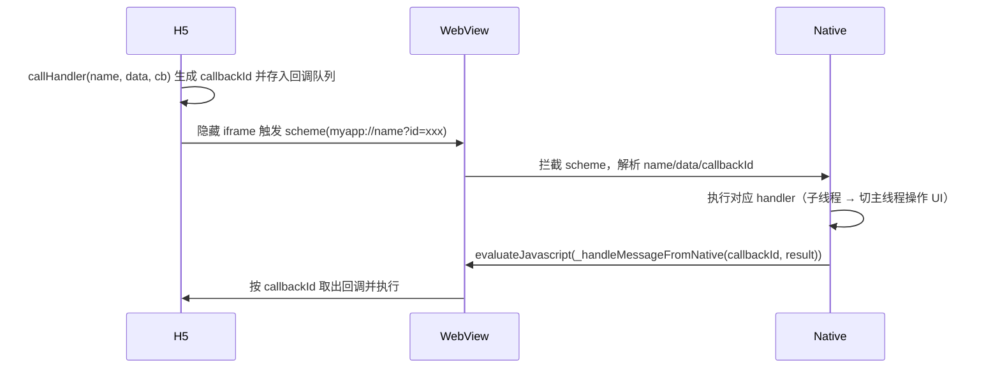
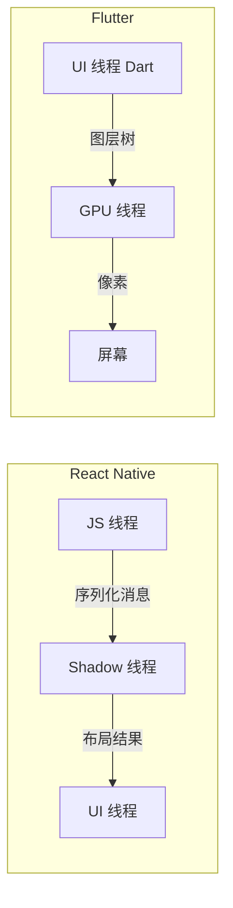

# 第二篇：跨端底层原理——渲染引擎、JS 引擎与桥接通信

核心要点：

- 三种渲染模型对比：自绘引擎（Skia/Impeller）vs 原生组件映射 vs WebView
- JS 引擎选型：JSCore、V8、Hermes、QuickJS 的差异
- 两类桥接：跨端框架桥接（JSBridge/JSI/FFI）与 Web 容器桥接（原生 + 内嵌 Web 的 JSBridge）
- 线程模型：UI 线程、JS 线程、渲染线程的协作
- 跨端性能开销从哪来：序列化、跨线程、桥接成本

---

上一篇我们把跨端的技术路线分成了三大类，但「路线」只是外壳，真正决定体验与性能的，是每一类路线底下的运行时（Runtime）。无论你选 Flutter、React Native 还是 Hybrid，最终都要回答四个问题：界面由谁来画、JS 由谁来跑、代码和原生怎么通信、这些线程怎么协作。本篇就顺着这四个问题，把跨端的底层原理拆开来看。

## 1. 三种渲染模型：界面由谁来画

跨端方案的本质差异，首先体现在「界面最终由谁绘制」。大致有三种模型：

### 1.1 自绘引擎

Flutter 代表。Skia（新版本逐步迁移到 Impeller）在屏幕上直接绘制每一个像素，不经过平台原生控件。优点是一致性极强、性能上限高；代价是引擎体积大、和原生控件体系脱节。

### 1.2 原生组件映射

React Native 代表。JS 描述组件树，再通过桥接映射到 iOS 的 `UIView` 或 Android 的 `View`。优点是控件是「真原生」，交互手感贴近原生；代价是每次更新都要跨桥，高频交互下存在桥接开销。

### 1.3 WebView 渲染

Hybrid App（原生壳 + H5）代表。页面交给 WebView 的浏览器内核渲染，原生只提供容器与能力。优点是开发门槛低、可复用 Web 生态；代价是性能与体验上限受限于浏览器内核。

| 模型 | 代表 | 渲染主体 | 一致性 | 性能上限 | 原生能力通道 |
| --- | --- | --- | --- | --- | --- |
| 自绘引擎 | Flutter | 引擎自绘像素 | 极高 | 高 | FFI / PlatformChannel |
| 原生映射 | React Native | 平台原生控件 | 高（受平台差异影响） | 中高（有桥接开销） | JSI 桥接 |
| WebView | Hybrid App | 浏览器内核 | 低（依赖内核） | 中低 | JSBridge |

小程序虽然也把 WebView 当作渲染容器，但它走的是「编译期转译 + 双线程」的另一条路线，与这里的「原生 + 内嵌 H5」并不等同，详见第五篇。

一句话：三种模型是「自己画」「用原生的画」「让浏览器画」的区别。这一区别，直接决定了后面三节的引擎、桥接与线程设计。

## 2. JS 引擎选型：代码由谁来跑

凡是需要跑 JS 的跨端方案，都要内嵌一个 JS 引擎。主流有四种：

- **JSCore**：iOS 系统内置，RN 在 iOS 上的默认引擎，由 WebKit 提供。
- **V8**：Chrome 同款引擎，Android 上 RN 的默认引擎，JIT 编译性能最强，但体积与内存占用也大。
- **Hermes**：Meta 为 RN 定制的轻量引擎，启动快、内存小，支持字节码预编译，省去运行时的源码解析。
- **QuickJS**：轻量可嵌入，体积只有几百 KB，适合 IoT、小程序引擎等对体积敏感的场景。

| 引擎 | 来源 | 编译方式 | 启动速度 | 内存 / 体积 | 典型场景 |
| --- | --- | --- | --- | --- | --- |
| JSCore | Apple / WebKit | JIT | 中 | 中 | RN（iOS） |
| V8 | Google | JIT | 慢（冷启动） | 大 | RN（Android）、Web |
| Hermes | Meta | AOT 字节码 | 快 | 小 | RN（推荐） |
| QuickJS | Bellard | 解释器 | 快 | 极小 | 轻量嵌入式 |

选型逻辑：移动端看重启动速度与内存 → 选 Hermes；追求极致执行性能且能接受体积 → 选 V8；对体积与可控性敏感 → 选 QuickJS。引擎选型会直接影响第五节的性能开销。

## 3. 桥接与通信机制

在跨端开发的语境里，「桥接（Bridge）」这个词经常被混用，但它的背后其实藏着两条完全不同的技术路径。搞清楚这一点，是理解后续 Flutter、React Native、小程序乃至 Hybrid App 通信机制的前提。

### 3.1 两类桥接：跨端框架桥接 vs Web 容器桥接

第一类桥接发生在**跨端框架内部**——RN 的 JS 引擎与原生组件之间、Flutter 的 Dart 运行时与平台通道之间。它的目标是让一套非原生的业务代码能调用到各平台的原生能力，通信双方是「代码引擎」和「原生运行时」。

第二类桥接发生在**原生应用与内嵌的 Web 页面之间**——也就是常说的 Hybrid App：原生壳里嵌一个 WebView，WebView 里跑 H5。这里的通信双方是「原生代码」和「浏览器运行时里的 JS」。

两类桥接虽然共享「JSBridge」这个名词，但机制、序列化方式、性能开销完全不同：

| 维度 | 跨端框架桥接（JSI/FFI） | Web 容器桥接（Hybrid JSBridge） |
| --- | --- | --- |
| 通信双方 | JS/Dart 引擎 ↔ 原生组件 | 原生代码 ↔ WebView 内的 JS |
| 通道机制 | JSI、FFI、PlatformChannel | URL Scheme、对象注入、JSBridge |
| 序列化 | 跨线程消息队列、二进制编解码 | JSON 字符串、URL 参数 |
| 性能特征 | 高频调用有开销，JSI 可同步 | 异步为主，跨进程/跨线程 |

一句话概括：前者解决「跨端框架怎么接原生」，后者解决「原生应用里的 H5 怎么接原生」。本节重点讲后者——这也是「原生 + 浏览器 + 内嵌 Web」这种混合开发模式里最核心的一环。

### 3.2 WebView 混合模式的三层架构与四个通信方向

Hybrid App 的运行时可以拆成三层：

```text
┌─────────────────────────────┐
│           H5 页面            │  ← 业务界面，跑在 WebView 里
├─────────────────────────────┤
│    WebView 容器（桥接层）     │  ← 拦截、注入、转发通信
├─────────────────────────────┤
│      原生壳（Native Shell）   │  ← 能力提供方：相机、定位、支付…
└─────────────────────────────┘
```

通信并不只有「H5 调原生」这一种，实际上有四个方向，每个方向都要靠不同机制支撑：

1. **H5 → Native**：页面发起调用，比如调起相机、读取定位。
2. **Native → H5**：原生主动把结果或数据推给页面。
3. **双向异步（带回调）**：H5 调原生后要拿返回值，这是最常用也最麻烦的一种。
4. **Native 事件推送**：原生状态变化（网络切换、登录态失效）要实时通知 H5。

这四个方向里，「双向异步」是设计难点，因为它要求在一个以异步回调为主的环境里，把「请求 - 响应」正确配对起来。下面的演进路径，本质上就是在逐步解决这个问题。

### 3.3 基础通道机制（演进第一层）

最早期、也最朴素的几种做法，只能覆盖部分方向，但它们是理解后续方案的基石。

**3.3.1 URL Scheme 拦截（H5 → Native 单向）**

页面通过 `location.href` 或隐藏 iframe 的 `src` 触发一个自定义协议，例如 `myapp://openCamera?type=front`。原生在容器层拦截这个跳转：

- Android：`WebViewClient.shouldOverrideUrlLoading`
- iOS：`WKWebView` 的 `decidePolicyForNavigationAction`

解析出协议名和参数后，原生执行对应能力。

```js
// H5 侧：通过隐藏 iframe 触发，避免页面整体跳转
function callNative(method, params) {
  const iframe = document.createElement('iframe');
  iframe.style.display = 'none';
  iframe.src = `myapp://${method}?${encodeURIComponent(JSON.stringify(params))}`;
  document.body.appendChild(iframe);
  setTimeout(() => iframe.remove(), 0);
}
```

它的局限很明显：**只能单向**（H5 主动发起）、参数受 URL 长度限制、**无法直接携带返回值**。要拿结果，往往得再配合一次「对象注入」或「反向 evaluateJavascript」。

**3.3.2 全局对象注入（双向基础能力）**

原生把一个对象挂到页面全局作用域上，H5 直接调用，从而获得返回值和双向能力：

- Android：`addJavascriptInterface(obj, "nativeBridge")`，H5 里 `window.nativeBridge.method()`。
- iOS：`WKScriptMessageHandler` 负责「H5 → Native」，`evaluateJavaScript` 负责「Native → H5」。

```java
// Android：注入一个带 @JavascriptInterface 注解的对象
webView.addJavascriptInterface(new Object() {
  @JavascriptInterface
  public String getDeviceInfo() { return ...; }
}, "nativeBridge");
```

```swift
// iOS：注册消息处理器，H5 通过 window.webkit.messageHandlers.xxx.postMessage 调用
webView.configuration.userContentController.add(self, name: "nativeBridge")
```

这一层解决了「双向」和「拿返回值」，但留下了两个坑：Android 4.2 以下存在著名的注入漏洞（可被反射调用系统类），且**异步回调难以管理**——一旦并发多个调用，返回值无法可靠地对应回原请求。

**3.3.3 prompt/alert 拦截（早期的 hack）**

利用 `prompt` 弹窗会被容器拦截的特性，把 JSON 塞进 `prompt(jsonStr)`，原生在 `onJsPrompt` 里解析。思路能用，但语义扭曲、性能差，如今基本只出现在历史包袱里，不建议新项目使用。

### 3.4 JSBridge 双向异步框架（核心）

为了把「双向异步 + 回调正确配对」做成稳定可用的基础设施，业界沉淀出了 JSBridge 这一类框架（如 WebViewJavascriptBridge 以及各家自研桥）。它的核心机制只有三句话：

> **callbackId 关联 + iframe scheme 触发 + evaluateJavascript 回调**

整体流程如下：



关键点在于 `callbackId`：每次调用生成唯一 id，H5 侧把回调函数存进一个 `Map<id, cb>`，Native 回传结果时带着这个 id，H5 就能精准地找到对应的回调。这样无论并发多少调用，都不会串台。

```js
// H5 侧 JSBridge 的简化实现
const callbacks = {};
let callbackId = 0;

function callHandler(method, data, cb) {
  const id = 'cb_' + (++callbackId);
  callbacks[id] = cb;
  triggerScheme(method, data, id);           // 走 iframe scheme 通知 Native
}

// Native 回传时调用
window._handleMessageFromNative = function(id, result) {
  const cb = callbacks[id];
  if (cb) { cb(result); delete callbacks[id]; }
};
```

iOS 与 Android 在实现细节上略有差异，但骨架一致：iOS 用 `WKScriptMessageHandler` + `evaluateJavaScript`，Android 用 `addJavascriptInterface` 或 `evaluateJavascript`，而「回调队列 + callbackId」是两侧共同的心跳。

### 3.5 现代协议化方案

当通信不再只是零散的能力调用，而是成体系的「能力开放」时，就会上升到协议化设计：

- **统一 RPC 协议**：把消息收敛为「请求 / 响应 / 事件」三类，形如 JSON-RPC，H5 与 Native 各维护一个 `invoke` 与 `emit` 的语义。
- **Native 主动事件推送**：用 `emit(event, payload)` 覆盖「Native 事件推送」方向，登录态失效、网络切换等状态能实时下发到 H5。
- **Android 官方新通道**：`addWebMessageListener` 与 `WebMessagePort` 提供了系统级的双向消息通道，替代部分手工 JSBridge 的工作，但仍需上层做协议与回调管理。

这一层的意义在于：把「通信」从技术手段升维成「接口契约」，让 H5 团队与原生团队能各自独立演进，只在协议边界上对齐。

### 3.6 通信设计要点清单

落地一个可维护的 Hybrid 通信层，有七个点需要重点处理：

1. **通道抽象**：屏蔽 Android/iOS 差异，对上暴露统一的 `call` / `on` / `emit` 接口。
2. **异步回调**：用 `callbackId` 机制保证并发回调正确配对，避免回调地狱。
3. **参数序列化**：常规数据走 JSON；大对象或二进制改用 base64 或原生直传，避免超长 URL 与序列化损耗。
4. **线程切换**：原生侧 handler 常驻子线程，操作 UI 前必须切回主线程。
5. **生命周期**：H5 刷新或重载后 bridge 需重新初始化；Native → H5 的推送要等 bridge ready，否则消息丢失。
6. **安全**：scheme 白名单、来源校验、规避 `addJavascriptInterface` 历史漏洞、对支付等敏感接口做鉴权。
7. **协议版本**：为 bridge 约定版本号，便于 H5 与原生灰度升级时做兼容判断。

如果你想把这套桥真正写出来、把相机与定位等能力接进 H5，可以跳转到[番外篇一：手写一个 JSBridge——把相机、定位等原生能力交给 H5](extra-01-jsbridge.md)。它把「通信原理 → 协议设计 → H5/原生两端代码 → 能力接入」完整走了一遍，并配套一个可运行 Demo。

## 4. 线程模型：几个线程怎么协作

跨端的性能瓶颈往往不在单线程，而在「线程之间怎么配合」。以 React Native 与 Flutter 为例。

### 4.1 React Native 的三线程

- **UI 线程（原生主线程）**：负责原生控件的布局与渲染。
- **JS 线程**：跑业务逻辑与 React 的 diff / render。
- **Shadow 线程**：负责 Yoga 布局计算。

三个线程通过消息队列通信，跨线程传递需要序列化，这正是 RN 桥接开销的来源。

### 4.2 Flutter 的线程

- **UI 线程（Dart）**：执行 Dart 代码、构建 Widget 树。
- **GPU 线程**：光栅化（Rasterizer）。
- **IO 线程**：图片解码等耗时操作。
- **Platform 线程**：对接平台能力。

Flutter 把 UI 与 GPU 分层，让 Dart 代码不阻塞绘制，是它能稳定高帧率的原因之一。

### 4.3 WebView 的线程

浏览器内核自带 UI 线程、JS 引擎线程与渲染（合成）线程，但受限于内核调度，Hybrid 页面难以对线程做精细化控制，这也是 WebView 路线性能上限偏低的原因。



## 5. 跨端性能开销从哪来

所有跨端方案都会在「纯原生」之外多付一点成本，主要来自三处：

1. **序列化**：跨边界传递要 JSON 编解码，数据越大越明显。
2. **跨线程**：消息在线程间排队，带来调度延迟。
3. **桥接**：每一次「JS ↔ 原生」往返都是一次固定开销，高频调用会把它放大。

以 RN 为例：JS 线程产出一棵组件树 → 序列化 → 跨线程 → 原生渲染。高频滚动时若频繁跨桥就会掉帧，所以 RN 后来用 JSI 支持同步调用、用 Fabric 架构把渲染下沉到原生侧。Flutter 则干脆用自绘引擎 + UI/GPU 分层，绕开了「跨桥渲染」这条路——这也解释了为什么两类方案的性能天花板不同。

## 小结

回到开头那四个问题：渲染模型决定「谁画」，JS 引擎决定「谁跑」，桥接决定「怎么通」，线程模型决定「怎么协作」，而性能开销是前四者的综合结果。理解了这四块，再看第三篇到第六篇的具体路线，就能看出它们在底层各自的选择与取舍。
