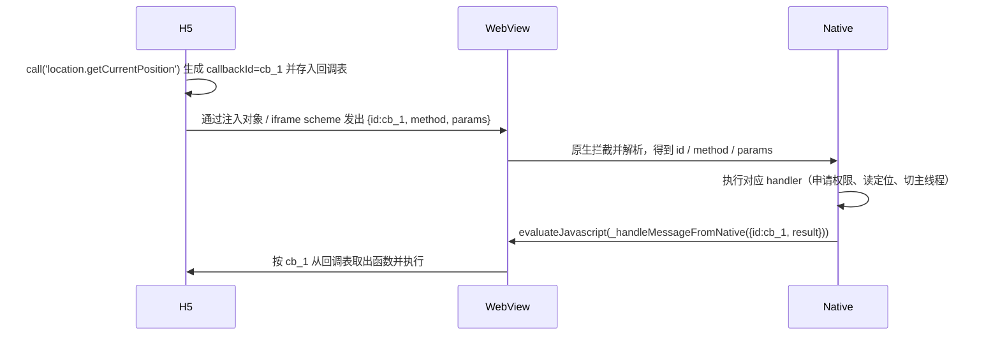

# 番外篇一：手写一个 JSBridge——把相机、定位等原生能力交给 H5

**核心要点：**

- Web 容器桥接的本质，是让「跑在 WebView 里的 H5」和「跑在原生壳里的 Native」能互相调用，它要同时解决「谁先发起」「参数怎么传」「返回值怎么拿回来」「回调怎么配对」四个问题
- 一条消息只有两个半通道：H5 → Native 靠「URL Scheme 拦截」或「对象注入」，Native → H5 靠「evaluateJavascript」，而「带回调的调用」之所以稳定，全靠一个 `callbackId` 把请求和响应一一配对
- 成熟的做法不是零散地调 API，而是先定一套「请求 / 响应 / 事件」三类消息的统一协议，H5 与 Native 只在协议边界上对齐
- 把相机、定位这类能力接进来，核心工作量不在桥本身，而在「权限申请 + 结果回传 + base64 序列化」这套原生侧的标准流程
- 落地时最容易踩的坑是回调丢失、线程切换、生命周期和图片传输性能，这些都要在桥层提前设计好

> 本文是「跨端开发」技术专栏的番外篇一。第二篇在讲桥接通信时，把「Web 容器桥接（原生 + 内嵌 Web 的 JSBridge）」一带而过，留了一句「callbackId 关联 + iframe scheme 触发 + evaluateJavascript 回调」。很多读者看到这里会有一个疑问：这三句话到底怎么落到代码里？如果我今天就要写一个桥，把相机、定位、扫码这些原生能力交给 H5 用，原理是什么、要写哪些代码、涉及哪些 API？这一篇就把这件事从头到尾讲清楚，并配套一个可以照着抄的可运行 Demo。

## 一、先厘清问题：H5 为什么不能直接调相机和定位

这是理解一切的前提。很多人下意识以为「H5 在 WebView 里，WebView 在 App 里，那 H5 不就能用 App 的能力了吗？」——不能。原因有三层。

**第一层：浏览器沙箱。** 浏览器出于安全考虑，从设计上就不允许网页随意访问系统能力。你能用相机，不是因为网页「能调相机」，而是浏览器把 `navigator.mediaDevices.getUserMedia` 这个「受控的、会弹授权框的」接口暴露给了你，真正的相机调用还是浏览器内核替你完成的。

**第二层：WebView 的能力是内核给的，不是 App 给的。** 你嵌进 App 的那个 WebView，它的能力上限由 WebView 内核决定。内核没暴露的能力（比如读通讯录、发短信、调起扫码、访问 App 自己的登录态），H5 再怎么写也摸不到。

**第三层：原生壳手里才握着真正的系统权限。** 相机、定位、相册这些能力，本质是操作系统授权给「这个 App」的，而不是授权给「App 里某个网页」的。所以最终去申请权限、调起相机的那段代码，只能写在原生壳里。

把这三层合起来，结论就很清晰了：**H5 负责「发指令」，Native 负责「执行指令」，两者之间需要一根能来回传消息的管道——这就是 JSBridge。** 它不是一个具体的库，而是一套「约定好的通信协议 + 一段原生壳里的转发代码 + 一段 H5 里的调用代码」的组合。

```text
┌──────────────────────────────────────────────┐
│  H5 页面（jsbridge.js）                        │
│  想拍照 → bridge.call('camera.takePhoto')      │
├──────────────────────────────────────────────┤
│  WebView 容器（拦截 / 注入 / 回传）             │
│  把 H5 的指令转成原生方法调用                   │
├──────────────────────────────────────────────┤
│  原生壳（真正做事的地方）                       │
│  申请权限 → 调起相机 → 拿到照片 → 回传 H5        │
└──────────────────────────────────────────────┘
```

## 二、通信原理：一条消息的完整旅程

先不管相机、定位这些具体能力，只聚焦一件事：**H5 里的一句 `bridge.call('xxx')`，是怎么跑到原生代码里，原生又把结果送回 H5 的？** 这是 Web 容器桥接的全部秘密。

### 2.1 两个半通道

WebView 容器里，能用的通信通道其实只有「两个半」：

| 方向 | 机制 | Android | iOS |
| --- | --- | --- | --- |
| H5 → Native | URL Scheme 拦截 | `shouldOverrideUrlLoading` | `decidePolicyForNavigationAction` |
| H5 → Native | 对象注入 | `addJavascriptInterface` | `WKScriptMessageHandler` |
| Native → H5 | 执行 JS 代码 | `evaluateJavascript` | `evaluateJavaScript` |

之所以说「两个半」，是因为 Native → H5 只有「执行 JS」这一种手段，而且它只能是「原生主动往页面里塞一段代码」，所以从 H5 视角看它是「被动的」。

**H5 → Native 的第一种：URL Scheme 拦截。** H5 触发一个自定义协议跳转，比如 `myapp://openCamera`，原生在容器层拦下这个跳转，解析出协议名和参数，再决定干什么。之所以常用「隐藏 iframe」来触发而不是 `location.href`，是因为 iframe 不会让页面整体跳转、不会打断当前页面状态：

```js
// H5 侧：用隐藏 iframe 触发 scheme，避免页面跳转
function triggerScheme(method, params) {
  const iframe = document.createElement('iframe');
  iframe.style.display = 'none';
  iframe.src = `myapp://${method}?${encodeURIComponent(JSON.stringify(params))}`;
  document.body.appendChild(iframe);
  setTimeout(() => iframe.remove(), 0);
}
```

原生侧分别在两个平台上拦截这个跳转：

```java
// Android：在 WebViewClient 里拦下自定义协议
webView.setWebViewClient(new WebViewClient() {
  @Override
  public boolean shouldOverrideUrlLoading(WebView view, String url) {
    if (url.startsWith("myapp://")) {
      handleScheme(url);   // 解析并分发
      return true;         // 返回 true 表示「这个跳转我接管了」
    }
    return super.shouldOverrideUrlLoading(view, url);
  }
});
```

```swift
// iOS：在 WKNavigationDelegate 里拦下自定义协议
func webView(_ webView: WKWebView,
             decidePolicyFor navigationAction: WKNavigationAction,
             decisionHandler: @escaping (WKNavigationActionPolicy) -> Void) {
  if let url = navigationAction.request.url, url.scheme == "myapp" {
    handleScheme(url)
    decisionHandler(.cancel)   // 取消跳转，不让页面真的导航
  } else {
    decisionHandler(.allow)
  }
}
```

Scheme 拦截的优点是简单、兼容性好，缺点是**只能单向**、参数受 URL 长度限制、**拿不到返回值**。所以它通常只作为「通知」用，拿结果要靠第二种通道。

**H5 → Native 的第二种：对象注入。** 原生把一个对象挂到页面全局作用域，H5 就能像调本地函数一样调它，从而拿到返回值：

```java
// Android：注入一个带 @JavascriptInterface 注解的对象
webView.addJavascriptInterface(new Object() {
  @JavascriptInterface
  public String getDeviceInfo() { return "{\"platform\":\"android\"}"; }
}, "nativeBridge");
// H5 侧：window.nativeBridge.getDeviceInfo()
```

```swift
// iOS：注册一个 messageHandler，H5 通过 window.webkit.messageHandlers.nativeBridge.postMessage 调用
let controller = webView.configuration.userContentController
controller.add(self, name: "nativeBridge")
```

对象注入解决了「双向」和「拿返回值」，但留下了两个坑：其一，Android 4.2 以下存在著名的注入漏洞（被反射调用系统类），老项目要规避；其二，**异步回调难以管理**——一旦并发多个调用，返回值无法可靠地对应回原请求。这个坑，正是下一节 `callbackId` 要填的。

**Native → H5 的唯一通道：执行 JS。** 原生把结果塞进一段 JS 代码，在页面里执行：

```java
// Android
webView.evaluateJavascript("window._handleMessageFromNative('" + json + "')", null);
```

```swift
// iOS
webView.evaluateJavaScript("window._handleMessageFromNative('\(json)')", completionHandler: nil)
```

### 2.2 一次「带回调」的调用是怎么配对的

现在把上面的通道拼起来，看一次完整的、带返回值的调用——这是整个 JSBridge 的心跳：



关键就在 `callbackId`：**每一次调用生成一个全局唯一 id，H5 侧把回调函数存进一个 `Map<id, cb>`，原生回传结果时带着这个 id，H5 就能精准找到对应的回调。** 无论并发多少调用都不会串台。这是所有 JSBridge 框架（WebViewJavascriptBridge 以及各家自研桥）共同的核心机制，后面的代码都围绕它展开。

## 三、统一协议设计：把「通信」变成「接口契约」

理解了原理，下一步不是急着写相机，而是先定协议。因为当通信从「一两个零散调用」长成「一整套能力开放」时，没有协议就会变成一堆 `if/else` 的散弹枪。

我们把消息收敛成三类，各自用一个 `type` 区分：

| 类型 | 方向 | 含义 | 关键字段 |
| --- | --- | --- | --- |
| `request` | H5 → Native | 一次能力调用 | `id`、`method`、`params` |
| `response` | Native → H5 | 对应某次调用的结果 | `id`、`result` / `error` |
| `event` | Native → H5 | 原生主动推送 | `event`、`payload` |

于是 H5 侧只需要暴露三个语义就够了：

```js
bridge.call('location.getCurrentPosition', { accuracy: 'high' }); // 调用并拿结果
bridge.on('networkChange', (payload) => { ... });                 // 订阅原生事件
bridge.on('loginExpired', () => { ... });
```

`call` 内部包装成 `request`，原生回包统一成 `response`；原生主动通知走 `event`。这样 H5 团队和原生团队就能各自独立演进，只在「协议边界」上对齐——这就是第二篇里说的「把通信从技术手段升维成接口契约」。

## 四、H5 侧实现：jsbridge.js

下面是 H5 侧桥接库的完整骨架，可以直接用。它做了三件事：发请求、收响应并配对、订阅事件。

```js
// jsbridge.js —— H5 侧桥接库
(function (global) {
  const NATIVE_NAME = 'nativeBridge';   // 与原生约定的注入对象名 / handler 名

  let callbackId = 0;
  const callbacks = {};                 // callbackId -> { resolve, reject }
  const eventHandlers = {};             // event -> Set<handler>
  let readyQueue = [];
  let isReady = false;

  const genId = () => 'cb_' + (++callbackId) + '_' + Date.now();

  function isIOS() {
    return /iPhone|iPad|iPod/i.test(navigator.userAgent);
  }

  // H5 -> Native：优先走注入对象，iOS 用 messageHandlers，兜底走 scheme
  function sendToNative(payload) {
    if (isIOS()
      && global.webkit && global.webkit.messageHandlers
      && global.webkit.messageHandlers[NATIVE_NAME]) {
      // iOS 直接传对象，原生在 didReceive 里拿 message.body
      global.webkit.messageHandlers[NATIVE_NAME].postMessage(payload);
    } else if (global[NATIVE_NAME] && typeof global[NATIVE_NAME].post === 'function') {
      // Android addJavascriptInterface 注入的对象，统一提供 post(jsonString)
      global[NATIVE_NAME].post(JSON.stringify(payload));
    } else {
      // 兜底：隐藏 iframe scheme
      const iframe = document.createElement('iframe');
      iframe.style.display = 'none';
      iframe.src = 'myapp://' + encodeURIComponent(JSON.stringify(payload));
      document.body.appendChild(iframe);
      setTimeout(() => iframe.remove(), 0);
    }
  }

  // 核心：带回调的调用
  function call(method, params = {}) {
    return new Promise((resolve, reject) => {
      const id = genId();
      callbacks[id] = { resolve, reject };
      sendToNative({ type: 'request', id, method, params });
    });
  }

  // Native -> H5 的统一入口，由原生 evaluateJavascript 调用
  global._handleMessageFromNative = function (raw) {
    let msg = raw;
    if (typeof raw === 'string') {
      try { msg = JSON.parse(raw); } catch (e) { return; }
    }
    if (msg.type === 'response') {
      const cb = callbacks[msg.id];
      if (!cb) return;
      delete callbacks[msg.id];
      msg.error ? cb.reject(new Error(msg.error)) : cb.resolve(msg.result);
    } else if (msg.type === 'event') {
      const set = eventHandlers[msg.event];
      if (set) set.forEach((fn) => fn(msg.payload));
    }
  };

  // 事件订阅
  function on(event, handler) {
    (eventHandlers[event] || (eventHandlers[event] = new Set())).add(handler);
    return () => off(event, handler);
  }
  function off(event, handler) {
    const set = eventHandlers[event];
    if (set) set.delete(handler);
  }

  // ready：等原生注入完成再调用，避免时序竞态
  function ready(cb) {
    isReady ? cb() : readyQueue.push(cb);
  }
  global._onBridgeReady = function () {
    isReady = true;
    readyQueue.splice(0).forEach((fn) => fn());
  };

  global.JSBridge = { call, on, off, ready };
})(window);
```

三点值得单独说：

1. **`_handleMessageFromNative` 是唯一的回包入口。** 无论原生回的是响应还是事件，都从这一个函数进来，H5 侧只在这里做一次分发，逻辑集中、不会漏。
2. **`ready` 机制解决时序竞态。** 原生注入对象是「页面加载后」才完成的，如果 H5 脚本一进来就 `call`，可能 `window.nativeBridge` 还没挂上。所以约定原生注入完成后主动执行一次 `_onBridgeReady()`，H5 的首次调用放进 `ready` 回调里。
3. **`call` 返回 Promise，而不是传 callback。** 这样 H5 侧业务代码可以用 `async/await`，比 WebViewJavascriptBridge 老版的 `callHandler(name, data, cb)` 舒服得多。

## 五、原生侧实现：把能力暴露出来

桥的 H5 侧只有十几行，真正的重头戏在原生侧：它要负责「收消息 → 分发到对应 handler → 申请权限/干活 → 把结果回传」。

### 5.1 Android 侧

Android 上我们统一走「注入对象 + `evaluateJavascript`」这条路线，一个 `post(String json)` 方法收所有请求，一个 `respond` 方法回所有结果：

```java
// MainActivity.java（节选）
private WebView webView;

private void initWebView() {
  WebSettings settings = webView.getSettings();
  settings.setJavaScriptEnabled(true);
  settings.setDomStorageEnabled(true);

  // H5 里 window.nativeBridge.post(jsonString)
  webView.addJavascriptInterface(new Object() {
    @JavascriptInterface
    public void post(String json) { dispatch(json); }
  }, "nativeBridge");

  webView.loadUrl("file:///android_asset/index.html");
}

// 所有 H5 请求的入口
private void dispatch(String json) {
  try {
    JSONObject msg = new JSONObject(json);
    String id = msg.optString("id");
    String method = msg.optString("method");
    JSONObject params = msg.optJSONObject("params");
    if (params == null) params = new JSONObject();
    handleMethod(method, params, id);
  } catch (Exception e) { e.printStackTrace(); }
}

// 回包：把结果以 response 类型塞回 H5
private void respond(String id, JSONObject result) {
  runOnUiThread(() -> {
    JSONObject resp = new JSONObject();
    try {
      resp.put("type", "response");
      resp.put("id", id);
      resp.put("result", result);
      webView.evaluateJavascript("window._handleMessageFromNative(" + resp + ")", null);
    } catch (JSONException e) { e.printStackTrace(); }
  });
}
```

注意 `respond` 里的 `runOnUiThread`：WebView 的 `evaluateJavascript` 必须在主线程调用，而能力 handler（比如定位）常常在回调线程里执行，所以回包前要切回主线程。

### 5.2 iOS 侧

iOS 上走「`WKScriptMessageHandler` + `evaluateJavaScript`」：

```swift
// WebViewController.swift（节选）
import WebKit

class WebViewController: UIViewController, WKScriptMessageHandler {
  var webView: WKWebView!

  override func viewDidLoad() {
    super.viewDidLoad()

    let config = WKWebViewConfiguration()
    // H5 里 window.webkit.messageHandlers.nativeBridge.postMessage(obj)
    config.userContentController.add(self, name: "nativeBridge")

    webView = WKWebView(frame: view.bounds, configuration: config)
    view.addSubview(webView)

    if let url = Bundle.main.url(forResource: "index", withExtension: "html") {
      webView.loadFileURL(url, allowingReadAccessTo: url.deletingLastPathComponent())
    }
  }

  // 收到 H5 发来的消息
  func userContentController(_ userContentController: WKUserContentController,
                             didReceive message: WKScriptMessage) {
    guard let body = message.body as? [String: Any],
          let method = body["method"] as? String,
          let id = body["id"] as? String else { return }
    let params = body["params"] as? [String: Any] ?? [:]
    handleMethod(method, params: params, id: id)
  }

  // 回包
  private func respond(id: String, result: [String: Any]) {
    DispatchQueue.main.async {
      guard let data = try? JSONSerialization.data(withJSONObject: [
        "type": "response", "id": id, "result": result
      ]),
      let json = String(data: data, encoding: .utf8) else { return }
      self.webView.evaluateJavaScript(
        "window._handleMessageFromNative(\(json))", completionHandler: nil)
    }
  }
}
```

两个平台骨架完全一致：**一个「收消息」入口 + 一个「分发」方法 + 一个「回包」方法**。差别只在通道 API 的名字（`addJavascriptInterface` vs `WKScriptMessageHandler`、`evaluateJavascript` vs `evaluateJavaScript`）。

## 六、能力接入实战：以相机为例走一遍端到端

现在把第一个真实能力接进来。相机是最典型的例子，因为它把「权限申请 → 调起系统能力 → 拿结果 → 序列化回传」这条链路完整走了一遍。定位、相册、扫码都是同一套骨架。

### 6.1 H5 侧：一句调用

```js
// H5 侧业务代码
JSBridge.ready(async () => {
  const photo = await JSBridge.call('camera.takePhoto', { source: 'camera' });
  // photo = { base64: "data:image/jpeg;base64,...", width: 1080, height: 1440 }
  document.querySelector('#preview').src = photo.base64;
});
```

### 6.2 Android 侧：权限 + 调起 + 回传

```java
private static final int REQ_CAMERA = 1001;
private ValueCallback<Uri[]> filePathCallback;   // 相机/相册的结果回调
private Uri cameraImageUri;

private void takePhoto(String id) {
  // 1. 申请相机权限
  if (ContextCompat.checkSelfPermission(this, android.Manifest.permission.CAMERA)
        != PackageManager.PERMISSION_GRANTED) {
    ActivityCompat.requestPermissions(this,
        new String[]{ android.Manifest.permission.CAMERA }, REQ_CAMERA);
    pendingCameraId = id;          // 记住这次请求，权限回调后再继续
    return;
  }
  launchCamera(id);
}

private void launchCamera(String id) {
  try {
    // 2. 用 FileProvider 生成一个 content:// 的 Uri，避免 7.0 的 file:// 限制
    File file = new File(getCacheDir(), "photo_" + System.currentTimeMillis() + ".jpg");
    cameraImageUri = FileProvider.getUriForFile(this,
        getPackageName() + ".fileprovider", file);

    Intent intent = new Intent(MediaStore.ACTION_IMAGE_CAPTURE);
    intent.putExtra(MediaStore.EXTRA_OUTPUT, cameraImageUri);
    startActivityForResult(intent, REQ_CAMERA);
    pendingCameraId = id;
  } catch (Exception e) {
    respondError(id, "camera launch failed");
  }
}

@Override
protected void onActivityResult(int requestCode, int resultCode, Intent data) {
  super.onActivityResult(requestCode, resultCode, data);
  if (requestCode == REQ_CAMERA && resultCode == RESULT_OK) {
    // 3. 读出照片，压缩后 base64 回传
    try {
      InputStream is = getContentResolver().openInputStream(cameraImageUri);
      Bitmap bitmap = BitmapFactory.decodeStream(is);
      // 压缩到最长边 1080，避免原图过大
      Bitmap scaled = scaleBitmap(bitmap, 1080);
      String base64 = bitmapToBase64(scaled, Bitmap.CompressFormat.JPEG, 80);

      JSONObject result = new JSONObject();
      result.put("base64", "data:image/jpeg;base64," + base64);
      result.put("width", scaled.getWidth());
      result.put("height", scaled.getHeight());
      respond(pendingCameraId, result);
    } catch (Exception e) {
      respondError(pendingCameraId, e.getMessage());
    }
  }
}
```

这里面有四个 Android 特有的知识点，也是「原生能力开放」真正的工作量所在：

- **权限申请**：`checkSelfPermission` 判断 + `requestPermissions` 申请 + `onRequestPermissionsResult` 处理结果，三步缺一不可。
- **FileProvider**：Android 7.0 起不允许 `file://` Uri 传给相机，必须用 `FileProvider` 转成 `content://`。
- **`onActivityResult` 是异步的**：调起相机后，结果不会立刻回来，要在这个回调里拿，再 `respond` 回 H5。这也再次印证了为什么桥必须是异步 + callbackId 的。
- **压缩与序列化**：原图动辄几 MB，直接 base64 会拖垮性能，必须先按最长边缩放、再压缩、再 base64。

`Manifest` 里还要补上权限和 FileProvider 声明：

```xml
<uses-permission android:name="android.permission.CAMERA" />
<uses-permission android:name="android.permission.ACCESS_FINE_LOCATION" />

<provider
    android:name="androidx.core.content.FileProvider"
    android:authorities="${applicationId}.fileprovider"
    android:exported="false"
    android:grantUriPermissions="true">
    <meta-data
        android:name="android.support.FILE_PROVIDER_PATHS"
        android:resource="@xml/file_paths" />
</provider>
```

### 6.3 iOS 侧：权限 + 调起 + 回传

iOS 上用 `UIImagePickerController` 是最省事的方式，同样要过一遍权限：

```swift
import AVFoundation
import UIKit

private var pendingCameraId: String?

private func takePhoto(id: String) {
  switch AVCaptureDevice.authorizationStatus(for: .video) {
  case .notDetermined:
    pendingCameraId = id
    AVCaptureDevice.requestAccess(for: .video) { [weak self] granted in
      DispatchQueue.main.async { granted ? self?.launchCamera() : self?.respondError(id: id, "denied") }
    }
  case .authorized:
    pendingCameraId = id
    launchCamera()
  default:
    respondError(id: id, message: "camera permission denied")
  }
}

private func launchCamera() {
  guard UIImagePickerController.isSourceTypeAvailable(.camera) else { return }
  let picker = UIImagePickerController()
  picker.sourceType = .camera
  picker.delegate = self
  present(picker, animated: true)
}

// UIImagePickerControllerDelegate：拿照片 → 压缩 → base64 回传
func imagePickerController(_ picker: UIImagePickerController,
                           didFinishPickingMediaWithInfo info: [UIImagePickerController.InfoKey : Any]) {
  picker.dismiss(animated: true)
  guard let id = pendingCameraId,
        let image = info[.originalImage] as? UIImage,
        let data = image.jpegData(compressionQuality: 0.8) else { return }
  let base64 = data.base64EncodedString()
  respond(id: id, result: ["base64": "data:image/jpeg;base64," + base64,
                            "width": image.size.width, "height": image.size.height])
}
```

iOS 侧的关键点是 `Info.plist` 里必须声明用途文案，否则调用时直接崩溃：

```xml
<key>NSCameraUsageDescription</key>
<string>用于拍摄照片</string>
<key>NSLocationWhenInUseUsageDescription</key>
<string>用于获取当前位置</string>
<key>NSPhotoLibraryUsageDescription</key>
<string>用于从相册选择图片</string>
```

## 七、标准能力 API 清单

当你把「相机」这条链路打通后，其余能力都是同一条流水线上的不同工序。一个 Hybrid App 通常会开放的能力，以及对应的原生 API，整理如下：

| 能力 | `method` | H5 入参 | H5 拿到 | Android 原生 API | iOS 原生 API |
| --- | --- | --- | --- | --- | --- |
| 拍照 / 选图 | `camera.takePhoto` | `{source}` | `{base64,width,height}` | `MediaStore.ACTION_IMAGE_CAPTURE` | `UIImagePickerController` |
| 定位 | `location.getCurrentPosition` | `{accuracy}` | `{lat,lng,accuracy}` | `LocationManager` / FusedLocation | `CLLocationManager` |
| 设备信息 | `device.getInfo` | — | `{platform,version,model}` | `Build` | `UIDevice` |
| 网络类型 | `network.getType` | — | `{type}` | `ConnectivityManager` | `NWPathMonitor` |
| 扫码 | `scan.scanCode` | — | `{code}` | CameraX / ZXing | `AVCaptureMetadataOutput` |
| 存储 | `storage.set/get` | `{key,value}` | `{value}` | `SharedPreferences` | `UserDefaults` |
| Toast | `ui.toast` | `{text}` | — | `Toast` | `UIAlertController` |
| 导航 | `navigator.openPage` | `{url}` | — | `Intent` | `pushViewController` |

你可以把这张表当作「原生团队要给 H5 开哪些口子」的清单，逐行实现即可。桥本身不用改，每加一个能力，只是在原生 `handleMethod` 的 `switch` 里加一个 `case`，外加 H5 侧一个封装函数。

## 八、容易踩的坑与工程化建议

桥写通了只是第一步，真正上生产要提前处理七件事，第二篇的清单这里展开讲：

1. **回调丢失**：H5 页面刷新或 WebView 重载后，`callbacks` 表被清空，但原生还在等结果。解决：H5 重载时重新初始化桥，原生侧回包前先判断页面是否还活着；对「必达」的调用（如支付）加超时与重试。
2. **线程切换**：原生 handler 常驻子线程（定位、网络回调），`evaluateJavascript` 必须回主线程，否则 iOS 直接崩、Android 会抛异常。
3. **时序竞态**：H5 首次调用必须在 `ready` 之后，否则 `window.nativeBridge` 还没注入。原生注入完成后要主动触发一次 `_onBridgeReady()`。
4. **图片传输性能**：不要直接 base64 传原图。先缩放、再压缩，大文件走「原生存文件 + 回传本地路径」的方式，让 H5 用 URL 去读。
5. **安全**：scheme 做白名单校验、来源校验；避免 `addJavascriptInterface` 历史漏洞；对支付、登录态等敏感接口做鉴权和二次确认。
6. **协议版本**：为桥约定一个 `version`，H5 与原生灰度升级时先做版本判断，避免「新 H5 调了老原生没有的方法」。
7. **降级与监控**：为 `call` 加超时；对 `unknown method`、`evaluateJavascript` 失败等异常做埋点上报，线上问题才能定位。

## 九、Demo：一个可以照着抄的示例

配套案例放在 [examples/cross-platform/jsbridge-demo/](../../examples/cross-platform/jsbridge-demo/README.md)，目录结构如下：

```text
jsbridge-demo/
├── README.md             # 架构说明 + 两种运行方式
├── h5/                   # H5 侧（可直接在浏览器打开演示）
│   ├── jsbridge.js       #   桥接库（与本文第四、五节一致）
│   ├── mock-native.js    #   浏览器本地 mock，无原生环境时模拟 Native
│   └── index.html        #   演示页：拍照 / 定位 / 设备信息 / 扫码 / Toast
├── android/
│   └── MainActivity.java #   Android WebView 容器（含相机、定位的完整实现）
└── ios/
    └── WebViewController.swift  # iOS WKWebView 容器（含相机、定位的完整实现）
```

Demo 提供了两条体验路径：

- **纯浏览器快速体验**：直接打开 `h5/index.html`，它会自动加载 `mock-native.js`，用一段 JS 模拟原生回包，让你不装 App 也能完整看到「H5 发指令 → 桥转发 → 拿到结果」的流程。
- **真机接入**：把 `jsbridge.js` 和 `index.html` 放进 Android 的 `assets` 或 iOS 的 Bundle，配上 `MainActivity.java` / `WebViewController.swift`，即可在真机上真正调起相机和定位。

## 小结

回到开头那个疑问——「callbackId 关联 + iframe scheme 触发 + evaluateJavascript 回调」这三句话怎么落到代码里？现在可以给出完整答案了：

- **通信原理**：H5 → Native 靠「注入对象」或「scheme 拦截」，Native → H5 靠 `evaluateJavascript`，一条带返回值的调用靠 `callbackId` 把请求和响应配对。
- **工程骨架**：先定「请求 / 响应 / 事件」统一协议，H5 侧一个 `call` / `on`，原生侧一个「收消息 + 分发 + 回包」。
- **能力开放**：相机、定位等能力，真正的代码量在「权限申请 + 调起系统能力 + 序列化回传」，桥层本身反而很薄。

理解到这一层，「原生 + 内嵌 Web」这条混合路线你就算真正入门了：桥不是黑魔法，它只是一套把「网页的调用」翻译成「原生的执行」的约定与代码。下一篇我们回到主线，进入 Flutter 的深度解析。
