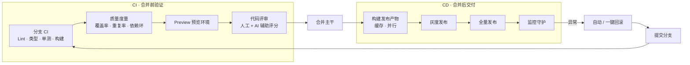
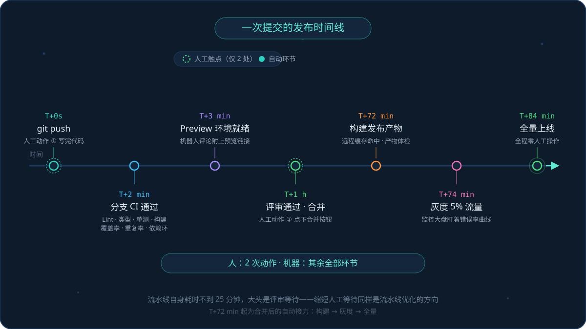
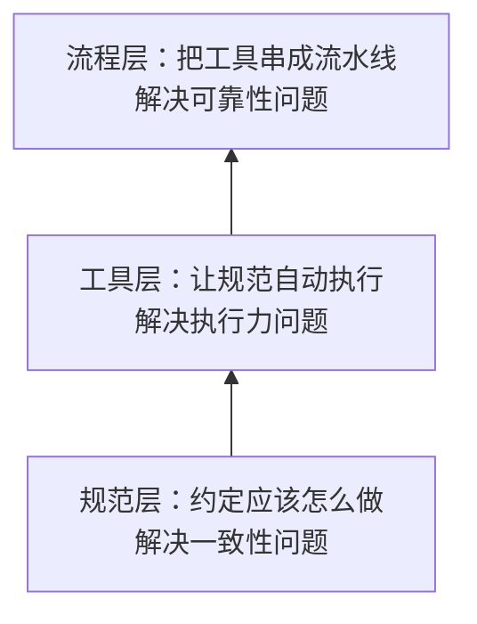
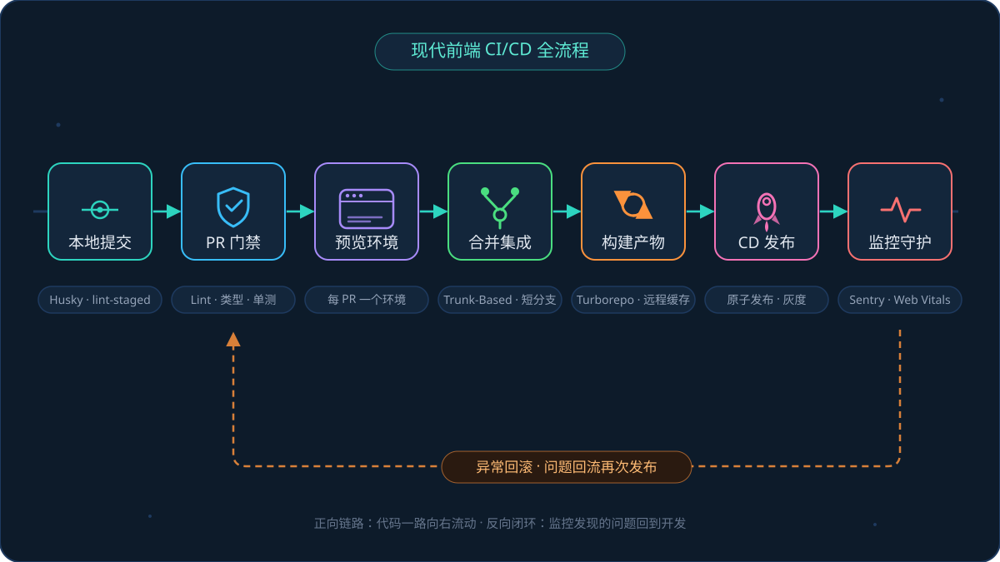
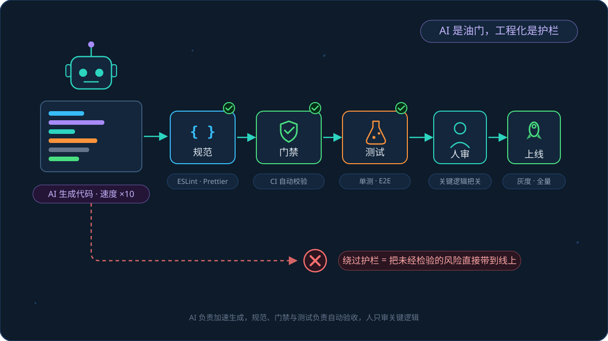

# 第一篇：前端工程化全景图——从构建到部署的完整链路

**核心要点：**

- 现代前端 CI/CD 以"合并主干"为界分两段：合并前的 **CI**（分支检查 → 质量度量 → 预览环境 → 代码评审）验证改动够不够格进主干，合并后的 **CD**（构建产物 → 灰度 → 全量 → 监控 → 回滚）把代码安全送上生产；人只负责写代码和关键决策
- 业界最新实践：Trunk-Based 主干开发、Preview Environment 预览环境、Feature Flag 发布与上线解耦、远程缓存与受影响构建、原子发布与秒级回滚、AI 辅助代码评审
- 好坏不看感觉看指标：DORA 四指标是通用基线，前端还有自己的专项水位（PR 反馈 10 分钟内、回滚 5 分钟内、Web Vitals 达标线）
- 不同项目类型的 CI/CD 关注点差异很大：SPA 拼缓存、SSR 拼服务化部署、小程序拼平台审核流、组件库拼版本管理，链路同构但权重不同
- AI 时代工程化更重要：AI 是油门，规范、门禁与测试是护栏，没有护栏的提速是风险放大器

**这篇适合谁看：**

- 写代码没问题，但对"代码从提交到上线中间发生了什么"还只有模糊印象的同学
- 团队的发布还停在"能部署就行"，想对齐业界现代做法的技术负责人
- 想知道自己的流水线在业界算什么水平、下一步该往哪优化的同学

## 一、开篇：现代前端 CI/CD 的标准链路

这条链路以**合并主干**为界，分成前后两段：合并前是 **CI（持续集成）**，负责验证这次改动够不够格进主干；合并后是 **CD（持续交付/部署）**，负责把通过验证的代码安全送上生产。

**合并前（CI）**：

- **分支 CI**：改动推到自己的分支（或提 PR）后，触发针对这次改动的检查——Lint、类型检查、单元测试，以及一次构建验证（确认"能构建"）
- **质量度量门禁**：CI 里同步产出代码质量水位——单测覆盖率、代码重复率、依赖循环，低于基线就拦截或告警
- **预览环境**：检查通过后，为这个分支自动部署一个独立、可访问的临时环境，评审人点开就能看到真实效果
- **代码评审**：人工评审 + AI 辅助评分。AI 先给改动打一遍分、标出可疑点，人把精力放在架构与业务正确性上，最后决定是否合并

**合并后（CD）**：

- **构建发布产物**：从主干构建出可发布的制品，依赖缓存、并行、受影响构建让它尽量快
- **灰度发布**：先放给一小部分流量，观察指标
- **全量发布**：指标平稳后逐步放量到 100%
- **监控守护**：发布后盯着错误率、性能与业务指标，和上一个版本对比
- **异常回滚**：指标劣化就一键回滚，旧版本产物仍在，秒级切回

把这条链路画出来：

> 图注：以"合并主干"为界，左边是 CI（验证这次改动够不够格进主干），右边是 CD（把代码送到用户面前）。监控发现异常自动回流，形成闭环。

> 图注：合并之后的环节全是自动接力，流水线自身耗时不到 25 分钟；最长的往往是评审等待——这也是后面讲指标时，"变更前置时间"要单独看的原因。

这就是**现代前端 CI/CD**。它不是某个工具，也不是某个脚本，而是一条从代码提交到用户浏览器、全程无人值守的交付流水线。

有个细节容易被忽略：**构建在这条链路上出现两次**——合并前那次是"验证这次改动能不能构建成功"（不合格就不该进主干），合并后那次是"产出真正用于发布的制品"。两件事目的不同，不是重复劳动；配合后面讲的远程缓存，第二次构建几乎零成本。

这篇文章的目标是帮你建立三个认知：

1. **全流程长什么样**——每个环节在做什么，业界现在的主流做法是什么
2. **什么算好**——用行业标准指标给自己的流水线定位，知道差距在哪
3. **不同项目有什么不同**——SPA、SSR、小程序、微前端、组件库的 CI/CD 关注点差异在哪

至于"怎么从零搭起来"，那是工程化篇后面几篇的内容，这一篇先把地图铺开。

## 二、工程化的底座：把个人技艺变成团队产能

前端工程化的本质，是**让代码质量不再依赖个人自觉，而是依赖一套可复制、可执行、可持续改进的体系。**

这套体系分三层，自下而上生长：

> 图注：规范是地基，工具是执行者，流程是把一切串起来的骨架。三层缺一层，工程化就瘸一条腿。

- **规范层**：约定"应该怎么做"。代码风格、目录结构、分支模型、发布流程，都属于这一层。它解决的是一致性。
- **工具层**：把规范变成自动执行的程序。ESLint 检查代码风格，Prettier 统一格式化，TypeScript 拦住类型错误。它解决的是执行力——规范不靠人记，靠机器强制。
- **流程层**：把工具串成端到端的流水线，也就是本文的主角 CI/CD。它解决的是可靠性——整条链路无人值守也能稳定运转。

有一个常见的误解需要澄清：**工程化不等于某个具体工具。**"我们用了 Vite，算工程化了吗？""买了 GitHub 企业版算吗？"——都算不上。工具只是零件，把零件按团队协作方式组装成流水线，才是工程化本身。

## 三、全景图：现代前端 CI/CD 的七个阶段

把开篇那条链路铺开看，现代前端从代码到用户，要经过七个阶段：

| 阶段 | 核心问题 | 业界主流做法 | 代表技术 / 平台 |
| --- | --- | --- | --- |
| 1. 本地提交 | 怎么让问题在提交前就被拦住 | Git Hooks 本地门禁 | Husky、lint-staged、Biome/Prettier |
| 2. PR 门禁 | 机器验收不合格的代码 | Checks 自动检查 + 质量度量门禁（覆盖率 / 重复率 / 依赖环） | GitHub Actions、GitLab CI |
| 3. 预览与评审 | 让评审"点开看"而不只是"读代码" | 每个 PR 一个独立可访问环境 + AI 辅助评审 | Vercel、Netlify、Cloudflare Pages |
| 4. 合并集成 | 主干随时可发布 | Trunk-Based 主干开发 + 短分支 | Feature Flag、GitHub Flow |
| 5. 构建产物 | 流水线又快又稳 | 依赖缓存、远程缓存、受影响构建 | pnpm store、Turborepo、Nx |
| 6. CD 发布 | 上线快、影响面小、可秒退 | 原子发布、灰度/金丝雀、蓝绿 | CDN 切换、Feature Flag、边缘部署 |
| 7. 监控守护 | 发布后立刻知道好不好 | 发布健康度对比 + Web Vitals | Sentry、RUM、告警分级 |

> 图注：正向链路上代码一路向右流动；反向闭环里，监控发现的问题回到开发，驱动下一轮迭代。

七个阶段里藏着现代 CI/CD 的四个关键特征，也是和"老式部署"拉开代差的地方：

- **门禁自动化**：代码合不合格，机器说了算。人从"检查员"变成"决策者"。
- **环境随代码生长**：每提交一个 PR，就自动长出一个预览环境；PR 关闭，环境自动销毁。环境不再是稀缺资源。
- **评审被 AI 增强**：AI 先对改动做一遍自动审查与打分，人从"逐行找问题"转向"判断 AI 看不懂的设计意图"。但 AI 只是辅助，最终是否合并仍由人拍板。
- **发布与上线解耦**：代码发布到线上 ≠ 功能对用户可见。用 Feature Flag 控制"谁能看到新功能"，发布从此可以随时做，上线变成一个开关。

后面逐个阶段拆解。

## 四、逐阶段拆解：每一环在做什么、业界怎么做

### 1. 本地提交：第一道门禁在开发者机器上

流水线的第一环不在 CI 服务器上，而在每个人的电脑里。**能在本地 1 秒发现的问题，就没必要等 CI 跑 3 分钟。**

业界标配是 Git Hooks 方案：Husky 挂载钩子 + lint-staged 只检查本次改动的文件。提交瞬间完成风格修复、类型提示，把"格式不对"这类低级问题挡在仓库之外。

这一环的设计原则是**本地快、CI 全**：本地只跑与改动文件相关的秒级检查，完整检查交给 CI。本地跑全量测试，等待会把人逼得用 `--no-verify` 绕过门禁——门禁一旦能被绕过，它的权威性就没了。

### 2. PR 门禁：机器验收，人做决策

Pull Request 发起后，CI 自动运行一组检查，业界俗称 Checks。一套典型的现代前端门禁包括：

- **静态检查**：ESLint/Biome 代码规范
- **类型检查**：TypeScript 编译零错误
- **单元测试**：Vitest/Jest 全量跑，改动文件覆盖率不降
- **端到端测试**：Playwright/Cypress 驱动真实浏览器走关键用户路径。全量 E2E 太慢，进 PR 门禁的通常只跑核心链路的冒烟子集，部署到预览环境后执行
- **构建验证**：确保代码能构建出产物——"能跑"和"能构建"是两回事
- **质量度量**：单测覆盖率、代码重复率（jscpd 等）、依赖循环（dependency-cruiser 等）。它们更适合以"基线 + 趋势"的方式约束，明显劣化就告警或拦截，而不是一刀切卡死阈值
- **构建产物体检**：产物体积对比（超出基线告警），这是前端特有的门禁

这一环的关键认知：**门禁的价值不在"抓人"，而在分工**。格式、命名、类型这些机械问题全部交给机器，评审人才能真正把精力放在架构合理性和业务正确性上。

### 3. 预览环境与代码评审：评审方式的代际升级

这是近几年前端 CI/CD 最具代表性的进化。传统做法里，评审人只能读代码 diff，凭想象推断效果；预览环境（Preview Environment）让每个 PR 自动获得一个**独立的、真实可访问的 URL**，评审人点开链接，看到的就是一个跑着这次改动的完整网站。

它改变了三件事：

- **评审质量**：从"读代码猜效果"变成"直接操作验证"，视觉问题、交互问题在评审阶段就暴露
- **协作半径**：设计师、产品经理不需要搭环境就能看到真实效果，验收左移到合并之前
- **环境隔离**：每个 PR 的环境互不干扰，合并后自动销毁，不留垃圾

Vercel、Netlify、Cloudflare Pages 把这套能力做成了默认配置——连上 Git 仓库就自动拥有。自建团队的等价方案是：CI 里向 Kubernetes 集群部署一个以 PR 号命名的临时环境，或在测试机上按分支路径部署。

预览环境还有个容易被低估的价值：它是端到端测试的天然运行场。E2E 用例指向预览 URL，在真实浏览器里走一遍关键路径；测试环境随代码自动生长、自动销毁，不用再维护一套常驻的、天天被测试数据污染的测试环境。

最近一两年，评审环节本身也在被 AI 改造：AI 辅助评审会先给这次改动打一遍分，标出潜在缺陷、坏味道和风险点，评审人据此聚焦到架构与业务逻辑上。要注意它的定位是**辅助**——AI 的判断会误报，最终是否合并仍由人决定，让 AI 直接阻塞合并反而会损耗流水线的效率。

### 4. 合并策略：主干开发成为主流

代码通过门禁后，怎么合入主干？业界经过多年演化，收敛到了 **Trunk-Based Development（基于主干的开发）**：

- 分支生命周期极短（通常 1~3 天内合入），分支越小，冲突和集成风险越小
- 主干**永远处于可发布状态**，随时可以从主干切出发布
- 没开发完的功能怎么办？**用 Feature Flag 关起来**——代码先合入主干，功能开关默认关闭，对用户不可见

这套模式和"长期功能分支"模式的对比，是理解现代 CI/CD 的关键：

| 维度 | 长期功能分支 | 主干开发 + Feature Flag |
| --- | --- | --- |
| 合并冲突 | 分支存活越久，冲突越大 | 小步合入，冲突极小 |
| 集成风险 | 合并那一刻才集中引爆 | 每天多次小规模集成 |
| 发布灵活性 | 发布 = 功能全部完成 | 发布与功能完成解耦 |
| 对门禁的要求 | 可以事后补救 | 必须机器强制，否则主干被污染 |

它对团队的要求也更苛刻：**主干可发布不是口号，是靠门禁和测试堆出来的硬约束**。这也是为什么主干开发和自动化门禁总是成对出现。

### 5. 构建：快，是流水线的生命线

构建在链路上出现两次（合并前验证、合并后产出制品），但工程较量是同一个字：**快**。

现代构建的速度优化三板斧：

- **依赖缓存**：pnpm/npm 的依赖目录按 lockfile 哈希缓存，第二次构建跳过安装。这是最基本的，所有团队都该有。
- **远程缓存**：Turborepo 和 Nx 的杀手锏——构建产物按"输入指纹"（源码 + 配置 + 依赖版本）缓存在云端，任何人构建过的产物，全团队其他人的 CI 都能直接复用。Monorepo 里的构建提速动辄 5~10 倍，靠的就是它。
- **受影响构建（Affected）**：Monorepo 里改了组件库，只重新构建依赖它的应用，没被波及的项目直接跳过。判定"谁受影响"靠依赖图分析，Nx 和 Turborepo 都内置了这套能力。

流水线的编排也有讲究：**能并行的绝不串行**。Lint、类型检查、单测互相不依赖，拆成并行任务；总时长约等于最慢的那个，而不是三个相加。

### 6. CD 发布：前端独有的"原子发布"与秒级回滚

前端产物是静态文件，这让前端的发布可以做得很优雅。业界标准的做法是**原子发布**：

- 每次构建产出一个以版本号命名的**完整目录**（如 `releases/v2026.10.01-a3f9c2/`），上传到存储或 CDN
- 发布 = 把流量入口（HTML 或路由规则）**原子地**指向新目录，毫秒级完成
- 回滚 = 把入口指回旧目录，**秒级完成**，且新旧目录共存，互不污染

配合内容哈希（JS/CSS 文件名带 hash 长缓存，HTML 不缓存），就得到前端的理想发布形态：**发布瞬间生效，回滚瞬间完成，缓存永远正确**。Vercel 的"Instant Rollback"就是这个模型的商业化呈现。

在"全量发布"之前，现代团队普遍插入灰度环节：

- **流量灰度**：CDN 或网关按比例（如 1% → 5% → 50% → 100%）把用户分到新旧版本，观察指标逐步放量
- **蓝绿部署**：新旧两套环境同时在线，流量整体切换，出问题瞬间切回
- **Feature Flag 灰度**：流量到了新版本，但新功能按用户维度开关，比流量灰度控制粒度更细

这里有个前端特有的深坑值得单独强调：**前端的"回滚"涉及用户侧缓存**。HTML 引用的旧资源若已被 CDN 清掉，拿着旧 HTML 的用户就会 404。所以回滚要保证旧版本资源在一段时间内仍然可访问——这也是"版本目录共存"方案优于"覆盖式上传"的原因。

### 7. 监控守护：发布不是终点，是证据收集的起点

灰度之所以有意义，前提是监控能告诉你"这 5% 用户过得好不好"。现代团队在每次发布后会盯着一个**发布健康度视图**：

- **错误类**：JS 异常率、接口错误率、白屏率，与上一个版本对比
- **性能类**：Web Vitals 核心指标（LCP / INP / CLS），同样做版本间对比
- **业务类**：转化率、留存等核心漏斗有没有异动

版本间对比是关键设计：错误率从 0.1% 涨到 0.15% 看起来无所谓，但如果全量是在昨天、而错误率涨发生在今天，那大概率是这次发布引入的。

告警要分级：P0 打电话，P2 发群消息。一个反直觉的经验：**告警太多等于没有告警**——当报警声变成背景音，真正的事故反而会被淹没。

最后一道安全网是回滚。要建立一个基本认知：**回滚不是失败，是能力**。能 5 分钟一键回滚的团队，才敢每天发布、放心灰度；不敢回滚的团队，发布本身就会变得迟疑和昂贵。

## 五、行业标准指标：什么样的流水线算"好"

工程化聊到深处，很容易变成玄学："我们流程挺完善的""感觉发布挺快的"。要摆脱感觉，需要业界公认的度量基线。

### 1. 通用基线：DORA 四指标

目前最权威的是 **DORA 四指标**。DORA（DevOps Research and Assessment）团队每年调研数万名工程师，用四个指标同时衡量交付的"速度"和"稳定"：

| 指标 | 回答的问题 | 数据从哪来 |
| --- | --- | --- |
| 部署频率 | 我们多常发布？ | CI/CD 系统的部署记录 |
| 变更前置时间 | 从代码提交到上线要多久？ | 提交时间戳 → 部署时间戳 |
| 变更失败率 | 多少比例的发布出了问题？ | 回滚、热修、事故记录 |
| 故障恢复时间 | 出事后多久能恢复？ | 告警时间 → 恢复时间 |

参照 DORA 报告的分级（数值做了简化，各年份口径略有差异，用于自我定位足够了）：

| 水平 | 部署频率 | 变更前置时间 | 变更失败率 | 故障恢复时间 |
| --- | --- | --- | --- | --- |
| 精英 | 按需（每天多次） | 小于 1 天 | 约 5% | 小于 1 小时 |
| 高 | 每天到每周 | 1 天到 1 周 | 约 10% | 小于 1 天 |
| 中低 | 每周到每月 | 1 周到 1 个月 | 15% 以上 | 1 天以上 |

关于这四个指标，有三个关键认知：

**第一，速度和稳定不是权衡关系。** 很多人以为"发得快"就会"更不稳定"，但 DORA 的数据结论恰恰相反：四个指标高度正相关，发得又快又稳的精英团队真实存在。原因也不神秘——快是因为自动化，稳也是因为自动化。

**第二，前端团队可以低成本统计。** 部署频率和前置时间从 CI/CD 系统日志里就能算出来；失败率和恢复时间可以从回滚记录和告警系统统计。别追求精确，先测起来——哪怕口径粗糙，趋势也比感觉可靠。

**第三，千万不要拿四指标考核个人。** 它衡量的是团队流程的健康度。一旦用来考核个人，被优化的就是数字而不是流程：刷部署次数、压报事故，指标全绿，系统照烂。

### 2. 前端专项水位：细化到环节的参考值

DORA 四指标偏"结果"，要指导日常优化，还需要看"过程"。下面是前端团队圈内常见的参考水位（综合头部互联网团队与云厂商最佳实践的常见口径，属于经验共识而非强标准，用于定位方向足够了）：

| 环节 | 指标 | 参考水位 | 说明 |
| --- | --- | --- | --- |
| PR 门禁 | 反馈时长 | **10 分钟内** | 业界共识：超过 10 分钟，开发者就切走上下文去干别的了 |
| CI 构建 | 全流水线时长 | **15 分钟内** | 从合并到产物就绪；含部署目标 20 分钟内 |
| CI 构建 | 缓存命中率 | **80% 以上** | 依赖缓存 + 构建缓存的综合命中比例 |
| CI 构建 | 构建成功率 | **95% 以上** | 频繁红着的流水线会被无视，形同虚设 |
| 发布 | 回滚时长 | **5 分钟内** | 原子发布方案应做到秒级，5 分钟是兜底线 |
| 发布 | 部署频率（活跃期） | **每天至少 1 次** | 发得越勤，单次变更越小，风险越低 |
| 线上 | LCP | **2.5 秒内**（75 分位） | Web Vitals "良好"线 |
| 线上 | INP | **200 毫秒内**（75 分位） | 已于 2024 年取代 FID |
| 线上 | CLS | **0.1 以内**（75 分位） | 布局稳定性的"良好"线 |
| 线上 | JS 错误影响 PV 比例 | **1% 以内** | 超过说明错误监控该补课了 |

> 表格之外多说一句：这些数字的用法是"定位方向"而不是"达标了事"。比如 PR 反馈 25 分钟，那就先查缓存配置和并行度，而不是纠结它是 20 还是 30。

把这些指标连起来看，会发现一条清晰的优化主线：**前端 CI/CD 的终极方向，是让"从写完代码到用户看到"的整条路径，快到感知不到等待、稳到敢在周五下午发布。**

## 六、项目类型不同，关注点差异很大

前面讲的是通用链路，但前端项目类型差异之大，足以让同一条链路在不同项目上呈现完全不同的形态。这一节按主流类型逐个过一遍。

### SPA（单页应用）

最常见的形态，CI/CD 的重心在**缓存与产物治理**：

- 代码分割与按需加载，控制首屏 JS 体积
- hash 长缓存 + HTML 不缓存，缓存收益最大化
- 部署到 CDN + SPA fallback（路由 404 回退到 index.html）
- 产物体积门禁：首屏 JS 超基线就告警

SPA 是所有类型里部署最轻的——纯静态，原子发布秒级回滚，前面讲的标准模型可以直接套用。

### SSR / 全栈框架（Next.js、Nuxt）

服务端渲染让前端项目第一次拥有了"后端属性"，CI/CD 的复杂度上一个台阶：

- **产物是两份**：客户端静态资源 + 服务端运行代码，构建和发布流程都要覆盖两边
- **部署目标变了**：不再只是 CDN，还有 Node 服务（容器化部署）或 Serverless/边缘运行时，涉及镜像构建、滚动更新、健康检查这些后端世界的东西
- **环境变量管理成为安全重点**：服务端密钥绝不能打进客户端产物，构建时要做泄漏检查
- **冷启动与扩缩容**：Serverless 部署要关注冷启动耗时对 LCP 的影响

### 微前端

多个独立应用拼装成一个站点，CI/CD 的核心矛盾从"一条流水线"变成"**多条流水线如何协同**"：

- **独立部署协议**：每个子应用独立构建、独立发布、独立回滚，互不阻塞
- **版本契约**：主应用与子应用之间、子应用与共享依赖之间的接口约定，改公共依赖必须做兼容性评估
- **集成验证**：子应用发布前要验证"在我的壳里还能正常跑"，需要联调环境或契约测试
- **发布顺序**：涉及接口变更时，先发消费方兼容代码，再发提供方，最后清理

### 小程序

CI/CD 的形态被平台生态重塑，**发布链路里多了一道"审核"**：

- **私有工具链**：用微信 miniprogram-ci、支付宝 CLI 等在 CI 里完成代码上传、预览生成，开发者工具 GUI 无法进入流水线
- **版本流绕不开审核**：上传 → 提交审核 → 审核通过 → 发布，周期以天计，无法像 Web 一样随时发布
- **体积红线**：主包 2MB、整包上限都有硬性限制，体积门禁是小程序流水线的必备项
- **分包策略**：分包既是体积手段，也让构建产物结构更复杂
- **灰度能力有限**：平台提供分阶段发布（如按比例放量），但粒度和灵活性远不如 Web 的自控灰度

### 组件库 / SDK

发布的目标不再是"用户看到页面"，而是"**其他开发者用上你的包**"，重心完全落在版本管理：

- **语义化版本（semver）是契约**：什么改动升 major、什么升 minor，要有严格约定
- **变更日志自动化**：changesets 等工具让"改了什么、版本怎么升、changelog 怎么写"在 PR 阶段就确定
- **产物形态齐全**：ESM/CJS 双格式、TypeScript 类型声明（d.ts）、sourcemap，缺一个下游都会骂
- **发布前验证**：在真实项目中"试用"待发布版本（发布预览版跑一遍），防止"npm 上发布成功、用户全装报废"
- **文档站与 Playground**：随版本发布自动部署（如 Storybook），文档和代码永不脱节

### Monorepo

Monorepo 不是项目类型，而是**代码组织方式**，但它彻底改变了 CI 的执行逻辑：

- **受影响构建是灵魂**：改了哪个包，就只构建、只测试受影响的项目，否则几十个项目全量跑一遍，流水线长到没法用
- **远程缓存是加速器**：Turborepo/Nx 的云缓存让"别人构建过的东西你不再构建"
- **版本策略要统一**：包版本是统一升降（fixed）还是独立升降（independent），用 changesets 统一管理
- **门禁按包配置**：不同包可以有不同级别的检查，核心包严格、工具包宽松

### 一张表收拢

| 类型 | 部署目标 | CI/CD 重心 | 最容易踩的坑 |
| --- | --- | --- | --- |
| SPA | CDN 静态托管 | 缓存策略、产物体积 | HTML 被缓存，发版不生效 |
| SSR/全栈 | Node 服务 / 边缘 | 双产物、镜像构建、环境变量 | 密钥打进客户端产物 |
| 微前端 | 多目标独立部署 | 版本契约、集成验证 | 子应用发了，壳里跑挂了 |
| 小程序 | 平台宿主 | 平台 CI 工具、体积门禁、审核流 | 体积超限被拒审 |
| 组件库/SDK | npm 仓库 | semver、changelog、产物形态 | 破坏性变更没升 major |
| Monorepo | 多目标 | 受影响构建、远程缓存 | 全量构建拖垮流水线 |

可以看出一条规律：**七个阶段对所有类型都是同构的，变化的只是每个阶段的权重**。理解了自己项目类型的重心在哪，就知道优化火力该往哪里集中。

## 七、AI 时代，工程化为什么反而更重要

最近两年，AI 写代码的能力突飞猛进：补全整段函数、生成组件、写测试用例，产出速度翻着倍地涨。于是有个问题值得认真想：AI 这么强，规范、测试、CI/CD 这些工程化建设还重要吗？

我的答案是：**更重要了，而且重要性在加速上升。**

原因在于一个朴素的瓶颈转移：AI 解决的是"代码产出速度"，但**团队消化代码的能力没有变**——评审还是要人花时间看，测试还是要有人维护，验证还是要跑流水线。产出端提速 10 倍，消化端不变，结果就是大量未经充分检验的代码涌向主干。

> 图注：AI 负责加速生成，护栏负责自动验收。右边那条红色虚线就是没有工程化的团队正在走的路——生成完直接上线，速度确实快，风险也是。

打个比方：工厂把产能翻了 10 倍，质检环节还是老样子，结果不是利润翻 10 倍，而是次品率击穿底线。对软件团队来说，规范、门禁、测试就是质检环节，也就是 AI 产出的**护栏**：

- **规范是第一道护栏**：ESLint 规则、格式化配置、项目结构约定，让 AI 产出的代码风格与团队一致。规范写得越清晰，AI 生成得越靠谱——规则文件本身就是给 AI 的"提示词"，第十一篇会展开。
- **门禁是第二道护栏**：AI 生成的代码一律过 CI——Lint、类型检查、自动化测试，机器验收，不合格不进主干。它不关心代码是人写的还是 AI 写的，只关心对不对。
- **测试是第三道护栏**：测试是"行为正确性"的自动证明。AI 可以帮你写代码，也可以帮你写测试（第十二篇），但最终是测试在回答"这段代码到底对不对"，而不是生成它的模型说了算。

值得注意的是，AI 也在反向改造 CI/CD 本身：智能体已经可以自动分析失败的流水线日志并给出修复建议、根据监控告警自动定位可疑变更。"AI 写代码 + AI 守流水线"的闭环正在形成，但它能跑起来的前提，依然是那条标准化的流水线——**AI 接管不了不存在的东西**。

所以如果你团队正在全面拥抱 AI，正确的顺序是反过来的：**先把护栏建好，再踩油门**。没有护栏的 AI 提速，本质上是把风险的发生率乘以 10。

## 八、总结：把工程化当作产品来经营

最后把整篇文章收拢成几句话：

- **现代前端 CI/CD 以"合并主干"为界分两段**：合并前的 CI（分支检查 → 质量度量 → 预览环境 → 代码评审）验证改动，合并后的 CD（构建产物 → 灰度 → 全量 → 监控 → 回滚）完成交付。人的位置从"操作员"变成了"决策者"
- **业界最先进做法有清晰范式**：门禁自动化、环境随代码生长（Preview Environment）、AI 辅助评审、发布与上线解耦（Feature Flag）、原子发布与秒级回滚
- **好坏用指标定位**：DORA 四指标看结果，PR 反馈 10 分钟、回滚 5 分钟、Web Vitals 达标线看过程。指标是罗盘，不是 KPI
- **项目类型决定优化重心**：SPA 拼缓存、SSR 拼服务化、小程序拼平台审核流、组件库拼版本契约、Monorepo 拼受影响构建。链路同构，权重不同
- **AI 时代护栏更重要**：产出端越快，消化端越关键。先建规范、门禁、测试，再全面拥抱 AI

还有一个观念层面的建议：把工程化当作一个**产品**来经营，而不是一个"一次性项目"。它有用户（团队里的开发者）、有需求（研发痛点）、有迭代节奏（工具链持续升级）、有度量指标（DORA 四项）。用做产品的心态持续投入，它才会持续回报。

下一篇我们进入链路上最"重"的一环——构建。《构建工具演进——从 Webpack 到 Vite 再到 Rspack》会讲清楚：构建工具为什么从 JavaScript 走向了 Rust、Vite 的双引擎架构快在哪、存量项目迁移新工具怎么评估收益与成本。
