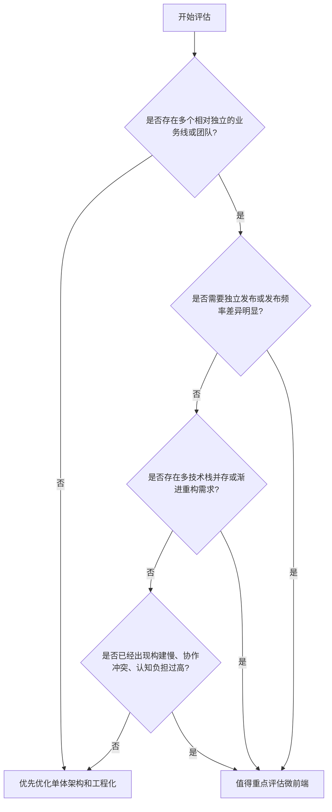
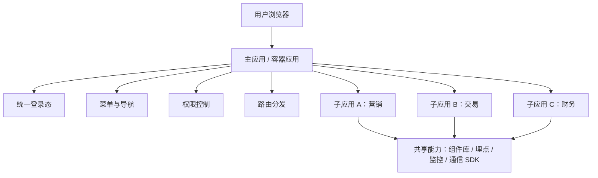

# 第一篇：为什么要微前端？——前端架构演进之路

**核心要点：**

- 单体前端应用常见的核心困境：代码量持续膨胀、构建时间越来越长、多人协作冲突频发
- 前端架构的典型演进路径：静态页面 -> jQuery 时代 -> MVC/MVVM 框架 -> 组件化单体应用 -> 微前端架构
- 微前端的核心理念：把大型前端系统拆分为可独立开发、测试、部署的子应用，再在用户侧形成统一体验
- 微前端解决的往往不只是技术问题，更是组织协作和交付效率问题
- 什么时候值得认真评估微前端：团队变大、业务线变多、技术栈并存、发布节奏差异明显、系统需要渐进式重构

## 开篇：什么是微前端

如果用一句大白话来解释，微前端就是：**把一个大型前端系统拆成多个相对独立的子应用，让它们可以独立开发、独立测试、独立部署，但在用户眼里仍然像一个完整系统。**

很多人第一次接触微前端时，会把它理解成“把多个前端项目放到一个浏览器标签页里”。这个理解不算错，但还不够完整。更准确地说，微前端强调的是：

- 按业务边界拆分系统，而不是按页面随意拆分
- 子应用之间具备相对独立的研发和发布能力
- 主应用负责统一入口、导航、权限、登录态、路由分发等基础能力
- 用户操作时感知到的是一个系统，而不是多个割裂的网站

它不一定要求所有子应用都使用不同技术栈，也不一定必须是独立仓库。`iframe`、路由分发、运行时集成等方式，都可以成为微前端落地方案的一部分。微前端的关键，不在于“形式像不像”，而在于**是否真正实现了业务边界清晰和交付能力解耦**。

## 为什么今天会讨论微前端

前端架构不是一开始就走向微前端的，它其实是随着业务复杂度和团队规模一步步演进过来的。

早期系统规模小、页面少、团队小，一个单体应用通常就够了。但随着业务线增多、团队人数增加、技术债务累积、交付频率提升，单体架构会逐渐暴露出边界模糊、协作低效、升级困难的问题。微前端就是在这个背景下被推到台前的。

## 一、微前端解决了哪些问题

我这里列两个真实的生产案例，看看它在实际业务中解决的到底是什么问题。

### 案例一：多业务线系统整合

一家大型保险中介公司，研发团队规模在 100 到 200 人之间，公司有十几条业务线。每个团队各自维护自己的管理后台，数据部分已经打通，但系统入口和界面彼此独立。处理一个跨业务流程，往往需要在多个后台之间来回切换。

更麻烦的是，像城市分公司的组织、产品、人员调整，往往要多个团队配合处理；新开一个城市，业务系统初始化甚至要花上个把月。这会直接影响公司的业务调整速度。于是公司提出了一个明确目标：把各个业务线整合到一个统一的平台中，打通数据，复用组织架构、角色和权限体系。

这时前端面临的核心问题，不是“页面怎么做得更漂亮”，而是：**如何在较短时间内，把多个已有系统整合为一个统一入口的业务平台。**

当时大多数管理后台是 Vue 2，也有少部分不是前后端分离的系统，比如 JSP、Laravel。时间大概在 2021 年左右，市面上已经有 `qiankun`、无界等方案。但从改造成本、边界控制、时间要求和团队熟悉度综合考虑，最后采用的是 `iframe` 方式接入。

这里要强调一点：`iframe` 不等于“不是微前端”。如果它背后承载的是统一入口、权限整合、登录态共享和子系统协同，那它依然是在解决典型的微前端问题，只是实现路径更偏工程权衡。

最终做法是：

- 新增一个父容器应用，承载统一入口
- 提供子项目模板，供各业务线按规范接入
- 统一处理登录状态获取
- 约定父子应用之间的事件通信方式

这个方案的价值，不是追求“技术最先进”，而是以更低改造成本，快速完成多个系统的统一整合。

### 案例二：单体后台的拆分与渐进升级

另一家公司是口腔门诊连锁企业，研发团队规模在 20 到 30 人之间，线下有 80 多家门诊。公司核心是一套门诊接诊业务系统，里面包含市场营销、患者接诊、医护看诊、物料管理、财务结算、第三方报表等大量业务模块，几乎所有业务都堆在这一个管理后台里。

这个项目最初由外包交付，后来团队接手自研迭代。接手后首先遇到的是两个典型问题：

1. 代码体量很大，用工具统计过，已经超过 50 万行，接近 2000 个文件，上手成本很高
2. 内部代码结构混乱，技术版本陈旧，编译和发版时间常常在 10 分钟以上

更关键的是，这还不是一个已经稳定封板的系统。它后面还要继续接入市场、财务、人事、报表等新模块。也就是说，代码量还会继续增长，构建时间还会继续增加，大家继续在一个项目里并行开发，代码冲突、联调成本、统一发版和统一回滚的压力都会持续上升。

随着公司发展，业务还会进一步拆给不同团队负责，也可能接入其他部门系统或第三方系统。这时候，单体架构带来的问题已经不只是“有点乱”，而是会持续拖累后续业务扩展。

更现实的一点是，这种项目想整体做架构升级，比如从 Vue 2 一次性升级到 Vue 3，基本不可行。原因不是“不能改”，而是业务面太大、影响范围太广、公共组件牵一发而动全身，回归测试成本极高，任何改动都会让团队束手束脚。

在这样的背景下，我引入了微前端方案，接入 `qiankun`，并约定了三件事：

1. 新增的、相对独立的大业务模块，可以直接用 Vue 3 新开项目接入
2. 老系统先按业务性质拆出 3 个独立项目，拆仓拆包，但暂时不做整体架构升级
3. 搭建私有 npm 仓库，沉淀跨项目复用的公共组件

这样做之后，后面无论公司继续拆分业务，还是组合业务，都还能沿着这套体系继续演进。系统升级不再意味着“停掉业务重写”，而是可以在业务持续运行的前提下，逐步替换和扩展。

### 这两个案例背后的共同点

表面上看，一个案例解决的是“多系统整合”，另一个案例解决的是“单体系统拆分”。但它们背后的共性很明显：

- 系统规模已经超出单体前端的舒适区
- 业务边界已经开始清晰，但技术边界还没有跟上
- 团队协作方式和交付节奏，已经不适合继续被一个单体项目绑定
- 后续演进需要的是渐进式改造，而不是一次性推倒重来

这也是为什么我更倾向于把微前端理解为：**用前端架构去匹配真实的业务边界和组织结构。**

## 二、微前端又带来了哪些问题

微前端不是没有代价。它解决了一些问题，也会引入新的复杂度。如果只看优点，不看成本，最后大概率会踩坑。

### 1. 拆分颗粒度和责任边界更难把控

系统到底应该按什么维度拆，是按菜单拆、按团队拆、按领域拆，还是按发布频率拆？这个问题没有标准答案。拆得太细，通信和治理成本会直线上升；拆得太粗，又失去了微前端的意义。

更进一步说，微前端不是把一个大项目拆成多个小项目那么简单，它要求团队先回答清楚：**谁负责什么，边界在哪里，公共能力归谁维护。**

### 2. 首屏加载和切换体验会更敏感

无论是 Vue 还是 React，只要子应用是按需加载的，首次进入某个子系统就不可避免会有资源拉取、运行时初始化、样式注入等开销。用户会明显感知到：“为什么这个菜单打开要等一下？”

如果主应用和子应用都比较重，又没有做好预加载、缓存、公共依赖抽离，体验就会很容易从“统一系统”变成“统一入口下的多次白屏”。

### 3. 状态管理和跨应用通信复杂度会上升

单体应用里，一个全局状态中心往往就够用了。但到了微前端场景，哪些状态属于主应用，哪些属于子应用，哪些可以共享，哪些必须隔离，就都需要重新设计。

如果边界不清，问题会很快出现：登录态同步混乱、菜单与路由联动异常、父子应用事件难追踪、联调时问题定位困难。很多团队引入微前端后，真正痛苦的地方往往不是“怎么接入”，而是“怎么把跨应用协作长期维护下去”。

### 4. 监控、日志和版本回归规则必须重建

单体应用出问题时，排查链路相对单纯。微前端里，一个页面异常，可能涉及主应用、子应用、公共 SDK、网关配置甚至发布策略。

这意味着你不能只关心“功能能不能跑起来”，还要补齐：

- 统一埋点与日志追踪
- 子应用版本标识与回滚机制
- 主子应用兼容性约束
- 发布窗口和联动变更规则

如果没有这些治理配套，微前端会把原来集中在一个系统里的问题，分散到多个系统里放大出来。

## 先别急着上微前端

很多团队一遇到构建慢、代码乱、组件复用差，就开始讨论微前端。但这些问题，并不一定都要靠微前端解决。

如果你的问题主要是下面这些：

- 工程规范混乱
- 组件库没有沉淀
- 仓库管理方式落后
- CI/CD 流程不完善
- 权限、路由、菜单设计本身就混乱

那更优先的事情通常不是“上微前端”，而是先把基础工程化补齐。否则只是把一个治理不好的单体，拆成多个治理不好的小单体。

## 三、微前端要不要引入现在的团队项目

微前端不是“好不好”的技术，而是“适不适合”的方案。下面这组数据是我自己做项目评估时常用的经验值，不是行业统一标准，但可以作为比较直观的参考。

我建议从以下四个维度逐层评估。只要有一个维度已经明显进入红色区间，就值得认真评估微前端；如果所有维度都处于绿色区间，那大概率属于过度设计。

#### 维度一：团队规模与组织架构（最核心）

| 指标      | 绿色（不建议）  | 黄色（可考虑）    | 红色（强烈建议） |
| ------- | -------- | ---------- | -------- |
| 前端团队人数  | < 15 人   | 15 \~ 30 人 | > 30 人   |
| 独立业务线团队 | 1 个      | 2 \~ 3 个   | >= 4 个   |
| 跨团队协作频率 | 每天对齐     | 每周对齐       | 几乎不交流    |
| 代码仓库数量  | 1 \~ 2 个 | 3 \~ 5 个   | > 5 个    |

**核心判断逻辑：** 康威定律（Conway's Law）告诉我们，系统架构往往会复制组织的沟通结构。

如果你们 50 个前端分属 6 个业务团队，各自有独立的迭代节奏和发布周期，那么微前端往往就是组织结构在前端架构层面的自然投射。反过来，如果只是 10 个人一起维护一个后台系统，大家协作紧密、发布节奏一致，微前端只会增加额外复杂度。

**参考场景：** 某电商平台里，交易、营销、商家、供应链四个团队各 10 到 15 人，发布频率差异很大。引入微前端后，各团队可以各自推进、各自交付，这就是典型的组织驱动型架构演进。

#### 维度二：业务复杂度的量化评估

| 指标      | 绿色（不建议） | 黄色（可考虑）     | 红色（强烈建议） |
| ------- | ------- | ----------- | -------- |
| 前端页面总数  | < 30 页  | 30 \~ 80 页  | > 80 页   |
| 独立业务模块数 | < 5 个   | 5 \~ 10 个   | > 10 个   |
| 代码总行数   | < 20 万行 | 20 \~ 50 万行 | > 50 万行  |
| 构建时间    | < 5 分钟  | 5 \~ 15 分钟  | > 15 分钟  |

**核心判断逻辑：** 当代码量和构建时间增长到一定程度后，单体应用的研发效率会开始明显下降。人越多，不一定做得越快，反而可能因为认知成本和协作成本一起上升而变慢。

如果你们的核心后台系统每次执行 `npm run build` 都要 20 分钟，开发一个功能要先理解整套路由和状态管理，新同事需要两周以上才能真正进入开发状态，这通常就意味着：系统复杂度已经超出了单体架构的舒适范围。

#### 维度三：技术债务与演进需求

| 指标                   | 绿色（不建议） | 黄色（可考虑） | 红色（强烈建议）  |
| -------------------- | ------- | ------- | --------- |
| 现存技术栈数量              | 1 种     | 2 种     | >= 3 种    |
| 是否有老旧框架（如 AngularJS） | 无       | 有，但计划替换 | 有，且无法整体替换 |
| 是否计划引入新框架            | 否       | 2 年内    | 正在进行      |
| 是否有渐进式重构需求           | 无       | 有部分     | 有强烈需求     |

**核心判断逻辑：** 微前端最大的独特价值之一，是支持渐进式重构。

当你面对一个五年前写成、体量巨大的旧系统时，整体重写通常意味着高投入、长周期和极高业务风险。但微前端允许你：

- 保留旧模块继续运行，不打断当前业务
- 新功能用新技术栈开发，并独立部署
- 以模块为单位逐步替换旧代码

它不是唯一的演进路线，但往往是**最实用、最容易和业务并行推进**的一类方案。如果团队正处在“旧系统不能停、新系统又必须上”的阶段，微前端会非常有吸引力。

**参考场景：** 某头部 SaaS 公司的管理后台，AngularJS、Backbone、React 三代技术栈并存，最后通过微前端完成了长达 3 年的渐进式迁移，旧代码逐步下线，用户基本无感知。

#### 维度四：发布频率与独立交付需求

| 指标          | 绿色（不建议） | 黄色（可考虑）  | 红色（强烈建议） |
| ----------- | ------- | -------- | -------- |
| 各模块发布频率差异   | < 2 倍   | 2 \~ 5 倍 | > 5 倍    |
| 是否有独立上线需求   | 无       | 部分模块     | 频繁存在     |
| 是否希望子团队自主发布 | 否       | 希望但暂无机制  | 强烈需求     |

**核心判断逻辑：** 如果模块 A 每天发布 3 次，模块 B 每月发布 1 次，把两者强行绑在一起发版，要么快的模块被拖慢，要么稳的模块被拖累。

微前端的价值之一，就是让发布节奏解耦。每个子应用可以拥有独立的 CI/CD 流水线，各自按需发布，而不是被整个大系统统一排队。

## 一张图看懂典型微前端架构

下面这个结构，它足够基础，也比较贴近大多数后台系统的落地方式。

你也可以把它理解成一套分层关系：

- 主应用负责“系统级能力”
- 子应用负责“业务级能力”
- 共享能力负责“跨项目复用与治理”

## 渐进式迁移路线图

对于很多老系统来说，微前端真正的价值，不是“从第一天就拆得很漂亮”，而是提供一条能走得下去的迁移路径。

这条路线的重点不是一次性完成，而是让系统在不断交付业务的同时，逐步走向更清晰的边界和更合理的治理结构。

## 总结：决策的核心逻辑

**不要为了解决局部技术问题而引入微前端，更应该为了解决组织协作和系统演进问题而引入微前端。**

微前端本质上是一种组织结构和业务边界在前端架构上的映射。当团队规模、业务复杂度、发布节奏和技术债务都达到一定程度时，它会成为一种自然选择。

但也要记住，微前端通常不是中小团队的起点。它往往建立在模块化、组件化、工程化、CI/CD、监控治理这些基础能力之上。如果这些基础还没有打稳，微前端很可能只是把原本的问题拆散，而不是解决掉。
