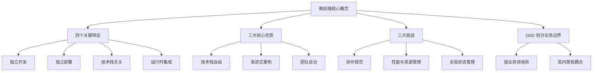
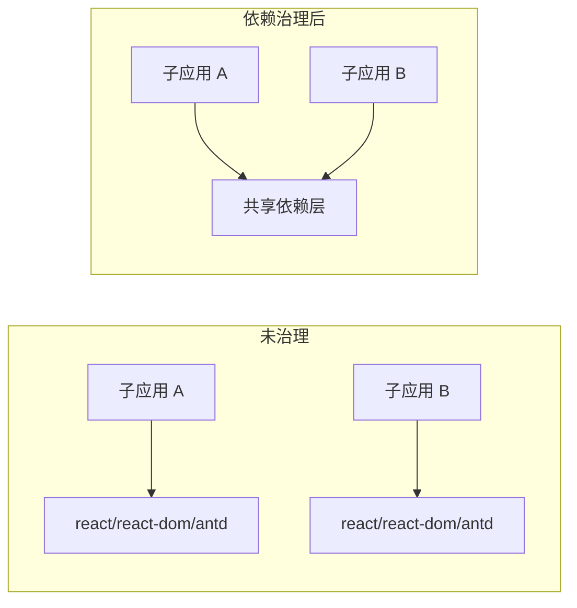
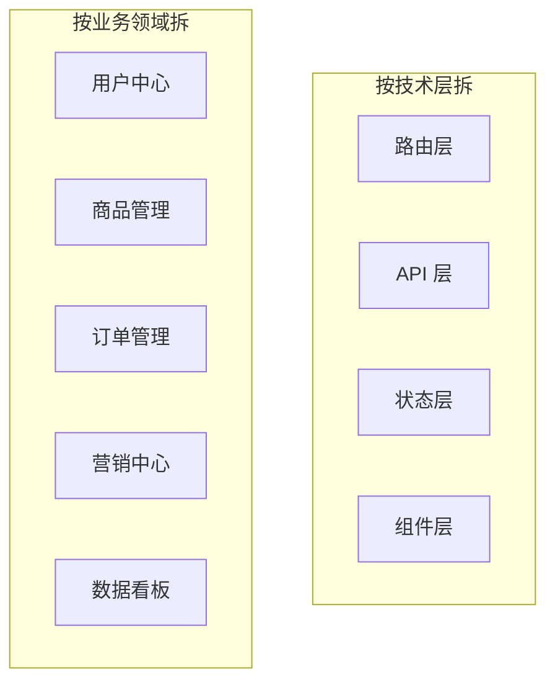

# 第二篇：微前端核心概念与设计理念

**核心要点：**

- 微前端的四个关键特征：独立开发、独立部署、技术栈无关、运行时集成
- 微前端的三大价值：技术栈自由、渐进式重构、团队自治
- 微前端落地时最常见的三类挑战：协作治理、性能与资源管理、跨应用状态管理
- 应用拆分优先按业务领域进行，而不是按技术层机械拆分

**这篇适合谁看：**

- 已经知道“微前端是什么”，但还没真正建立起概念框架的前端同学
- 正在评估 `qiankun`、`Module Federation`、`无界（Wujie）` 等方案的技术负责人
- 想从架构原则出发，而不是只记工具用法的同学

## 开篇：先建立一张完整地图

如果说第一篇回答的是“为什么会有微前端”，那这一篇要解决的，就是“到底该怎么理解微前端”。

我们继续往前走一步，把三个更核心的问题讲清楚：

- 微前端到底有哪些关键特征
- 它为什么值得引入，又会带来哪些代价
- 业务系统应该按什么方式拆分，才不会“拆了等于没拆”

你可以先把微前端理解成一句话：**把一个大型前端系统拆成多个可以相对独立演进的子应用，再通过主应用把它们组织成一个统一系统。**

如果你想先建立一张完整地图，再进入细节，可以先看这张总览图：



## 一、微前端的四个关键特征

不同团队对微前端的定义会有细节差异，但在主流工程实践里，下面这四点通常是最关键的特征。

它们未必是教条式标准，却基本决定了一个系统是不是在朝真正的微前端方向演进。换句话说，工具可以不同，落地方式可以不同，但底层思路通常绕不开这几件事。

### 1. 独立开发

先看第一点：独立开发。

每个子应用拥有相对独立的代码仓库、依赖管理和开发环境。

这意味着，子应用 A 的开发者不需要拉取子应用 B 的代码，也不需要理解 B 的业务细节。他们更关心的是自己负责的业务边界，以及和主应用之间约定好的接入规范。

对团队来说，这种独立开发能力带来的最大价值，不是“项目分开了”，而是**认知负担被控制住了**。每个团队只需要对自己的领域负责，而不是每天都被整个大系统拖着跑。

### 2. 独立部署

第二点是独立部署。

每个子应用可以独立构建、独立发布、独立上线，不需要总是和其他子应用一起发版。

这也是微前端和很多传统前端系统最大的区别之一。多页应用（MPA）里的页面看起来也相互独立，但很多项目在工程层面仍然共享一套构建流程或发布流水线；而微前端更强调的是**交付能力解耦**。

说得更直接一点，子应用 A 发布了一个新版本，理论上不应该要求子应用 B 跟着重新构建、重新上线。只要主应用的接入契约没变，A 就可以按自己的节奏独立演进。

### 3. 技术栈无关

第三点是技术栈无关。

每个子应用可以根据场景选择合适的技术栈，主应用不必强行要求所有模块都使用同一套前端框架。

比如：

- 老模块继续维护在 AngularJS 或 Vue 2 上
- 新功能使用 React 18 + TypeScript 开发
- 活动或运营类页面采用 Vue + Vite，追求更快的交付速度

技术栈无关的真正价值，不是“为了炫技混用框架”，而是给系统保留**渐进式演进的空间**。老模块可以继续跑，新模块可以用更新的技术落地，二者不必互相绑死。

### 4. 运行时集成

第四点是运行时集成。

微前端的组合通常发生在浏览器端，也就是运行时，而不是在构建阶段提前打成一个整体。

这意味着，主应用在用户访问某个路由时，再按规则加载对应的子应用资源并完成挂载。只要接入协议稳定，某个子应用更新后，其他子应用通常不需要重新构建。

这里要注意：运行时集成带来的不只是“能拼起来”，还有一系列随之而来的机制问题——JS 沙箱、样式隔离、生命周期管理、资源调度。它们大多是把浏览器（iframe 场景）或单体内部天然处理好的事，重新在“同一个页面上下文”里手工补上；其中样式隔离会在第九篇专门展开。

下面这张图可以帮助理解“运行时集成”到底在浏览器里发生了什么：


如果你是第一次接触这个概念，可以先记住一句最朴素的话：**微前端不是先打成一个包再展示，而是先进入主应用，再按需把子应用“拼起来”。**

**顺带认识几个运行时概念。** 后面讲具体落地时，你会反复碰到几组词，这里先各用一句话对齐：

- **生命周期**：子应用暴露给主应用的启动、挂载、卸载钩子（通常命名为 `bootstrap` / `mount` / `unmount`），框架据此决定何时把子应用“放进来”、何时“清出去”
- **注册与加载**：主应用维护一张“注册表”，登记子应用的路由激活规则（如 `/user`），路由命中时再由加载器去拉取对应资源
- **入口形态**：HTML Entry 让框架拿到子应用 HTML 后自行解析其中的 JS/CSS；JS Entry 则是直接提供打包产物地址，通常需要配合 SystemJS / import map 这类机制解析

这些机制在不同框架里的具体实现差异，正是第四、五篇要展开的重点。

## 二、三大核心优势：为什么要用微前端

把基本概念对齐之后，接下来就要看一个更现实的问题：微前端到底值不值得做？

从工程实践看，它最核心的价值通常集中在下面三个方面。

### 1. 技术栈自由

先看最直观的一点：技术栈自由。

不同团队可以根据自己的业务特点选择更合适的技术方案。

- 面向运营的营销活动页用 jQuery 或轻量方案快速交付，追求几周内上线
- 数据报表、大屏这类可视化模块用 React + ECharts / D3.js 生态，发挥其渲染能力
- 核心交易链路继续沿用已被长期验证的稳定技术栈，等待渐进替换而不是推倒重来

技术栈自由的本质，不是鼓励堆叠框架，而是把“选什么技术”的决策权交还给最了解业务的团队：同样一个系统里，核心链路可以用最稳的方案，创新模块可以用最快的组合，两者各取所需、互不拖累。

### 2. 渐进式重构

再往下看，渐进式重构往往是微前端最独特、也最有现实意义的价值。

想象一个运行了 5 年的管理后台，已经有 30 万行代码，仍然跑在 AngularJS 上。你当然知道应该升级到 React 或 Vue 3，但问题不在于“知不知道该升级”，而在于**业务根本不允许你停下来重写一年**。

这时候，微前端提供的不是一套漂亮概念，而是一条更温和、更现实的演进路径：

| 阶段 | 做法 |
| --- | --- |
| 第一阶段 | 保留主应用，新功能直接用 React 开发，并作为独立子应用上线 |
| 第二阶段 | 旧功能按模块逐步迁移，每次只迁移一块业务 |
| 第三阶段 | 老的 AngularJS 模块陆续下线，系统完成整体替换 |

整个过程里，用户通常不需要感知到底层架构发生了什么变化，业务也不需要为了“一次性重构”而停摆。

### 3. 团队自治

最后一个优势，是团队自治。

每个子应用团队可以拥有更完整的研发控制权，包括：

- 技术选型自己定
- 代码仓库自己管
- 发布节奏自己定
- 测试流程自己维护

这背后其实很符合康威定律（Conway's Law）：**系统的架构，往往会复制组织的沟通结构。**

如果一个系统本来就由 4 个相对独立的业务团队分别负责，那么让前端架构也体现这种边界，通常会比所有人继续挤在一个单体项目里更自然。微前端的价值之一，就是让代码结构和组织结构尽可能对齐。

## 三、三大挑战：微前端不是没有代价

聊完优势，也得把代价讲清楚。

第一篇在“微前端又带来了哪些问题”里，按“会踩到什么坑”的角度列了四类问题（拆分颗粒度、首屏与切换体验、状态与通信、监控治理）；这里我们换个角度，按“长期运行最需要治理的对象”把它们重新收敛成三类：协作与规范、性能与资源、状态与通信。监控、回滚这类配套不在其中单列，因为它们会分散到每一类里反复出现。

微前端能解决很多问题，但它从来不是“拆开就轻松了”。相反，它会把原本被单体系统掩盖的一些问题，直接暴露出来。

### 1. 跨团队协作规范

先看最容易被忽略的一类问题：协作规范。

代码可以拆开，但用户体验不能拆开。

如果子应用 A 使用 Ant Design，子应用 B 使用 Element Plus，颜色、间距、弹窗行为和表单风格都不一样，用户很容易感知到系统是“拼起来的”。这时候你就需要有一套统一的设计系统（Design System），去约束颜色、字体、间距、组件样式和交互语言。

更棘手的是组件库版本漂移。A 升了组件库，B 没升，同一个弹窗在两个子应用里的行为可能都不一致。常见做法包括：

- 用 Monorepo 统一维护基础 UI 组件包
- 建立公共的设计令牌和样式规范
- 抽出共享的“UI 基座”或组件能力层

微前端拆开的不只是代码，也把“治理能力够不够”这个问题摆到了台面上。

### 2. 性能与资源管理

第二类问题，是性能与资源管理。

每个子应用独立加载，最常见的问题就是重复加载公共依赖。

例如，子应用 A 和子应用 B 都各自打包了 `react`、`react-dom` 和 `antd`，用户实际下载的体积可能会被放大很多：

```text
// 子应用 A 的产物
app-a.js: 包含 react + react-dom + antd（约 800KB）

// 子应用 B 的产物
app-b.js: 包含 react + react-dom + antd（约 800KB）

// 用户总共下载了 1.6MB，其中很大一部分是重复内容
```

这时候就需要做依赖治理。`Module Federation` 的 `shared` 是一种很常见的实现方式（下面是省略了 `name`、`filename`、`exposes` 等选项的**配置片段**，只示意 `shared` 的写法）：

```javascript
new ModuleFederationPlugin({
  shared: {
    react: { singleton: true, requiredVersion: '^18.0.0' },
    'react-dom': { singleton: true, requiredVersion: '^18.0.0' }
  }
})
```

这两个选项背后是一套**运行时版本协商**：`singleton: true` 表示整个运行时只保留一份共享依赖（例如只加载一个 React），当各子应用要求的版本不一致时取较高版本，并对低版本的一方告警；`requiredVersion` 则用于声明“低于这个版本不可用”的版本下限。所谓“共享依赖避免重复下载”，靠的正是这种协商，而不是构建期强行合并。

当然，`shared` 不是唯一方案。根据具体架构，你也可以通过外部依赖抽离、CDN 复用、预加载、缓存策略和资源拆包来降低重复下载和初始化开销。核心目标只有一个：**避免每个子应用都把公共依赖重新带一遍。**

这张图可以直观看出问题和优化方向：



### 3. 全局状态管理

第三类问题，是全局状态管理。

子应用之间经常需要共享登录态、权限信息、主题设置、租户信息等全局状态。这类信息如果完全不共享，系统就无法形成统一体验；但如果共享方式太随意，后期维护会非常痛苦。

最简单粗暴的方式，是直接把共享状态挂在 `window` 上：

```javascript
// 主应用写入
window.__GLOBAL_STORE__ = {
  user: { name: '张三', roles: ['admin'] }
};

// 子应用读取
const user = window.__GLOBAL_STORE__.user;
```

这种方式不是完全不能用，但它的问题非常明显：

- 状态修改来源不清楚
- 变更时机难以追踪
- 调试和回溯成本很高

更常见、也更稳妥的做法，是由主应用提供统一的共享上下文或通信容器，子应用通过约定接口读写状态、订阅变化：

```javascript
// 主应用维护共享状态
const globalStore = createGlobalStore({
  user: { name: '张三', roles: ['admin'] }
});

// 主应用挂载子应用时传入
mount({
  globalStore
});

// 子应用读取状态
const user = globalStore.get('user');

// 子应用订阅变化
globalStore.subscribe('user', (nextUser) => {
  // 更新本地状态
});
```

这里的 `createGlobalStore` 不一定是某个固定库，也可以是你们自己的状态容器、事件总线或者轻量通信层。关键不在于 API 长什么样，而在于：**状态共享必须可追踪、可约束、可调试。**

## 四、如何划分边界：DDD 来帮忙

到这里，其实就会自然碰到一个更关键的问题：既然要拆，那到底该怎么拆？

引入微前端之后，最难的问题通常不是“怎么接入”，而是“到底该怎么拆”。

这里我更推荐借助领域驱动设计（Domain-Driven Design，DDD）的思路来做拆分。它最核心的一句话是：**优先按业务领域划分边界，而不是按技术层划分边界。**

说得更精确一点，DDD 里的“领域”对应的是**限界上下文（Bounded Context）**——把每个业务域建模为一块有清晰边界、内部使用统一语言（Ubiquitous Language）的范围，跨上下文之间的通信只发生在边界上的少量接口。微前端里的“子应用边界”，本质上就是在技术侧复刻这套上下文边界；借用 DDD，是为了让“拆哪里、不拆哪里”有据可依，而不是凭感觉随手切。

### 错误的拆法：按技术层拆

很多团队第一次做拆分时，都会下意识地往“技术分层”上靠：

```text
- 公共组件库（所有模块共享）
- 路由层（集中管理所有路由）
- API 层（所有接口调用）
- 状态层（Redux store 全量）
```

看起来拆开了，实际上业务改动还是要跨多个仓库、多个子应用一起配合。一个订单功能的修改，依然可能牵动路由层、接口层、状态层和展示层。结果就是：**系统被拆散了，业务却没有真正解耦。**

### 更合理的拆法：按业务领域拆

更合理的思路，是直接围绕业务领域来拆。

以一个电商后台为例，通常会更接近下面这种结构：

```text
├── 用户中心（User Center）
│   └── 包含：登录、注册、个人资料、权限管理
├── 商品管理（Product Management）
│   └── 包含：商品列表、商品详情、分类管理、库存管理
├── 订单管理（Order Management）
│   └── 包含：订单列表、订单详情、售后处理、物流追踪
├── 营销中心（Marketing Center）
│   └── 包含：优惠券、满减活动、拼团、秒杀
└── 数据看板（Dashboard）
    └── 包含：销售报表、用户画像、实时数据
```

判断这类划分是否合理，可以看三个标准：

- 子应用内部功能要高内聚
- 子应用之间的依赖要尽量低耦合
- 跨应用通信应该是少量、明确、可约束的

如果两个子应用天天高频通信、彼此大量依赖对方的数据结构和页面行为，那往往说明边界划分得还不够好。边界拆错也不必推倒重来：可以先在上下文之间加一层防腐层（Anti-Corruption Layer，ACL）把上下游隔离开，等时机成熟再逐步收敛边界、重新归并子应用。

下面这张图可以作为“按技术层拆”和“按业务域拆”的直观对比：



落到代码层面，按业务域拆分后，每个子应用往往对应一个独立入口：

```javascript
// 示意代码：qiankun 采用 HTML Entry，entry 应指向子应用的 HTML 访问地址，
// 而不是打包产物 URL；container 必填，注册完成后还要调用 start() 启动
import { registerMicroApps, start } from 'qiankun';

registerMicroApps([
  { name: 'user-center', entry: '//cdn.com/user-center/', container: '#subapp-container', activeRule: '/user' },
  { name: 'product-mgmt', entry: '//cdn.com/product-mgmt/', container: '#subapp-container', activeRule: '/product' },
  { name: 'order-mgmt', entry: '//cdn.com/order-mgmt/', container: '#subapp-container', activeRule: '/order' },
  { name: 'marketing', entry: '//cdn.com/marketing/', container: '#subapp-container', activeRule: '/marketing' },
  { name: 'dashboard', entry: '//cdn.com/dashboard/', container: '#subapp-container', activeRule: '/dashboard' }
]);

start();
```

这里的路由前缀 `activeRule`，其实就天然形成了业务子域之间的边界。每个子应用都可以围绕自己的业务路径独立开发、独立发布，而不是继续被一个超级单体项目绑在一起。

顺带说明示例里的几个要点：`entry` 指向子应用的 HTML 地址（即 HTML Entry），qiankun 会拉取 HTML 后自行解析其中的 JS/CSS；子应用还需要导出 `bootstrap`/`mount`/`unmount` 生命周期，注册后调用 `start()`，路由命中时 qiankun 才会把子应用挂载到 `container`。这套机制的细节，第四篇会展开。

## 小结：先理解原则，再谈工具选型

写到这里，其实可以把整篇文章收束成一句话：很多人一提微前端，马上想到的是 `qiankun`、`Module Federation`、`无界（Wujie）`，但这些本质上都只是实现手段。真正决定一个方案能不能落地的，还是前面这几件事：

- 你有没有明确独立开发和独立部署的目标
- 你是否真的需要技术栈共存和渐进式重构
- 你有没有能力处理治理、性能和跨应用通信带来的复杂度
- 你是不是按业务边界在拆，而不是按技术层“看起来很工整地拆”

如果这几件事想清楚了，工具选型反而会容易很多。

下一篇我们就继续往下走，专门聊主流微前端方案的差异、适用场景，以及它们各自的优缺点。
