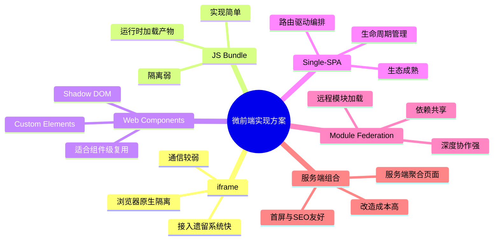
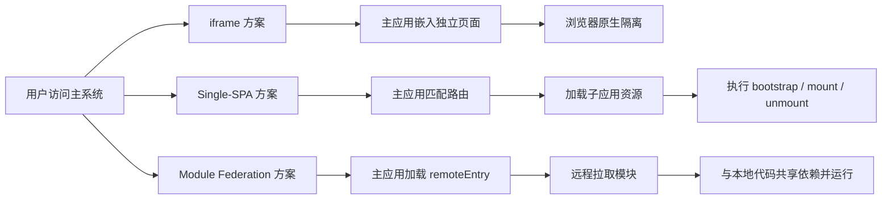
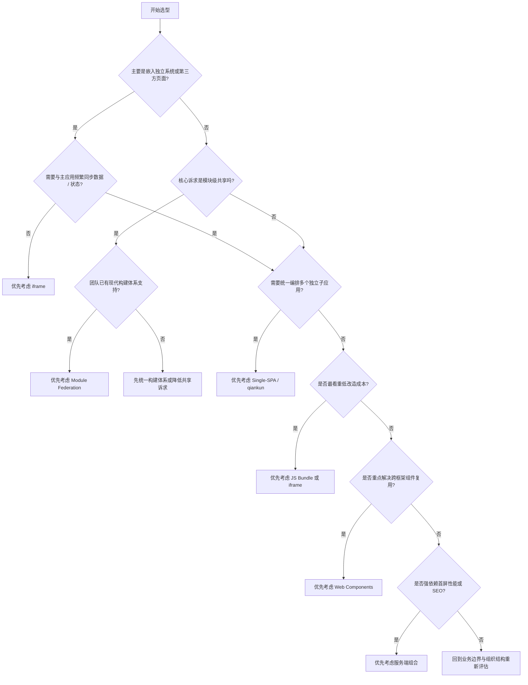

# 第三篇：微前端实现方案全景对比与选型建议

**核心要点：**

- 六大实现方式横向对比：`iframe`、JS Bundle、Web Components、Single-SPA、Module Federation、服务端组合
- 三类典型方案重点分析：
  - `iframe`：隔离性最强，改造成本最低，但用户体验和通信能力受限
  - Single-SPA：生态成熟，编排能力强，但需要额外解决 JS/CSS 隔离问题
  - Module Federation：依赖共享机制优秀，工程协作能力强，但更依赖现代构建体系
- 各方案在隔离性、通信效率、改造成本和工程复杂度几个维度上的差异，决定了它们适合不同类型的团队和项目阶段
- JS Bundle 更适合作为过渡型方案来看；Web Components 和服务端组合更适合作为补充方案，用来解决特定场景问题
- 如何根据团队现状，选择更适合自己的微前端落地方案

**这篇适合谁看：**

- 已经理解微前端基本概念，但还不清楚不同方案差异的前端同学
- 正在评估 `qiankun`、`Module Federation`、`micro-app` 等方案的技术负责人
- 希望从业务场景和工程约束出发做选型，而不是只看框架热度的团队

## 一、开篇：条条大路通罗马，但每条路的路况不同

如果说前两篇主要回答的是“为什么要做微前端”和“微前端到底是什么”，那这一篇要解决的问题就是：**微前端到底该怎么落地。**

微前端是一种“将多个前端应用组合成一个整体”的架构思想，但它从来不只对应一种实现方式。你可以把它理解成从北京到上海的多种交通方案: 坐飞机、坐高铁、自驾，甚至骑行，都能到，但它们在时间、成本、舒适度和适用人群上完全不同。

微前端方案也是一样。有的方案强调**隔离性**，尽量让子应用互不干扰；有的方案强调**协作效率**，让模块之间像本地代码一样协同；还有的方案强调**改造成本**，希望尽量少动现有系统就能接入。

所以，方案选型的关键从来不是“谁最先进”，而是“谁更适合当前团队的业务约束和演进阶段”。

在正式展开之前，你可以先用下面这张脑图建立一个全局印象：




## 二、六大方案全景概览

先看结论版全景表。它的作用不是替你直接做决定，而是帮你先建立一套比较坐标。

| 方案 | 核心思路 | 隔离性 | 通信效率 | 改造成本 | 工程复杂度 | 性能 | 适用场景 |
| :--- | :--- | :--- | :--- | :--- | :--- | :--- | :--- |
| **iframe** | 用浏览器原生隔离机制加载独立页面 | ⭐⭐⭐⭐⭐ | ⭐⭐ | ⭐⭐⭐⭐⭐ | ⭐⭐⭐⭐⭐ | ⭐⭐ | 第三方页面嵌入、遗留系统快速接入 |
| **JS Bundle** | 主应用在运行时按需加载子应用产物 | ⭐ | ⭐⭐⭐⭐⭐ | ⭐⭐⭐ | ⭐⭐⭐ | ⭐⭐⭐⭐ | 简单模块拆分、无需强隔离 |
| **Web Components** | 用浏览器原生自定义元素封装组件 | ⭐⭐⭐ | ⭐⭐⭐ | ⭐⭐ | ⭐⭐⭐⭐ | ⭐⭐⭐⭐ | 组件级复用、框架无关的 UI 能力封装 |
| **Single-SPA** | 路由驱动子应用生命周期管理 | ⭐⭐ | ⭐⭐⭐⭐ | ⭐⭐ | ⭐⭐⭐ | ⭐⭐⭐ | 中大型项目的统一编排方案 |
| **Module Federation** | 运行时远程加载模块并共享依赖 | ⭐⭐ | ⭐⭐⭐⭐⭐ | ⭐⭐ | ⭐⭐⭐ | ⭐⭐⭐⭐ | 模块级共享、深度集成需求 |
| **服务端组合** | 服务端聚合 HTML 片段后整体返回 | ⭐⭐ | ⭐⭐ | ⭐ | ⭐ | ⭐⭐⭐⭐⭐ | 首屏性能要求高、SEO 场景 |

> **图例说明**：星级越高代表在该维度上表现越好（⭐=较差，⭐⭐⭐=中等，⭐⭐⭐⭐⭐=优秀）。
>
> 注 1：这里的“通信效率”指子应用之间共享数据、调用能力和保持实时同步的难易程度；“改造成本”指把现有系统迁移到该方案的工作量高低（星越多代表改造成本越低）。
>
> 注 2：“隔离性”按**运行时应用级隔离**的口径评价，即子应用的 JS 全局环境、DOM 和样式是否真正被隔开。`iframe` 靠独立浏览上下文实现“硬隔离”，所以星级最高；Single-SPA、Module Federation 都运行在同一个页面上下文里，属于需要自己补沙箱的“软隔离”，因此星级较低；Web Components 的 Shadow DOM 只隔离样式不隔离 JS，介于两者之间（机制差异见“三类典型方案重点分析”一节开头）。
>
> 注 3：“工程复杂度”指生命周期管理、依赖治理、资源调度、故障排查等长期维护成本，星越多代表复杂度越低、越省心——所以 `iframe` 最高、服务端组合最低。“性能”指首屏与运行期资源效率，星越多代表性能越好。

理解这张表时，建议优先盯住四个问题：

- 你最在意的是不是“隔离”，也就是一个子应用出问题时，是否容易影响其他子应用
- 你是不是需要高频通信，比如共享状态、共享组件、共享依赖
- 你的系统是不是存量系统很多，必须优先考虑改造成本
- 你的团队是不是已经被某种构建体系、部署方式或组织结构绑定住了

上面的“工程复杂度”是一个容易被低估的分数：它不像隔离性或通信效率那样立竿见影，却贯穿在很多判断里——生命周期要不要自己管、依赖版本怎么治理、资源加载和卸载怎么兜底、出问题后排查链路长不长。很多方案表面上“能跑”，真正把它长期跑稳，差别往往就在这里。

顺着这四个问题看，后面的选型就会顺很多。

**路线与代表框架怎么对应？** 全景表里梳理的是“路线”，而你日常纠结的往往是具体“框架/产物”。二者大致可以这样对应：

| 路线 | 代表框架 / 形态 | 后文 |
| :--- | :--- | :--- |
| 路由编排（Single-SPA 系） | single-spa、qiankun | 第 4、5 篇 |
| 类 Web Components（自定义元素壳） | micro-app | 第 7 篇 |
| iframe 沙箱增强 | wujie | 第 7 篇 |
| Module Federation（运行时模块共享） | webpack 5 / rspack 等现代构建体系的 MF | 第 6 篇 |
| JS Bundle / 原生 ESM 加载 | SystemJS、import map、Vite 生态 | 番外篇二 |

把“路线”和“框架名”分开记，选型时就不容易被“谁比谁火”带偏，也方便回查对应篇目。

另外要说明的是，六大路线之外还有两条常被提到的演进方向：一是原生 ESM / import map 体系（SystemJS、Vite 生态里都在探索），二是 npm 包/组件共享（把可复用能力发布为私有包，按版本依赖）。它们更适合模块级共享场景，本系列会在番外篇继续展开。

## 三、三类典型方案重点分析

六类方案里，真正最常进入团队正式候选名单、也最值得重点展开的，通常还是 `iframe`、`Single-SPA` 和 `Module Federation`。它们分别代表了“强隔离嵌入”“统一编排”“模块级协作”三种主流落地思路。

先看一张运行方式对比图：



在展开三个方案之前，先建立一个贯穿全篇的机制坐标：**隔离可以分为“上下文级硬隔离”和“同上下文软隔离”。** `iframe` 属于前者——子应用跑在独立的 `window`/`document` 里，浏览器替你划死了边界；但也正因为隔着上下文，数据同步只能走 `postMessage` 这类显式通道，通信和体验成本天然更高。Single-SPA、Module Federation 这类同上下文方案属于后者——大家共用一个 `window`，隔离靠 JS 沙箱和 CSS 作用域在“软件层面”模拟，接入成本低、通信接近本地调用；可任何在同一个 `window` 上模拟出来的隔离都天然存在逃逸面（未代理的对象、原型链、事件系统都可能漏出去）。这也是“强隔离”和“低通信/体验成本”常常互为跷跷板的原因，也是前面表格里 Single-SPA、Module Federation 隔离星级低于 `iframe` 的根源所在。JS 沙箱为什么封不住、又要怎么防逃逸，第四篇会展开；样式层究竟能隔离到什么程度，第九篇会专门讲。

### 方案一：iframe，最直接的“物理隔离”

#### 原理说明

`iframe` 是浏览器原生提供的嵌入机制。每个 `iframe` 都有独立的浏览上下文，包括自己的 `window`、`document`、路由历史和脚本执行环境。你可以把它理解成“在一个页面里再开一个小页面”。

```html
<!-- 主页面 -->
<iframe src="https://app-a.example.com/dashboard"></iframe>
```

这意味着什么？意味着你几乎不用额外设计隔离机制，浏览器已经天然帮你把 DOM、CSS 和大部分 JavaScript 运行环境隔开了。

#### 优缺点分析

**优点：**

- 隔离性最强，浏览器原生机制就能提供很好的边界
- 改造成本最低，任何可以独立访问的站点理论上都能嵌进去
- 样式、脚本和 DOM 基本互不干扰，尤其适合接入历史系统或第三方系统

**缺点：**

- 用户体验一般：滚动条、弹窗层级、页面自适应等细节很容易露出“拼接感”
- 路由和状态天然不容易与主应用保持一致，刷新、前进后退和深链接管理都更麻烦
- 通信依赖 `postMessage` 等机制，简单场景还好，复杂场景会迅速变重
- 每次加载本质上都是重新初始化一个完整页面，资源利用率通常不高

```javascript
// 主页面监听 iframe 消息
window.addEventListener('message', (event) => {
  if (event.origin !== 'https://app-a.example.com') return;

  if (event.data.type === 'USER_LOGOUT') {
    // 处理退出登录
  }
});

// iframe 内部发送消息
window.parent.postMessage(
  { type: 'USER_LOGOUT' },
  'https://main-app.com'
);
```

#### 场景案例

某电商平台的卖家后台，需要嵌入第三方物流查询页面。由于第三方页面完全独立，不需要和主应用共享组件、状态或复杂交互，这时 `iframe` 往往是最现实的选择。

但如果你希望两个页面之间频繁同步数据，例如实时刷新商品信息、共享登录态变化、联动筛选条件，那么 `iframe` 的通信和体验问题就会迅速放大。

### 方案二：Single-SPA，微前端编排框架的经典方案

#### 原理说明

`Single-SPA` 是微前端领域最早成熟起来的一类编排框架。它解决的核心问题不是“隔离”，而是“**如何把多个子应用有序地组织在一起**”。

它的基本思路可以概括成三步：

1. 主应用定义路由规则，决定什么 URL 激活哪个子应用
2. 子应用暴露统一的生命周期，如 `bootstrap`、`mount`、`unmount`
3. 路由变化时，由框架负责调度对应生命周期

换句话说，谁来加载、谁来卸载、子应用异常时如何兜底，都由这套注册与调度机制统一负责——这正是“编排”区别于 JS Bundle 手写拼装的地方（qiankun 对这套机制的封装细节见第四、五篇）。

```javascript
// 示意代码：对象式 registerApplication 需要 single-spa v5.6+。
// 加载函数直接写“远程 URL 的动态 import”并不能被常规打包器编译，
// 官方做法是配合 import map + SystemJS，用 System.import 解析裸模块名。
import { registerApplication, start } from 'single-spa';

registerApplication({
  name: 'app-react',
  app: () => System.import('app-react'), // app-react 在 import map 中映射到真实产物地址
  activeWhen: ['/react']
});

start();
```

如果说 `iframe` 是“把页面塞进来”，那 `Single-SPA` 更像是“有一个总调度台，根据路由按规则装载和卸载子应用”。

#### 优缺点分析

**优点：**

- 生态成熟，概念体系和工程实践都比较清晰
- 不强绑定前端框架，React、Vue、Angular 都可以接入
- 适合渐进式迁移，尤其适合把存量系统逐步接入统一基座

**缺点：**

- 它本身更偏“编排层”，并不直接提供完整的 JS 沙箱和 CSS 沙箱
- 样式隔离、全局变量污染、公共依赖治理等问题，仍需要额外设计
- 对新手来说，需要先理解生命周期、注册机制、路由激活等概念

需要特别说明的是：`qiankun` 的底层建立在 `single-spa` 之上，并进一步补充了沙箱、样式隔离和工程接入能力；而 `micro-app` 采用的是另一套实现思路，它和 `qiankun` 都是常见落地方案，但不能简单地都归为“基于 Single-SPA”。

#### 场景案例

某 SaaS 公司有 20 多个子应用，分别用 React、Vue、Angular 开发。团队希望统一入口、统一路由、统一接入规范，同时保留各子应用独立开发和独立部署能力。

这类场景下，`Single-SPA` 作为编排基座非常合适。它让主应用像调度中心一样管理所有子应用，而不是让各个系统各自为战。

### 方案三：Module Federation，模块协作能力最强的方案

#### 原理说明

`Module Federation` 是 Webpack 5 引入的运行时模块共享机制。它允许一个应用在运行时从另一个应用加载模块，并且可以共享依赖。

这件事真正厉害的地方在于：它不只是“加载一个远程页面”，而是“像使用本地模块一样使用远程模块”。

```javascript
// 子应用（提供方）
new ModuleFederationPlugin({
  name: 'app_a',
  filename: 'remoteEntry.js',
  exposes: {
    './Header': './src/Header',
    './store': './src/store'
  },
  shared: {
    react: { singleton: true },
    'react-dom': { singleton: true }
  }
});

// 主应用（消费方）
new ModuleFederationPlugin({
  name: 'host',
  remotes: {
    app_a: 'app_a@http://localhost:3001/remoteEntry.js'
  },
  shared: {
    react: { singleton: true },
    'react-dom': { singleton: true }
  }
});

const Header = React.lazy(() => import('app_a/Header'));
```

这段配置里的 `shared` 背后是一套**运行时版本协商**机制：`singleton: true` 表示整个运行时只保留一份共享副本（例如只加载一个 React），当多个应用要求的版本不一致时取较高版本，并对低版本的一方给出告警；`requiredVersion` 则用于声明“低于这个版本不可用”的下限。所谓“像使用本地模块一样使用远程模块”，靠的并不是构建期把代码合并到一起，而是运行时按需拉取 + 依赖协商——远程模块天然是异步加载的，宿主应用只需像对待本地模块一样正常 `import` 它即可。

#### 优缺点分析

**优点：**

- 依赖共享能力很强，能有效减少重复打包和重复加载
- 模块协作非常顺滑，远程模块在使用体验上接近本地模块
- 对需要共享组件、工具库、状态能力的场景非常友好

**缺点：**

- 隔离性较弱，多个模块仍然运行在同一个页面上下文中
- 依赖共享带来额外的版本协商成本，公共依赖管理需要更谨慎
- 它与现代构建体系结合很深，虽然现在也有其他生态的实现方案，但工程细节仍需仔细评估

#### 场景案例

某大型设计工具的插件系统，需要让插件与主应用共享一套 UI 组件库，并在运行时按需加载。由于插件和主应用之间是深度协作关系，不只是页面级拼装，而是组件和状态层面的协作，这时 `Module Federation` 往往比传统页面集成更合适。

## 四、另外三类补充方案

除了上面三类重点展开的主流方案，JS Bundle、`Web Components` 和服务端组合也很值得了解。但更准确地说，它们通常不是“通用默认答案”，而是更偏特定场景或特定阶段的补充方案。

### 补充方案 1：JS Bundle——更像过渡型方案，而不是长期主方案

JS Bundle 可以理解成一种更轻量的“运行时拼装”思路：子应用先独立打包出自己的资源，主应用在需要时再通过 `script` 标签或动态加载方式把它拉进来执行。

它和 `iframe` 最大的区别是：子应用不是跑在独立浏览上下文里，而是直接运行在同一个页面、同一个 JavaScript 上下文中。

```javascript
function loadSubApp(url) {
  return new Promise((resolve, reject) => {
    const script = document.createElement('script');
    script.src = url;
    script.onload = resolve;
    script.onerror = reject;
    document.head.appendChild(script);
  });
}

loadSubApp('https://cdn.example.com/app-a.bundle.js').then(() => {
  window.appA.mount('#subapp-container');
});
```

它的优点是实现简单、接入直接、通信也方便，所以在小规模模块拆分或架构过渡阶段很常见。但它的问题也很典型：隔离弱、生命周期要自己管、依赖和样式冲突要自己兜底，而且复杂度会随规模**非线性**恶化——所有子应用共享同一个全局作用域，命名冲突、样式互相覆盖、依赖重复加载只能靠约定约束；`script` 的加载顺序一旦错位就是线上故障；切走一个子应用后，它的全局监听和定时器却可能还在继续跑，卸载与清理无人负责。换句话说，JS Bundle 方案的“实现”是常数级简单，但“治理它”的成本会随模块数量一起快速上涨，这正是它更适合当过渡方案的机制原因。

所以更稳妥的定位是：**JS Bundle 可以作为过渡方案或轻量方案，但通常不适合作为长期微前端主架构来重点投入。**

### 补充方案 2：Web Components——更适合解决“跨框架组件复用”

`Web Components` 主要由 `Custom Elements`、`Shadow DOM` 和模板机制组成。它最有价值的地方，是提供了一套浏览器原生的组件封装能力。

如果你的核心诉求是把某个通用搜索框、导航栏、用户卡片、筛选面板，封装成跨框架可复用的组件，那么它非常合适。

但如果你想用它单独解决一个完整微前端系统的接入、路由、生命周期、沙箱、资源调度等问题，就会发现它并没有直接覆盖这些能力。换句话说，`Web Components` 更擅长解决“组件封装”，而不是独立完成“应用级编排”。如果把范围限定在组件样式封装层面，它的隔离能力不错；但放到应用级微前端语境里，它并不等于一套完整的隔离方案。

即便是在 Shadow DOM 里封装样式，也存在两个边界：`color`、`font` 这类**可继承的 CSS 属性仍会从外部穿透**进 shadow tree；而 **Shadow DOM 内的 JavaScript 与外部完全不隔离**，弹窗这类浮层一旦挂到 `body`，也会逃出封装边界。所以在评估 Web Components 的隔离星级时，要清楚它隔离的主要是“样式作用域”，而不是整个运行环境。

### 补充方案 3：服务端组合——更适合解决“首屏与 SEO”

服务端组合的思路是：先在服务端把多个子应用或页面片段拼装成一个完整 HTML，再返回给浏览器。

```html
<!-- 示意：服务端用 SSI / 模板引擎完成页面拼装 -->
<html>
  <body>
    <!--#include virtual="/modules/global-header.html" -->
    <!--#include virtual="/modules/recommend.html" -->
    <!--#include virtual="/modules/footer.html" -->
  </body>
</html>
```

它的最大优势在于：

- 首屏可控，尤其适合对首屏速度要求高的页面
- SEO 友好，适合搜索引擎抓取很重要的业务
- 页面结构在返回浏览器前就已经基本确定

但它的代价也很明显：前后端边界会更紧，部署链路和模板拼装机制更复杂，改造成本往往也最高。

所以它通常更适合门户首页、电商首页、内容聚合页这类场景，而不是所有后台系统都默认采用。

## 五、对比总结：一张图看懂怎么选

第二节的全景表已经把所有方案连同“性能”放进同一张坐标系，并统一了口径（星越多代表表现越好；工程复杂度的星越多代表越省心）。这里不再重复列表，直接给出适合边看边对照的决策流程。

### 选型决策流程图



> 图注：流程图并不产出“唯一正确答案”，它帮你排除明显不合适的选项。“嵌入但需要高频通信”这个分支，对应的是第二节里“是否高频通信”那一问——本质上它已经不再是“嵌入”问题。

举个走查的例子：假设你要把第三方物流查询页嵌进卖家后台，两边只在发货后同步一次状态——第一问选“是”，第二问“是否频繁同步数据/状态”选“否”，落到 iframe；可如果待嵌入的是你们自己开发的、需要和主应用共享登录态并实时联动筛选条件的模块，第二问就会选“是”，流程会把你引向统一编排或模块共享，而不是 iframe。反过来，如果对方是彻底独立的第三方页面、无法改造，那么即便存在通信需求，`iframe` + 约定式 `postMessage` 往往仍是唯一现实解——这也说明“选型图”需要结合“你是否能改造对方”这个现实约束来读。

这张流程图背后的判断逻辑其实很简单：

- 先看是不是“页面级嵌入”问题
- 再看是不是“模块级协作”问题
- 最后才看是不是“统一编排”或“性能优化”问题

很多团队选型困难，不是因为方案太多，而是因为一开始就把这三类问题混在一起了。

## 六、综合建议

如果你是刚开始调研微前端，我更建议你用“团队现状 + 业务形态 + 演进目标”三个维度一起做判断。

### 1. 如果你只是想嵌入几个第三方页面

对交互要求不高，也不追求主子应用深度协作，那就直接选 `iframe`。它不是最优雅的方案，但往往是最低成本、最少踩坑、最符合现实约束的方案。

### 2. 如果你已经在使用现代构建体系，并且需要模块级共享

例如你希望多个应用共享组件、工具库、状态管理能力，甚至直接消费远程模块，那 `Module Federation` 通常是成本和收益比较均衡的选择。

不过这里要提醒一句：它强在“协作”，不强在“隔离”。如果你的团队对运行时边界控制要求很高，就不能只看它的共享能力。

### 3. 如果你有多个独立子应用，需要统一编排和渐进迁移

这类场景更适合 `Single-SPA` 或基于它进一步封装的方案，例如 `qiankun`。如果你更看重开箱即用的接入体验、沙箱能力和工程规范，这类封装框架通常会比直接使用底层编排能力更省心。

### 4. 如果你的重点不是“应用级微前端”，而是“跨框架组件复用”

那就不要把问题做大。很多时候，一个 `Web Components` 方案就足够了。它不一定能替代完整的微前端架构，但非常适合作为体系中的基础能力层。

### 5. 如果你对首屏性能和 SEO 有极高要求

服务端组合值得认真评估，尤其是在首页、门户、营销或内容聚合类系统里。但这通常意味着更高的改造成本，也更依赖后端和网关能力。

### 6. 常见演进组合：多数团队的答案是一条路径

把上面的场景串起来看，多数团队的选型不是“一步到位选某个方案”，而是沿某条组合路径走：

- **先编排后共享**：JS Bundle / 遗留直嵌 → Single-SPA / qiankun 统一编排 → 局部引入 Module Federation 加深模块共享
- **先基座后加深**：iframe 基座低风险接入存量系统 → 新协作需求用 Module Federation 局部补上

换句话说，选型真正的产出，往往不是“选中某个方案”，而是确定一条“从现状到目标、每一步都可验证可回退”的演进路径。

最后用一句话收束全文：

**没有最好的微前端方案，只有最适合你当前阶段的方案。**

真正成熟的选型，不是追逐技术名词，而是先看业务边界，再看团队能力，最后看系统要往哪里演进。
