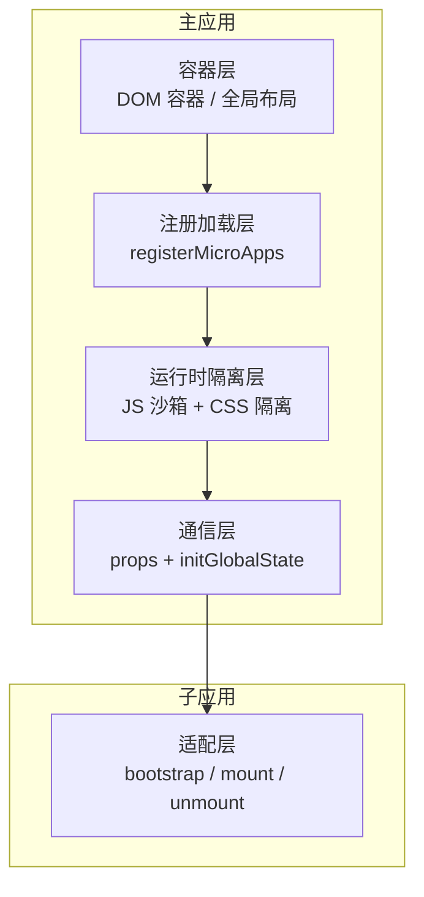
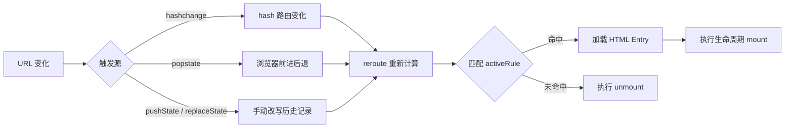
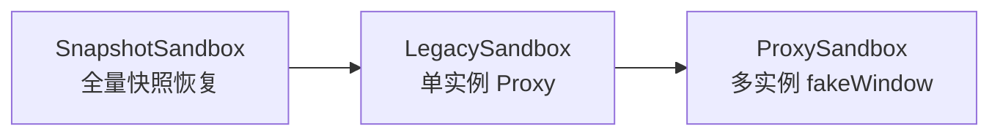
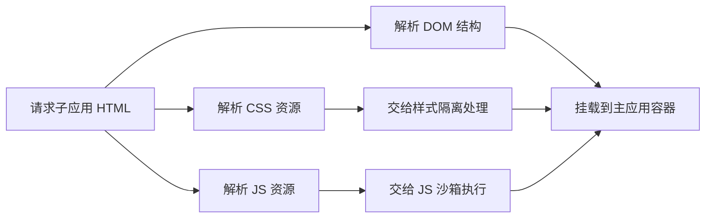
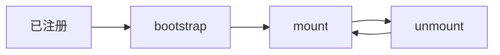
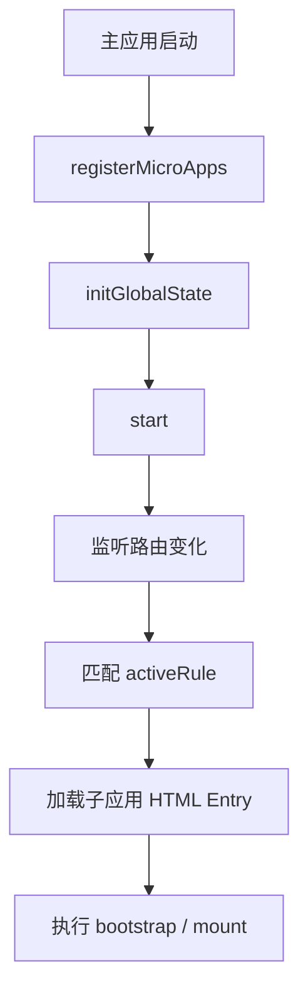
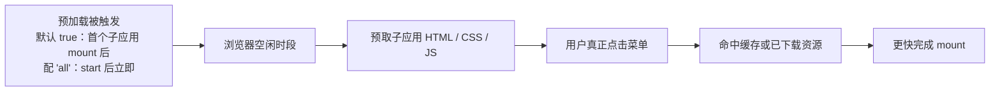
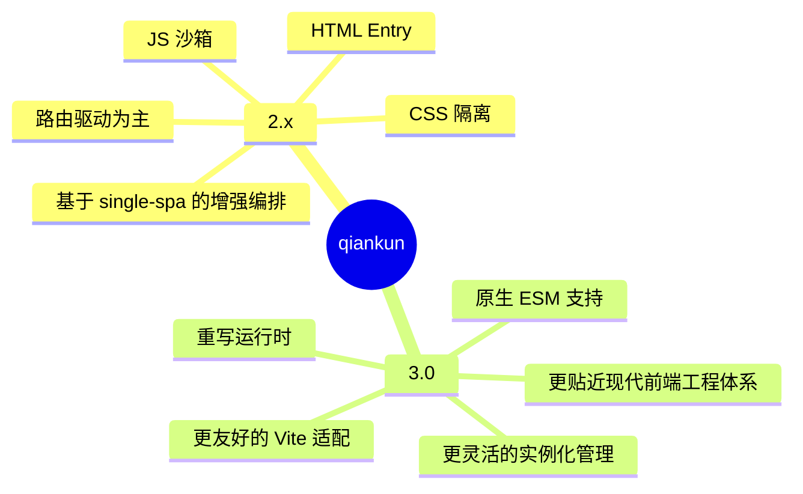

# 第四篇：qiankun 深度解析（上）——原理与架构

**核心要点：**
- qiankun 的背景：阿里开源，基于 single-spa 封装，增强了微前端应用编排能力
- qiankun 的架构定位：在 single-spa 的应用调度基础上，补充了 HTML Entry、沙箱隔离和样式隔离等关键能力
- 核心原理一：路由劫持——监听 URL 变化，动态加载/卸载子应用
- 核心原理二：JS 沙箱——通过 Proxy 或快照机制隔离全局变量
- 核心原理三：CSS 沙箱——通过样式作用域隔离，降低子应用之间的样式污染
- 子应用生命周期：bootstrap、mount、unmount
- HTML Entry 加载方式
- 预加载机制：在用户访问前预先加载子应用资源，提升切换体验
- 版本演进：qiankun 3.0（rc/开发阶段）在保留 HTML Entry 与生命周期模型的基础上，重写运行时并引入原生 ESM 支持

## 一、开篇：qiankun 是什么？

在上一篇文章里，我们介绍了 single-spa 这个微前端领域的“老大哥”。它解决了“如何根据路由切换不同子应用”这个核心问题，但还留下两个很现实的空白：

1. **JS 隔离**：子应用之间的全局变量可能相互污染
2. **CSS 隔离**：子应用之间的样式可能相互覆盖

如果直接使用 single-spa，这些问题通常要靠业务方自己兜底：要么靠约定命名规范，要么靠 CSS Modules、styled-components 之类的方案做局部缓解。但这些办法本质上都更偏“工程约束”，不是真正的运行时隔离。

**qiankun**（乾坤）就是在这样的背景下出现的。它并没有推翻 single-spa，而是**建立在 single-spa 之上，把微前端真正落地时最麻烦的几块能力补齐了**。

可以把它先记成一句话：

`qiankun = single-spa（路由管理 + 生命周期）+ JS 沙箱 + CSS 沙箱 + HTML Entry`

简单说，qiankun 让微前端从“能跑起来”，变成了“更适合工程化使用”。

## 二、整体架构：五层结构

从职责上看，qiankun 可以拆成五层：

| 层级 | 名称 | 核心职责 |
| :--- | :--- | :--- |
| 第 1 层 | 主应用容器层 | 提供子应用挂载容器，承载主应用壳、导航和全局状态 |
| 第 2 层 | 注册加载层 | 注册子应用的名称、入口、激活规则，并负责加载与卸载 |
| 第 3 层 | 运行时隔离层 | 提供 JS 沙箱和 CSS 隔离，减少应用间互相污染 |
| 第 4 层 | 通信层 | 提供 `props`、`initGlobalState` 等通信能力 |
| 第 5 层 | 子应用适配层 | 要求子应用暴露 `bootstrap`、`mount`、`unmount` 等生命周期 |

这五层拼起来，才构成了 qiankun 的完整体验：



> 说明：图中箭头表达的是逻辑上的组合 / 依赖关系，并非严格的运行时调用链；第 5 层“适配层”属于子应用侧的横向接入契约（暴露 `bootstrap` / `mount` / `unmount`），由主应用在运行时调用。

如果从理解角度再压缩一下，qiankun 的价值其实就是三件事：

1. **知道什么时候该加载谁**
2. **知道怎么把它安全地加载进来**
3. **知道怎么在退出时把现场清干净**

## 三、核心原理一：路由劫持

路由劫持是 qiankun 最基础的能力。没有它，就没有“按 URL 激活不同子应用”这件事。

### 3.1 什么是路由劫持？

所谓路由劫持，可以理解为：

**qiankun 持续观察浏览器 URL 的变化，一旦发现当前路由命中了某个子应用的激活规则，就自动完成该子应用的加载、挂载或卸载。**

一句大白话就是：

**URL 变了，应该显示的子应用也跟着变。**

### 3.2 浏览器路由的两种模式

在理解 qiankun 之前，先回顾一下浏览器里常见的两种路由模式：

| 模式 | 实现方式 | URL 示例 | 特点 |
| --- | --- | --- | --- |
| `hash` 模式 | 监听 `hashchange` | `example.com/#/dashboard` | 兼容性好，不依赖服务端路由兜底 |
| `history` 模式 | 监听 `popstate`，并拦截 `pushState` / `replaceState` | `example.com/dashboard` | URL 更自然，但需要服务端配合 |

qiankun 对这两种模式都支持，但具体怎么匹配，取决于你写的 `activeRule`。

### 3.3 qiankun 如何实现路由劫持？

它的基本流程可以拆成三步。

**第一步：注册子应用时声明激活规则**

```js
registerMicroApps([
  {
    name: 'app-a',
    entry: '//localhost:3001/',
    container: '#app-a',
    activeRule: '/a',
  },
  {
    name: 'app-b',
    entry: '//localhost:3002/',
    container: '#app-b',
    activeRule: '/b',
  },
]);
```

这里的 `activeRule` 可以是：

- 字符串：如 `'/a'`
- 函数：如 `location => location.hash.startsWith('#/a')`
- 数组：多个规则共同激活同一个子应用

**第二步：监听 URL 变化**

`start()` 之后，qiankun 会接管浏览器路由相关事件。下面是一个便于理解的简化版逻辑：

```js
function setupRoutingListeners() {
  window.addEventListener('hashchange', reroute);
  window.addEventListener('popstate', reroute);

  const rawPushState = window.history.pushState;
  window.history.pushState = function (...args) {
    rawPushState.apply(this, args);
    reroute();
  };

  const rawReplaceState = window.history.replaceState;
  window.history.replaceState = function (...args) {
    rawReplaceState.apply(this, args);
    reroute();
  };
}
```

**第三步：匹配规则并执行挂载/卸载**

```js
function reroute() {
  const apps = getRegisteredApps();

  apps.forEach((app) => {
    const shouldActive = matchActiveRule(app.activeRule, window.location);

    if (shouldActive && !app.isActive) {
      loadAndMountApp(app);
    } else if (!shouldActive && app.isActive) {
      unmountApp(app);
    }
  });
}
```

这里要特别说明一下：上面的代码是为了讲原理做的简化版。真实实现里，qiankun 底层复用了 single-spa 的调度机制，匹配时也不只是机械地盯着 `pathname`，而是会结合你定义的 `activeRule` 来判断 `location` 的具体部分。

而且真实流程并不是上面那种“同步 forEach 遍历”就能概括的：single-spa 的 `reroute` 是**异步调度**，每个应用都带一个完整的状态机（`NOT_LOADED → LOAD_SOURCE_CODE → BOOTSTRAPPING → NOT_MOUNTED → MOUNTED`…），并且**加载与挂载是分离的两步**——首次进入某个路由，要走 load → bootstrap → mount 的完整链路；之后再切回来，应用已经 load 过了，只需重新 mount。这也是为什么 qiankun 的路由切换通常比“每次从零加载”轻得多。

### 3.4 路由劫持的整体流程



### 3.5 它解决了什么问题？

路由劫持带来的价值主要有三点：

1. **按需加载**：访问哪个路由，就加载哪个子应用
2. **浏览器行为自然**：前进、后退都能驱动微前端切换
3. **切换成本低**：主应用不需要手动管理每个子应用的显示与隐藏

## 四、核心原理二：JS 沙箱

JS 沙箱要解决的问题很直接：

**让每个子应用“以为自己在独占一个全局环境”，但实际上它们共享同一个浏览器页面。**

如果没有沙箱，子应用 A 往 `window` 上挂一个变量，子应用 B 很可能就会读到；如果其中一个应用重写了全局方法，另一个应用也会被波及。

qiankun 的 JS 沙箱大致经历了三代演进。

### 4.1 快照沙箱（SnapshotSandbox）

第一代思路比较直接：**进入子应用前，把当前 `window` 拍一张快照；离开时，再把全局环境恢复回去。**

> ⚠️ 示意代码：为便于讲原理做的简化实现，细节与 qiankun 真实实现有出入，请勿照抄。

```js
class SnapshotSandbox {
  constructor() {
    this.snapshot = {};
  }

  active() {
    this.snapshot = {};
    for (const key in window) {
      this.snapshot[key] = window[key];
    }
  }

  inactive() {
    for (const key in window) {
      if (!(key in this.snapshot)) {
        delete window[key];
      } else if (window[key] !== this.snapshot[key]) {
        window[key] = this.snapshot[key];
      }
    }
  }
}
```

**优点**是概念简单。  
**问题**也很明显：每次切换都要遍历整个 `window`，性能差，而且天然只适合单实例场景。

### 4.2 单实例代理沙箱（LegacySandbox）

第二代开始使用 `Proxy`。它的核心思路是：

**不再每次都全量拍快照，而是代理对 `window` 的访问，把“改了哪些东西”记录下来，退出时再还原。**这里要小心“还原”的含义：子应用既可能“新增”属性，也可能“改写”了进入前就存在的全局属性——对前者退出时要删除，对后者则要恢复原值。否则一个进入前值为 `1` 的全局变量，被子应用改成 `2` 后退出会直接消失成 `undefined`，反而破坏了沙箱要保护的共享环境。

> ⚠️ 示意代码：为便于讲原理大幅简化（核心思想与 qiankun 真实实现一致，真实实现还会处理更多边界），请勿照抄进生产代码。

```js
class LegacySandbox {
  constructor() {
    this.addedPropsMap = {};            // 沙箱期间新增的属性 → 退出时删除
    this.modifiedPropsOriginalMap = {}; // 被改写的既有属性 → 退出时还原原值
    this.isActive = false;

    this.proxy = new Proxy(window, {
      set: (target, key, value) => {
        if (this.isActive) {
          if (!(key in target)) {
            // 新增属性：记入新增表
            this.addedPropsMap[key] = value;
          } else if (!(key in this.modifiedPropsOriginalMap)) {
            // 改写既有属性：先记下原值（只记第一次）
            this.modifiedPropsOriginalMap[key] = target[key];
          }
          target[key] = value;
        }
        return true;
      },
      get: (target, key) => target[key],
    });
  }

  active() {
    this.isActive = true;
  }

  inactive() {
    this.isActive = false;
    // 先还原被改写的既有属性
    for (const key in this.modifiedPropsOriginalMap) {
      window[key] = this.modifiedPropsOriginalMap[key];
    }
    // 再删除沙箱期间新增的属性
    for (const key in this.addedPropsMap) {
      delete window[key];
    }
    this.addedPropsMap = {};
    this.modifiedPropsOriginalMap = {};
  }
}
```

它比快照沙箱轻一些，但仍然偏向“**同一时刻只跑一个子应用**”的心智。

### 4.3 多实例代理沙箱（ProxySandbox）

这是更接近当前主流实现的方案。

它的核心变化在于：**每个子应用不再共享同一个代理上下文，而是各自拥有独立的 `fakeWindow`。**

> ⚠️ 示意代码：同上，为便于讲原理简化；真实的 ProxySandbox 在 get 等陷阱上还有更多处理（详见 4.4 的补充说明）。

```js
class ProxySandbox {
  constructor() {
    this.fakeWindow = Object.create(null);

    this.proxy = new Proxy(this.fakeWindow, {
      set: (target, key, value) => {
        target[key] = value;
        return true;
      },
      get: (target, key) => {
        if (key in target) return target[key];
        return window[key];
      },
    });
  }
}

const sandboxA = new ProxySandbox();
const sandboxB = new ProxySandbox();

sandboxA.proxy.a = 1;
sandboxB.proxy.a = 2;

console.log(sandboxA.proxy.a); // 1
console.log(sandboxB.proxy.a); // 2
```

这意味着：

- 子应用 A 写入的是自己的 `fakeWindow`
- 子应用 B 写入的是另一个 `fakeWindow`
- 彼此都能读取真实 `window` 上的公共能力
- 但不会轻易把自己的运行时状态污染给别人

### 4.4 三种 JS 沙箱方案对比



| 方案 | 实现方式 | 是否支持多实例 | 性能 | 适用场景 |
| --- | --- | --- | --- | --- |
| SnapshotSandbox | 遍历 `window` 做快照恢复 | 否 | 较差 | 早期思路或低兼容兜底 |
| LegacySandbox | `Proxy` 代理全局对象 | 否 | 中等 | 一次只激活一个子应用 |
| ProxySandbox | `Proxy` + 独立 `fakeWindow` | 是 | 较优 | 现代主流方案 |

这张表背后，还有两点值得展开，能帮你把“为什么会这样取舍”看透：

1. **快照沙箱并不是被“淘汰”了，它仍是低版本环境的兜底**：`Proxy` 无法在低版本浏览器里被 polyfill，因此当运行环境不支持 `Proxy` 时，qiankun 只能退回快照式方案——代价就是每次激活都要全量遍历 `window`，性能差、且天然只支持单实例。表里的“性能 / 单实例限制”，本质都是“要不要兼容老浏览器”的取舍结果。
2. **真实沙箱做的事远不止“代理读写”**：为了防“逃逸”，真实的 Proxy 沙箱还会做一批收尾处理——让 `window.window` / `window.self` / `window.top` / `window.parent` 都指向代理自身，防止子应用绕开代理直接摸到真实的全局对象；通过 `has`、`getOwnPropertyDescriptor` 等陷阱应对 styled-components 这类依赖属性探测的库；并在应用卸载时回收它注册的定时器、事件监听和动态插入的样式——前文反复强调的“卸载时把现场清干净”，主要就是这层机制在承担。

从架构演进上看，qiankun 的 JS 沙箱其实是在不断回答同一个问题：

**既要让子应用有“独立运行”的感觉，又不能真的给每个子应用开一个浏览器上下文。**

## 五、核心原理三：CSS 沙箱

相比 JS 沙箱，CSS 隔离更容易被低估。因为样式污染不像 JS 报错那样“立刻炸掉”，它更像一种慢性问题：今天按钮颜色串了，明天布局被覆盖了，排查起来还很痛苦。

不过这里要先校准一个概念：

**qiankun 默认并不是“自动拥有强样式隔离”。**  
它默认更像是做了样式资源的加载与卸载管理；如果要更强的隔离效果，还需要显式开启对应策略。

### 5.1 默认样式处理：负责加载和回收，但不是强隔离

当 qiankun 通过 HTML Entry 拉取子应用时，会把子应用的 `<link>`、`<style>` 等样式资源解析出来，并在挂载阶段插入页面，在卸载阶段尽量移除。

这个机制的意义主要是：

1. 子应用切出后，静态样式不会一直残留在页面里
2. 主应用不用手动管理子应用样式资源的插入和清理

但它解决的是“**样式生命周期管理**”，不等于“**样式绝对隔离**”。

还要看清官方口径下默认隔离的边界：**它只保证“单实例场景下、子应用之间”的样式隔离，并不保证主应用与子应用之间、或多实例场景下子应用之间的样式隔离。**想要更彻底的隔离，需要显式开启下面 5.2 / 5.3 的策略，或配合组件库的 CSS-in-JS / CSS Modules 等工程手段。

### 5.2 `strictStyleIsolation`：基于 Shadow DOM 的严格隔离

这是 qiankun 提供的严格样式隔离方案。核心思路是：

**把子应用的渲染容器变成一个 Shadow DOM 根节点，让子应用样式尽量收敛在这个封闭作用域里。**

```js
start({
  sandbox: {
    strictStyleIsolation: true,
  },
});
```

你可以把它理解成给子应用单独罩了一个“样式玻璃罩”：

- 子应用样式不容易泄漏到外部
- 外部样式也不容易直接渗透进来

**优点**：

- 隔离效果强
- 最符合“子应用样式互不影响”的直觉

**代价**：

- 依赖 Shadow DOM
- 一些全局样式覆盖能力会变弱
- 调试和第三方组件兼容性可能更复杂

### 5.3 `experimentalStyleIsolation`：基于 Scoped CSS 的实验性隔离

另一种方案是实验性的样式隔离，也就是常说的“Scoped CSS 重写”。

它的做法不是把 DOM 放进 Shadow DOM，而是：

1. 给子应用根节点加一个专属属性
2. 给该子应用的样式选择器统一加上属性前缀

例如原始样式是：

```css
.header {
  background: red;
}
```

处理后可能变成：

```css
div[data-qiankun="app-a"] .header {
  background: red;
}
```

配置方式如下：

```js
start({
  sandbox: {
    experimentalStyleIsolation: true,
  },
});
```

这种方案的优点是比较容易理解，也更接近前端工程里常见的“作用域样式”思路。

但它也有边界：

- 对 `html`、`body`、`:root` 这类全局选择器处理有限
- 对运行时动态插入样式的场景，需要额外观察
- 不会改写 `@keyframes`、`@font-face`、`@import`、`@page` 等规则，动画帧、字体等定义仍可能全局泄漏
- 隔离强度不如 Shadow DOM

### 5.4 两种样式隔离策略怎么选？

| 策略 | 原理 | 隔离强度 | 优点 | 代价 |
| --- | --- | --- | --- | --- |
| `strictStyleIsolation` | Shadow DOM | 强 | 隔离更彻底 | 兼容性和调试成本更高 |
| `experimentalStyleIsolation` | Scoped CSS 重写 | 中 | 易理解，接入相对平滑 | 对全局选择器和动态样式存在边界 |

如果从入门角度总结一句：

**JS 沙箱解决的是“脚本别互相污染”，CSS 隔离解决的是“样式别互相串台”。**

## 六、HTML Entry：比 JS Entry 更贴近工程现实的加载方式

在 qiankun 之前，single-spa 更常见的接入方式是 **JS Entry**，也就是直接加载子应用导出的 JS 模块。

```js
registerApplication({
  name: 'app-a',
  app: () => import('https://cdn.com/app-a.js'),
  activeWhen: ['/a'],
});
```

> ⚠️ 示意代码：这里用远程 URL 的动态 import 只为做“反例”对照，打包器并不能直接编译运行这种写法。single-spa 官方实际是配合 import map + SystemJS 使用（`System.import('app-a')`，见第 3 篇），此处不要照抄。

这种方式当然能用，但它会暴露出一个问题：

**浏览器真正加载一个前端应用，通常不只是加载 JS。**

你还会关心：

- CSS 从哪里来
- HTML 模板长什么样
- 资源公共路径怎么算
- 入口页面里声明的静态资源如何处理

于是 qiankun 引入了更贴近真实前端应用形态的 **HTML Entry** 思路：  
**直接以子应用的 HTML 入口为起点，把应用需要的 DOM、CSS、JS 一起解析出来。**

```js
registerMicroApps([
  {
    name: 'app-a',
    // entry 也可以是对象形式：直接声明要加载的 JS / CSS，而不必先请求一份 HTML
    entry: {
      scripts: ['//localhost:3001/js/app-a.js'],
      styles: ['//localhost:3001/css/app-a.css'],
    },
    container: '#app-a',
    activeRule: '/a',
  },
]);
```

对象形式把要加载的资源点得很直接；而更贴近真实前端应用的是把 `entry` 指向 HTML 地址（字符串写法见 3.3 节）。当 qiankun 请求 `//localhost:3001/`、拿回 HTML 时，大致会做这些事情：

1. 拉取完整 HTML
2. 解析出 `<link>`、`<style>` 等样式资源
3. 解析出 `<script>` 并放进 JS 沙箱执行
4. 提取应用内容并挂载到主应用容器里

这里的“解析”远不只是把 HTML 字符串拼进页面，背后（qiankun 复用了 import-html-entry 库）其实有几件“重活”：

- **模板改写**：解析并移出 `<link>` / `<style>` / `<script>` 时，会把 `href` / `src` 中的相对地址改写成基于子应用真实部署地址的绝对地址——否则这些资源一旦挪到主应用页面里，会按主应用的 URL 去解析而错位；
- **外链 script 的执行方式**：为了把脚本放进沙箱执行，同时保证执行顺序与错误可追踪，外链 `<script>` 会被改为先拉取文本、再以字符串方式执行，而不是简单插一个 `<script>` 标签；
- **publicPath 重写**：执行前会把子应用的 `__webpack_public_path__` 指向其真实部署目录，让运行时按需加载的 chunk、图片等相对资源解析正确——这正是上面“部署目录 / 静态资源路径”约束的底层来源。

比如子应用返回的 HTML 可能是这样：

```html
<!DOCTYPE html>
<html>
  <head>
    <link rel="stylesheet" href="//cdn.com/app-a.css" />
    <style>
      .header { font-size: 16px; }
    </style>
  </head>
  <body>
    <div id="root">这是子应用内容</div>
    <script src="//cdn.com/app-a.js"></script>
  </body>
</html>
```

qiankun 会把它拆解后再接入主应用：



HTML Entry 的价值在于它**明显降低了接入改造成本**，但这里也不宜说成“完全零改造”。

因为真实项目里通常还要考虑这些问题：

- 子应用是否正确导出了生命周期
- 静态资源路径是否能在主应用场景下正常解析
- 是否存在跨域、部署目录、`publicPath` 等工程约束

所以更准确的说法是：

**HTML Entry 让微前端接入更像接一个完整前端应用，而不是只接一段 JS。**

这个取舍也划出了 qiankun 与其它路线的核心分岔点：它选择“HTML Entry + 同上下文 Proxy 沙箱”，换来的是低接入改造成本，代价是隔离强度弱于 iframe / Shadow DOM 这类“真隔离”方案。micro-app（Web Components 思路）、wujie（iframe 沙箱思路）正是在这个坐标系里的其它答案——路线全景见第 3 篇，框架级对比留到第 7 篇展开。

## 七、子应用生命周期：`bootstrap` → `mount` → `unmount`

qiankun 沿用了 single-spa 的生命周期规范。一个能被主应用正确接管的子应用，至少要暴露三个函数：

- `bootstrap`
- `mount`
- `unmount`

示例如下：

```js
import React from 'react';
import ReactDOM from 'react-dom';
import App from './App';

export async function bootstrap() {
  console.log('子应用初始化');
}

export async function mount(props) {
  console.log('子应用挂载', props);
  ReactDOM.render(<App {...props} />, document.getElementById('root'));
}

export async function unmount() {
  console.log('子应用卸载');
  ReactDOM.unmountComponentAtNode(document.getElementById('root'));
}
```

这三个阶段分别对应三种职责：

| 生命周期 | 调用时机 | 适合做什么 |
| --- | --- | --- |
| `bootstrap` | 应用首次初始化时 | 一次性的初始化逻辑 |
| `mount` | 应用每次进入页面时 | 渲染页面、绑定事件、恢复状态 |
| `unmount` | 应用离开页面时 | 卸载 DOM、清理监听器、清理定时器 |

状态流转如下：



> 图注：上图为了简洁画成了回环。完整的官方状态机里，`unmount` 后应用会回到“未挂载”（NOT_MOUNTED）状态，下次激活时直接重新 `mount`，`bootstrap` 不再执行。

这里最容易被忽略的一点是：

**`bootstrap` 往往只执行一次，但 `mount` 和 `unmount` 会反复执行。**

所以只要你在 `mount` 里做了副作用操作，比如：

- 事件监听
- 定时器
- 全局变量写入
- 第三方实例挂载

那就必须在 `unmount` 里对称地清掉，否则切换几轮之后，页面就会越来越“脏”。

## 八、主应用注册：一个完整示例

前面的原理串起来，主应用侧的使用方式大致如下：

```js
import { registerMicroApps, start, initGlobalState } from 'qiankun';

registerMicroApps([
  {
    name: 'app-a',
    entry: '//localhost:3001/',
    container: '#app-a',
    activeRule: '/a',
    props: {
      userInfo: { name: '张三' },
    },
  },
  {
    name: 'app-b',
    entry: '//localhost:3002/',
    container: '#app-b',
    activeRule: '/b',
  },
]);

const { onGlobalStateChange, setGlobalState } = initGlobalState({
  user: null,
  theme: 'light',
});

start({
  sandbox: {
    strictStyleIsolation: false,
    experimentalStyleIsolation: false,
  },
});
```

这个示例里，主应用做了三件事：

1. 注册子应用
2. 初始化全局状态通信能力
3. 启动 qiankun 运行时

如果把它再压缩成一张架构流程图，就是这样：



## 九、预加载机制：为什么切换会更快？

路由按需加载虽然很好，但它有一个天然问题：

**第一次进入某个子应用时，用户需要等待它的资源下载和解析。**

为了解决这个问题，qiankun 提供了预加载能力，也就是在用户真正访问之前，先把未来可能要用到的子应用资源提前拉下来。

而且**预加载默认就是开启的**：`prefetch` 的默认值是 `true`，语义是“第一个子应用完成 mount 之后、浏览器空闲时，预取其余子应用的 HTML / CSS / JS”。

如果想主应用 `start` 后立刻预取全部子应用，可以显式配成：

```js
start({
  prefetch: 'all',
});
```

（本系列第 5 篇的实践示例使用的就是 `'all'` 口径。）`prefetch` 也支持传应用名数组或自定义函数，只挑关键子应用预取；需要更精细控制时，还可以手动调用 `prefetchApps(apps)`。

它的核心收益是：

1. **把首次进入的等待时间前置**
2. **让路由切换更平滑**
3. **适合后台系统这类“菜单可预测”的场景**

触发时点取决于你配置的值，思路可以简单画成这样：



当然，预加载也不是“越多越好”。如果子应用很多、资源很大，盲目全量预取会带来额外带宽和首屏竞争。所以它本质上是一个**性能体验和资源消耗之间的权衡**。

## 十、版本演进：从 qiankun 2.x 到 3.0

理解 qiankun 的版本演进，关键不是背 API，而是理解它的心智变化。

### 10.1 qiankun 2.x 的价值

qiankun 2.x 的核心贡献，是把基于 single-spa 的微前端编排能力做成了更完整的工程方案：

- 有路由驱动的应用调度
- 有生命周期模型
- 有 HTML Entry
- 有 JS/CSS 隔离
- 有预加载和通信能力

所以在很多团队眼里，qiankun 2.x 的关键词是：

**“在 single-spa 之上，补齐微前端落地所需的运行时能力。”**

### 10.2 为什么 3.0 值得关注？

先校准一下状态：**截至本文核验（2026-09），qiankun 3.0 仍处于 rc / 密集开发阶段**——npm 上需通过 `qiankun@rc` 安装（`latest` 仍指向 2.x），API 也还在演进，例如 rc 版本里 `registerMicroApps` 的 `container` 已从字符串选择器改为直接接收 DOM 元素。所以现阶段生产环境仍以 2.x 为主，下面这段是帮你理解演进方向，而不是“现在就该迁移”的信号。

随着前端工程体系变化，新的问题出现了：

- 越来越多项目转向 Vite
- 原生 ESM 成为主流趋势
- “只靠路由切换应用”不再覆盖全部场景

于是 qiankun 3.0 的演进重点，开始从“补能力”进一步走向“适配现代工程体系”。

这时它更强调几件事：

1. **运行时重写**：让微前端运行时更加现代化
2. **原生 ESM 支持**：更好适配 Vite 等新一代构建体系
3. **实例化管理更灵活**：`loadMicroApp` 这类手动加载能力其实自 2.x 就已提供（适合局部嵌入、不依赖路由的场景），3.0 是继续强化这类实例化体验，而不是把它当作全新概念引入

落到机制层面，3.0 与 2.x 的差异也远不止“重写”两个字：

- 原生 ESM 并非简单地让浏览器去原生加载，而是让子应用的 `<script type="module">` 经过“隔离膜”路由，并配合动态注入的 import map 完成模块解析——动态 `import()` 可用，Vite 的 dev server 也因此可以直接接入，不再依赖社区插件
- 样式隔离从 2.x 的“属性前缀重写 / Shadow DOM”演进为基于 CSS `@scope` 的运行时作用域方案
- HTML 入口由整份拉取改为流式加载
- 运行时拆出独立的沙箱包，并提供 React / Vue 的 UI 绑定（如 `<MicroApp/>`）

具体 API 形态与路线图仍会随 rc 版本迭代调整，建议以 [qiankun 官方仓库的 next 分支](https://github.com/umijs/qiankun/tree/next) 为准。

### 10.3 2.x 和 3.0 的理解方式有什么不同？

可以用一张对比图来理解：



所以如果用一句话概括：

**qiankun 2.x 更像“把微前端做完整”，而 qiankun 3.0 更像“把这套能力继续搬到现代工程世界里”。**

## 十一、小结

回到开头那句话，qiankun 之所以重要，不是因为它重新发明了微前端，而是因为它把微前端真正做成了一套更容易落地的运行时方案。

下一篇《qiankun 深度解析（下）》会把视角从“原理”切到“实战与踩坑”：走一遍主应用与子应用的标准接入流程，给出 Vite 等现代工程体系的适配路径，并整理一份高频问题清单；番外篇还会搭一个 qiankun3-lab 试验台，直接用 rc 版体验 3.0 的这些新特性。
