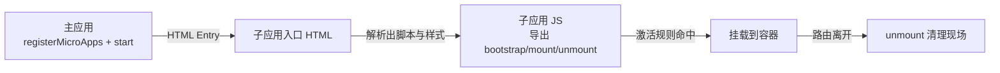
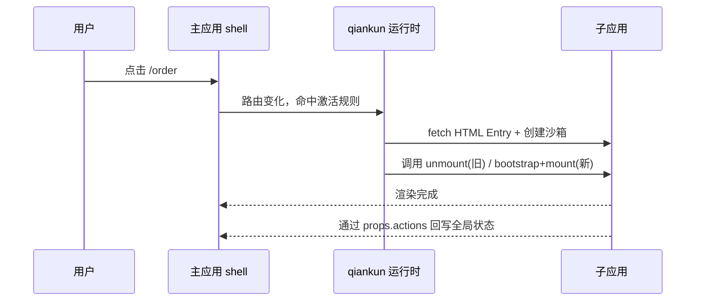

# 第五篇：qiankun 深度解析（下）——实战与踩坑

**核心要点：**
- 从 0 到 1 跑通 qiankun：主应用注册、子应用接入与联调流程
- 子应用改造三步走：导出生命周期、处理路由基座、配置资源路径
- 主应用标准接入流程：`registerMicroApps` + `start` 的最小可用方案
- 常见踩坑点：路由冲突、资源 404、样式污染、生命周期未清理、开发环境跨域
- 一个可运行的简单案例：主应用 + 2 个子应用，演示挂载、切换与通信
- 从 demo 到项目：接入多个子应用后，主应用壳、公共依赖、预加载与边界治理怎么做

## 一、开篇：从上篇的“原理”到这篇的“跑起来”

在第四篇里，我们把 qiankun 的原理拆开讲了一遍：路由劫持、HTML Entry、JS/CSS 沙箱、生命周期、预加载。原理讲清楚了，但真正让很多人停住脚步的，往往是第一次动手时的这段空白：

**文档里写得很顺，但自己一接就报错。**

原因不难理解：qiankun 的接入不是一个“装上依赖、写两行代码”的动作，它横跨了**主应用**和**子应用**两端，还要求子应用在打包、路由、资源路径上做出配合。任何一个环节没对齐，现象都是“白屏”“资源 404”“刷新后不见了”。

所以这篇我们把视角从“它怎么工作”切到“我怎么把它接起来”。目标很朴素：先让一个最小案例真正跑起来，再把最常见的坑一个个拆掉，最后聊聊子应用多起来之后的工程化边界。

一个可运行的最小案例放在这里，建议边读边跑：

- 案例目录：[examples/micro-frontend/qiankun-basic-demo](../../examples/micro-frontend/qiankun-basic-demo/README.md)



## 二、子应用改造三步走

不管子应用用什么技术栈，接入 qiankun 的前提都指向同一个事实：**qiankun 不知道“子应用应该怎么启动”，它只负责在合适的时机，调用子应用暴露出来的三个生命周期函数。**

所以子应用改造的本质，就是把原本“页面加载就自动启动”的应用，改造成“由外部调用来决定何时启动”。

### 2.1 第一步：入口文件导出生命周期

子应用需要在入口文件里把三个生命周期暴露出去：

```js
let root = null
let router = null

export async function bootstrap() {
  console.log('[sub-app] bootstrap')
}

export async function mount(props) {
  // props.container 是主应用传入的挂载容器
  const container = props.container || document
  root = createRoot(container.querySelector('#app'))
  router = createRouter(container, props.baseRoute)
  root.render(<App router={router} />)
}

export async function unmount(props) {
  root.unmount()
  root = null
  router = null
}
```

有两个容易被忽略的细节：

1. **每个生命周期函数都要返回 Promise**，qiankun 内部依赖它做异步编排；
2. **应用要能“独立运行”，也能“被挂载运行”**，通常会通过一个运行时标识区分：在微前端环境下才使用 `props.container`，否则直接挂到自己的 `#app` 上。

### 2.2 第二步：配置打包格式，让产物“能被找到”

qiankun 通过 HTML Entry 拿到子应用的入口 HTML 后，需要把里面的 JS 拿到沙箱里执行，并读取它挂在全局的生命周期函数。这就要求**子应用的构建产物最后要暴露成一个全局变量**（经典的 UMD/`library` 形态）。

以 webpack 为例，需要把入口产物暴露成库：

```js
// webpack.config.js
output: {
  library: 'subAppDashboard', // 产物挂在 window.subAppDashboard 上
  libraryTarget: 'umd',
  jsonpFunction: `webpackJsonp_${name}`,
  globalObject: 'window',
}
```

我们配套的简单案例里，子应用用了最直白的等价写法——在全局注册同名对象：

```js
window['subapp-dashboard'] = { bootstrap, mount, unmount }
```

原理是一样的：**qiankun 约定从入口脚本执行后的全局对象上取生命周期。**

### 2.3 第三步：处理路由基座与资源路径

这是子应用接入中最容易“看上去成功、一刷新就崩”的一步，有两件事：

- **路由基座（base）**：子应用内部路由要挂在主应用分配给它的前缀下。比如主应用用 `/order` 激活子应用，子应用内部路由的 basename 就得是 `/order`，否则子应用内部跳转会把整条 URL 覆盖掉。
- **资源路径（publicPath / base）**：构建产物的 JS/CSS 若使用绝对路径 `/assets/xxx.js`，一旦子应用部署在子目录或由主应用跨域加载，就会出现资源 404。webpack 项目普遍用 `__webpack_public_path__` 运行时修正，Vite 项目则用 `base` 或部署时的动态基址。

这三步走完，子应用基本就具备“被接入”的条件了。剩下的问题，交回给主应用。

## 三、主应用标准接入：registerMicroApps + start

主应用要做的事情反而更固定，可以理解成三步：

1. 准备一个挂载容器（一个 div）；
2. 用 `registerMicroApps` 声明每个子应用的名称、入口、容器与激活规则；
3. 调用 `start()` 启动整个编排。

```js
import { registerMicroApps, start } from 'qiankun'

registerMicroApps([
  {
    name: 'subapp-dashboard',
    entry: 'http://localhost:7101',          // HTML Entry
    container: '#micro-container',            // 挂载容器
    activeRule: (location) => location.pathname.startsWith('/dashboard'),
    props: { baseRoute: '/dashboard' },       // 传给子应用的 props
  },
  {
    name: 'subapp-order',
    entry: 'http://localhost:7102',
    container: '#micro-container',
    activeRule: (location) => location.pathname.startsWith('/order'),
    props: { baseRoute: '/order' },
  },
])

start({ prefetch: 'all' })
```

`activeRule` 支持三种形态，实际项目里按路由复杂度选择：

| 形态 | 写法 | 适用场景 |
| --- | --- | --- |
| 字符串 | `'/crm'` | 前缀清晰、无需额外判断 |
| 函数 | `location => location.pathname.startsWith('/crm')` | 需要自定义匹配逻辑 |
| 数组 | `['/crm', '/customer']` | 一个子应用对应多个路由前缀 |

到这里，一个“能跑”的最小骨架其实已经齐了。我们把这套骨架整理成了一个开箱即用的 demo。

## 四、跑起来：qiankun-basic-demo 最小案例

为了不让你对着文章手抄配置，仓库里放了一个完整的最小案例：

```text
examples/micro-frontend/qiankun-basic-demo/
├── main-app            # 主应用，http://localhost:7100
├── subapp-dashboard    # 子应用一，http://localhost:7101
├── subapp-order        # 子应用二，http://localhost:7102
├── package.json        # npm workspaces + 一键启动
└── README.md           # 启动与验证说明
```

### 4.1 启动

```bash
cd examples/micro-frontend/qiankun-basic-demo
npm install
npm run dev
```

一键脚本会同时拉起主应用和两个子应用（分别占用 7100 / 7101 / 7102）。

### 4.2 验证点

1. 打开 `http://localhost:7100`，默认进入 `/dashboard`，主应用挂载 dashboard 子应用；
2. 点击顶部的 Order，URL 切到 `/order`，主应用卸载 dashboard 并挂载 order；
3. 在 dashboard 子应用里点击“通知主应用”，顶部“全局状态”卡片会实时变化——这是 `initGlobalState` 在通信；
4. dashboard 子应用内部有一个每秒跳动的定时器，切走路由后再切回来会发现它重新开始——因为 `unmount` 里做了 `clearInterval`。

### 4.3 关键代码怎么读

建议阅读顺序：

- [main-app/src/main.js](../../examples/micro-frontend/qiankun-basic-demo/main-app/src/main.js)：主应用注册、全局状态、路由同步；
- [subapp-dashboard/public/subapp.js](../../examples/micro-frontend/qiankun-basic-demo/subapp-dashboard/public/subapp.js)：子应用生命周期导出、独立运行分支、定时器清理；
- [subapp-dashboard/public/index.html](../../examples/micro-frontend/qiankun-basic-demo/subapp-dashboard/public/index.html)：HTML Entry 的形态——这就是 qiankun 真正 fetch 过去解析的东西。



案例本身很克制，只做两件事：**演示标准接入流程**，**把生命周期和通信这类抽象概念变成可见的行为**。

## 五、高频踩坑清单

跑通之后，真正消耗时间的是各种“边缘情况”。这里按现象归类，列出接入十几个子应用时最常见的五类问题。

### 5.1 路由冲突

现象：主应用路由和子应用路由互相抢占，或一个前缀同时命中多个子应用。

原因与对策：

- 子应用内部路由没配 `base`，导致跳转覆盖主应用 URL；
- `activeRule` 前缀写得过宽（比如 `'/'`），把主应用自己的页面也接管了；
- 两个子应用前缀存在包含关系，例如 `/order` 与 `/order-detail`，需要让规则更精确，或使用函数型 `activeRule`。

### 5.2 静态资源 404

现象：页面能渲染，但图片、字体、懒加载 chunk 全部 404。

原因与对策：子应用产物用了绝对路径，或部署在子目录。webpack 用动态 `publicPath`，Vite 用 `base`，并且**开发时跨域端口必须配置 CORS 响应头**，否则 qiankun 用 `fetch` 拉取 HTML Entry 时会直接失败。

### 5.3 样式污染

现象：两个子应用用了同名 class，后者把前者样式覆盖了。

qiankun 2.x 默认不开启样式隔离，需要显式开启：

```js
start({
  sandbox: { experimentalStyleIsolation: true },
})
```

它会对子应用样式做运行时作用域包装。但要清楚：**这是运行时兜底，不是银弹**，公共 UI 库的全局样式、`body` 级样式、以及动态插入的样式都可能绕过隔离，仍需靠工程约定兜住（CSS Modules、设计变量前缀等）。

### 5.4 生命周期未清理

现象：反复切换子应用后，页面越来越卡、事件重复触发、接口重复请求。

原因：`unmount` 里没清理定时器、事件监听、全局变量。凡是子应用 mount 期间创建的副作用，都应该在 unmount 时反向释放。这也是第四篇讲“JS 沙箱”时强调的：**框架负责隔离，业务负责清理。**

### 5.5 开发环境问题：跨域与端口

现象：主应用访问子应用时 Console 报跨域，或子应用端口被占用。

对策：

- 子应用 devServer 加 `Access-Control-Allow-Origin: *`；
- 端口统一规划，避免主应用、多个子应用、本地 mock 相互冲突；
- 子应用要能独立启动调试，和主应用联调是两种运行形态，代码里要同时支持。

## 六、从 2 个子应用到十几个子应用

demo 只有两个子应用，看起来一切都很顺。但当数量来到十几个，真正决定成败的不再是某个 API 怎么调，而是**主应用壳和子应用之间如何守住边界**。这里给出四个关键收敛点：

| 收敛点 | 做法 | 目的 |
| --- | --- | --- |
| 壳应用瘦身 | 主应用只负责布局、登录、菜单、权限路由，业务全部下沉子应用 | 避免主应用变成“新的巨石” |
| 注册信息集中管理 | 子应用列表抽成统一配置，按环境切 entry | 新增/下线子应用不散落在页面里 |
| 公共依赖显式共享 | 把 Vue/React、UI 库等抽到公共依赖或 external | 降低重复下载与多实例成本 |
| 命名与目录规范 | 子应用名、路由前缀、全局对象前缀统一前缀约束 | 让沙箱、调试、监控都可预期 |

这部分治理会牵出样式隔离、通信机制、性能优化、发布治理等专门话题——它们在本系列里各自有独立篇章：

- [第八篇：微前端通信机制全攻略](./08-communication.md)
- [第九篇：样式隔离与资源管理](./09-style-isolation-and-resource-management.md)
- [第十篇：微前端性能优化实战](./10-performance-optimization.md)

## 七、小结：先跑通，再治理

回看这一篇，核心其实是一条递进链路：

**先让最小案例跑起来（演示流程）→ 把高频坑变成可复用的经验（沉淀清单）→ 再考虑多子应用下的治理边界（约束收敛）。**

我们配套的 [qiankun-basic-demo](../../examples/micro-frontend/qiankun-basic-demo/README.md) 停在第一步和第二步的交界处。真实生产环境比它复杂得多——存量老系统、异构技术栈、局部嵌入、多子应用同屏、新老版本并存，这些都会让“接入”从技术问题变成架构决策问题。

下一篇番外，我们就用一套更贴近生产的混合案例，把这几个场景逐个过一遍：[番外篇：企业级混合微前端改造实战](./extra-04-production-hybrid-micro-frontend.md)。
