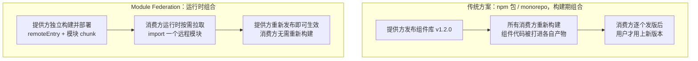
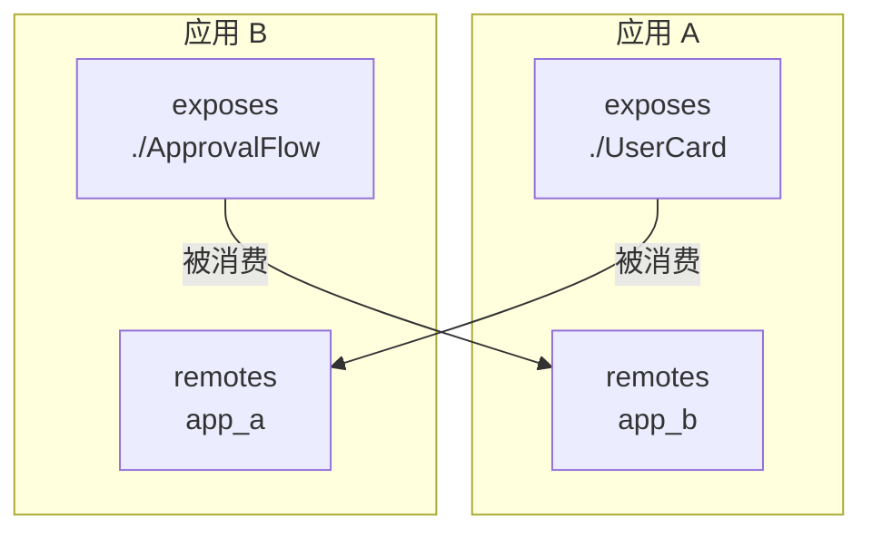
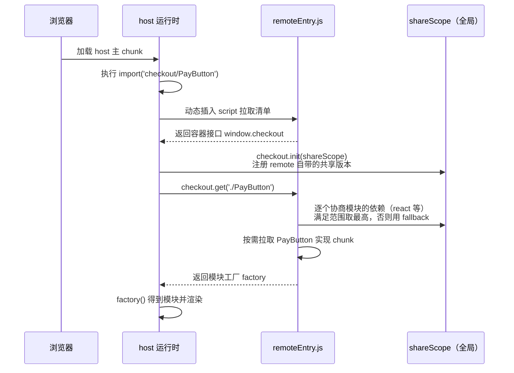
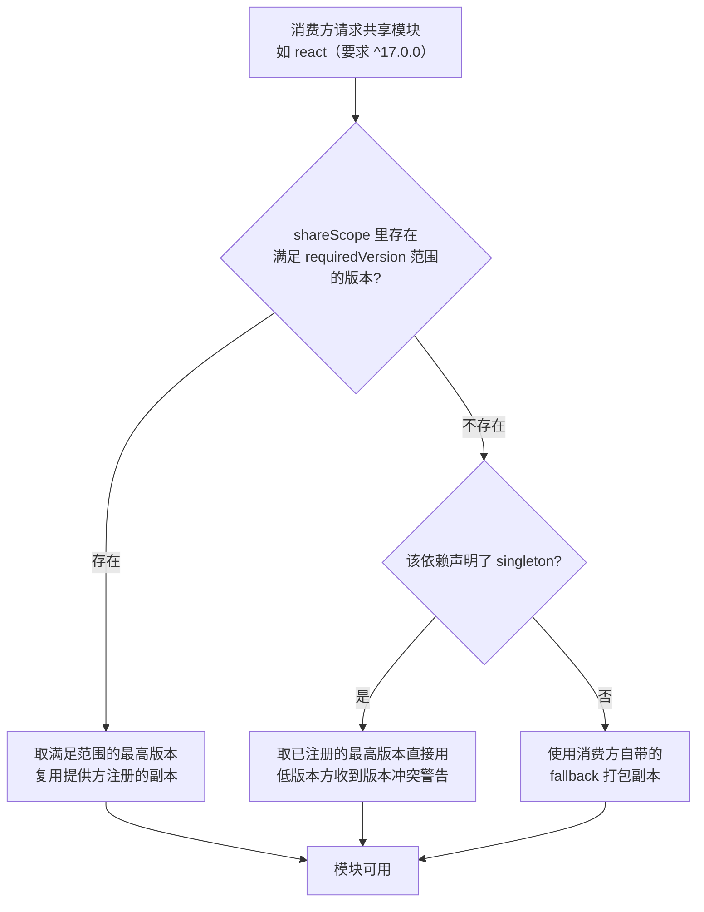
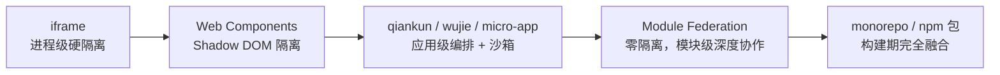
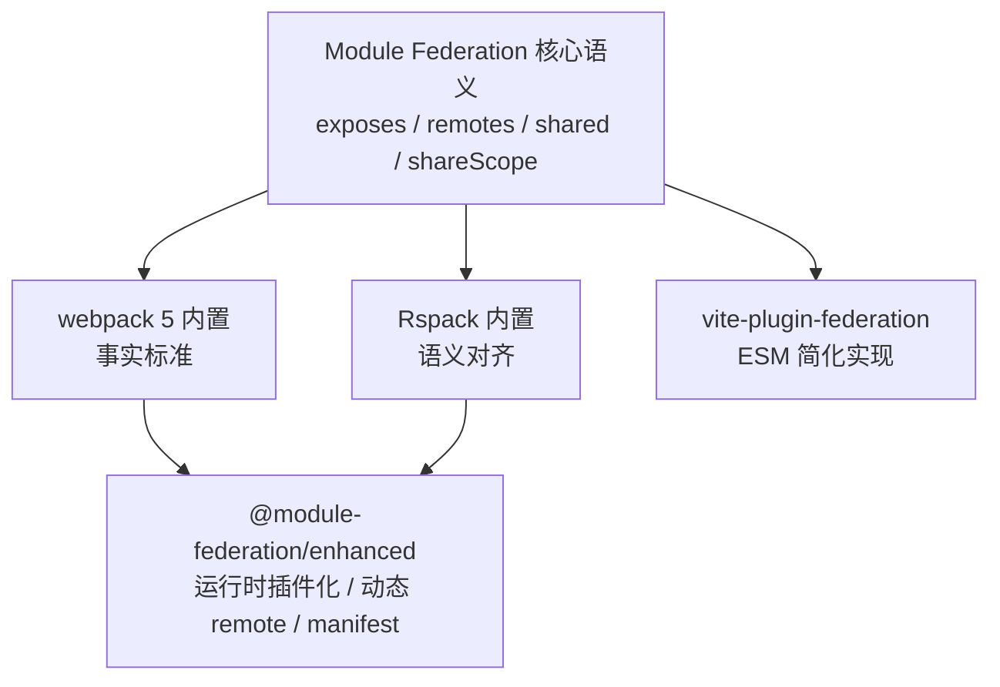
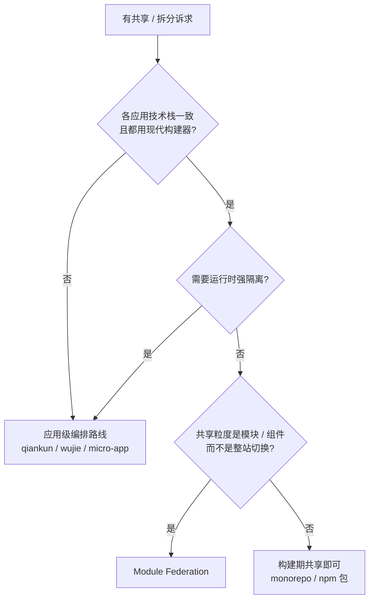

# 第六篇：Module Federation——Webpack 5 时代的微前端方案

**核心要点：**

- 核心模型：host/remote、exposes/remotes/shared 三组配置，把「构建期写死的依赖」变成「运行时协商的模块」
- shared 的版本协商机制：singleton、requiredVersion、fallback 与 eager 的真实处理逻辑
- 与 qiankun 的差异：qiankun 是「应用级编排」，MF 是「模块级共享」——沙箱、样式隔离、路由接管都要自己补
- 异步边界：入口为何要求异步化，及常见报错根因
- 生态：@module-federation/enhanced 的运行时插件化、Rspack 原生支持、Vite 的 federation 插件
- 适用边界：同栈微模块与公共依赖复用是主场；跨技术栈、老应用接入不是目标场景
- 常见坑：shared 的「幽灵升级」、样式全局污染、路由集成 DIY

## 一、开篇：当「共享一个组件」比「编排一个应用」更常见

前几篇讲的都是「应用级」微前端，解决**多团队、多系统整合**。但工程里还有一类更高频的诉求，没那么重的「编排」味道：

- 中台团队的「支付收银台」，想让电商 App、会员 App 都直接用上它最新版；
- 公共的「审批流程组件」只有一份，提供方发布即更新，其他应用**不需要重新构建**；
- 多个应用都背了一份 React + 组件库，你希望页面里只有一份。

用已有手段硬解，都别扭：

| 手段 | 别扭在哪 |
| --- | --- |
| npm 包 / monorepo 共享 | 构建期组合：提供方每次发版，所有消费方都要重新构建、重新发版 |
| iframe 嵌入 | 隔离太重：组件级共享被放大成页面级隔离，通信、弹层、样式都要绕路（番外篇一） |
| qiankun 整站编排 | 粒度太粗：只想共享一个组件，却要付出整套生命周期与沙箱的接入成本 |
| 各带各的依赖 | 用户重复下载，多实例还可能行为不一致 |

**Module Federation（模块联邦，下文简称 MF）** 就是冲着这类「模块级共享」诉求来的。它是 Webpack 5 发布时的头号特性：让多个独立构建的应用，在运行时按需共享模块——把「模块」从构建期写死的产物，变成运行时协商的服务。



最后校准一个误解：**MF 不是「更好的 qiankun」**——qiankun 回答「怎么编排多个独立应用」，MF 回答「怎么让多个独立构建的应用共享模块」。

## 二、核心模型：三组配置与两个角色

MF 的 API 就是 `ModuleFederationPlugin` 上的一组配置，背后是一套角色模型——模型立起来，配置就不用背了。

### 2.1 host 和 remote 是角色，不是应用类型

- **remote（提供方）**：通过 `exposes` 对外暴露模块，「我能给你什么」；
- **host（消费方）**：通过 `remotes` 声明依赖谁，「我要用谁的什么」。

关键是**角色可叠加**，最常见的是「互相联邦」：



所以不要套用「主应用 / 子应用」的心智：MF 里没有谁包住谁，只有**谁在这条依赖关系里当消费方**。

### 2.2 提供方（remote）配置：name / filename / exposes

```js
// checkout 应用：webpack.config.js
const { ModuleFederationPlugin } = require('webpack').container;

new ModuleFederationPlugin({
  name: 'checkout',            // 唯一名称：协商与远程引用的「身份证」
  filename: 'remoteEntry.js',  // 对外入口：消费方要加载的「模块清单」
  exposes: {                   // 暴露哪些模块：键是对外路径，值是本地模块
    './PayButton': './src/components/PayButton',
    './routes': './src/routes',
  },
  shared: {                    // 声明共享依赖（下一节展开）
    react: { singleton: true, requiredVersion: '^18.0.0' },
    'react-dom': { singleton: true, requiredVersion: '^18.0.0' },
  },
})
```

### 2.3 消费方（host）配置：remotes

```js
// mall_host 应用：webpack.config.js
new ModuleFederationPlugin({
  name: 'mall_host',
  remotes: {
    // 格式：<引用名>@<remoteEntry 的 URL>，名字须与提供方 name 一致
    checkout: 'checkout@http://localhost:3001/remoteEntry.js',
  },
  shared: {
    react: { singleton: true, requiredVersion: '^18.0.0' },
    'react-dom': { singleton: true, requiredVersion: '^18.0.0' },
  },
})
```

业务代码里，远程模块「像本地模块一样」被 import：

```js
// 编译期看起来是普通动态 import
// 运行时被改写成「加载 remoteEntry → 协商 → 拉取模块」
const { default: PayButton } = await import('checkout/PayButton');
```

两个细节：`checkout/PayButton` 两段对应 `remotes` 的引用名和 `exposes` 的键，对不上会报「module does not exist in the container」；**消费方也要配置 `shared`**——共享是双方注册、协商取胜，只配一方时另一方只能自带副本。

### 2.4 remoteEntry.js：模块清单，不是完整应用

产物里会多出一个特殊的 `remoteEntry.js`——**它不含模块实现代码**（实现代码在 `PayButton.async.js` 这类按需拉取的 chunk 里），只有容器接口（`window.checkout.get / init`）、模块映射表（`'./PayButton'` → chunk 地址）、shared 注册表三样东西，通常只有几 KB，加载极便宜。它也是联邦的「发布开关」：更新清单，消费方下次加载就拿到新版本（缓存策略见 8.4）。

### 2.5 整体架构图

```mermaid
flowchart TB
    subgraph Host["消费方 mall_host"]
        H1["业务代码<br/>import('checkout/PayButton')"]
        H2[webpack 运行时<br/>remote 解析 + shareScope 协商]
    end

    subgraph Remote["提供方 checkout"]
        R1["remoteEntry.js<br/>容器接口 + 模块映射 + shared 注册表"]
        R2["PayButton 实现 chunk<br/>（按需拉取）"]
        R3["react 等共享依赖副本<br/>（协商后可能复用 host 的）"]
    end

    H1 --> H2
    H2 -->|1. script 标签加载清单| R1
    H2 -->|2. init 注入 shareScope| R1
    H2 -->|3. get('./PayButton')| R2
    R2 -->|4. 共享依赖按协商结果加载| R3
```

## 三、运行时机制：import() 背后发生了什么

### 3.1 编译期改写：这不是普通的动态 import

`import('checkout/PayButton')` 之所以「像本地模块」，是因为 **webpack 构建期识别出 remote 前缀，把它改写成了运行时编排代码**——拉清单、注册共享依赖、要模块、执行工厂函数，四步时序见下节。

两个结论：**远程模块天然是异步的**，消费方式必须是 `import()` / `React.lazy` / `defineAsyncComponent`；**共享协商发生在 `init()` 与 `get()` 之间**——这就引出本文最重要的数据结构。

### 3.2 完整时序图



### 3.3 shareScope：页面级的「包注册表」

`__webpack_share_scopes__.default` 挂在整个页面全局，**同页面所有联邦应用共享同一个 shareScope**——这是理解「幽灵升级」「单例共享」的钥匙。它像一个极简版 npm registry：

- **注册**：`init()` 时把携带的共享副本登记进来（版本号、加载方式、来源）；
- **查找**：消费共享依赖时，拿 `requiredVersion` 的 semver 范围来匹配，多个满足取最高；
- **复用**：协商命中就复用已注册的副本，而不是各加载各的。

### 3.4 异步边界：为什么官方示例的入口都要 bootstrap 化

MF 最著名的入门困惑来自这个报错：

```text
Error: Shared module is not available for eager consumption
```

白话翻译：**入口代码在 shareScope 准备好之前，就同步消费了共享依赖。**`init()` 是**异步**的（remoteEntry 要走网络），而入口顶部的 `import React from 'react'` 是**同步**的——React 声明为 shared 时，同步消费它可能还没协商出版本，于是崩溃。

标准解法是把入口整体异步化，即 bootstrap 模式：

```js
// index.js —— 只剩一件事：异步启动真正的入口
import('./bootstrap');

// bootstrap.js —— 原来入口里的逻辑都搬到这里
// 同步 import 在异步 chunk 里执行，共享依赖已就位
import { createRoot } from 'react-dom/client';
import App from './App';

createRoot(document.getElementById('root')).render(<App />);
```

原理：**`import('./bootstrap')` 把入口变成异步 chunk，浏览器先走完「加载清单 → init → 协商」，再执行应用代码。**注意 **host 同样需要**这个改造——host 自己的 React 也声明为 shared。另一条路是 `eager: true`：副本打进初始 chunk 同步可用，但首屏必须背这份依赖，只在无法改造入口时局部兜底。

## 四、shared 深拆：内嵌在运行时的「包管理器」

如果说 `exposes/remotes` 是 MF 的骨架，`shared` 就是它的灵魂——也是大多数线上事故的源头。

### 4.1 版本协商的完整规则



三条规则用大白话总结：

1. **能匹配就取最高**：满足 semver 范围的已注册版本里，协商永远偏向最高；
2. **singleton 是「强制合一」**：单例依赖全页面只允许一份，版本不一致时消费方**被直接切到已注册版本**运行，只给 console 警告；加 `strictVersion: true` 升级为抛错；
3. **fallback 是最后的兜底**：找不到可用版本就用自己的副本——这也是 MF 应用**单独打开永远能跑**的原因，协商只是「能不能省掉这份副本」的优化。

### 4.2 五个选项精讲

| 选项 | 作用 | 不配置时的默认行为 |
| --- | --- | --- |
| `requiredVersion` | 声明可接受的 semver 范围，协商匹配的依据 | 默认读取 `package.json` 里的依赖版本范围 |
| `singleton` | 全页面强制一份，版本不一致时统一到已注册的最高版本 | 各应用版本不同时各用各的副本（多实例） |
| `strictVersion` | 版本不满足时从警告升级为抛错 | 仅 console 警告 |
| `fallback` | 协商失败时的自带兜底副本 | 默认就是本应用自己打包的那份 |
| `eager` | 把共享副本打进初始 chunk，同步可用 | 副本异步加载，入口需异步化（bootstrap 模式） |

第 2 篇的 `shared` 片段至此补全——**协商的本质是用 semver 表达预期、用运行时匹配处理偏差**，比 externals 写死全局变量优雅得多。

### 4.3 「幽灵升级」：shared 最危险的坑

场景：主应用和子应用 A 都声明 `react: { singleton: true }`，都是 React 17；某天主应用升到 React 18 发版，子应用 A **一行没改**。打开页面，shareScope 里的 react 是 18.x，子应用 A 协商失败，singleton 生效——**被切到 React 18 上运行**，踩中依赖 React 17 行为的代码，线上炸了。

这就是「幽灵升级」：**提供方的一次常规发版，改变了从未参与发版的应用的运行时行为。**子应用确实没动过，是运行时把它挪进了从未被测试的环境。

治理手段按层次递进：

| 层次 | 手段 | 效果 |
| --- | --- | --- |
| 事前约束 | 版本范围收紧 + `strictVersion` | 版本不匹配直接报错，把「静默换环境」变成「显式失败」 |
| 发布流程 | 主应用升大版本前通知所有消费方对齐，或走双版本共存灰度 | 消除「突然升舱」 |
| 自动化保障 | 契约测试 / 集成冒烟：host + 全部 remote 的组合跑通关键路径 | 发版前暴露组合问题 |
| 架构兜底 | 对高风险依赖评估是否真的需要 singleton | 宁可短暂多实例，不要全局互踩 |

singleton 不是免费的：它用「一荣俱荣、一损俱损」换「单实例、状态一致」。框架本体（React/Vue）值得 singleton——多实例会导致 hooks 状态与事件系统错乱；很多第三方库不需要，各带副本反而更稳。

### 4.4 什么该共享，什么不该共享

| 类别 | 建议 | 理由 |
| --- | --- | --- |
| 框架本体（react / vue / angular） | 强烈建议 `singleton: true` | 多实例必出行为异常，且体积最大、复用收益最高 |
| 路由库（react-router / vue-router） | 建议共享 | 页面内最好只有一套路由上下文，否则跳转与监听会分裂 |
| 大型 UI 库（antd / element-plus） | 建议 `singleton` | 体积大，且其全局行为（弹层、主题）隐含单例假设 |
| 状态管理（zustand / pinia 等） | 谨慎 | 共享的是「库」不是「store 实例」，跨应用状态要用通信机制（第 8 篇） |
| 工具函数小库（dayjs、lodash 等） | 一般不共享 | 体积小收益低，版本碎片化风险高，各带各的更省心 |
| 业务组件 / 内部 npm 包 | 不建议放 shared | 属于 `exposes` 的职责（共享代码本体），不是 shared 的职责（共享三方依赖） |

## 五、与 qiankun 的本质差异：应用级编排 vs 模块级共享

**qiankun 的组合单元是「应用」，MF 的组合单元是「模块」。粒度不同，决定了它们在隔离、路由、依赖上的所有差异。**

| 维度 | qiankun（应用级编排） | Module Federation（模块级共享） |
| --- | --- | --- |
| 加载单元 | 整个应用（HTML Entry） | 单个模块 / 组件（JS chunk） |
| 入口协议 | HTML：解析 DOM / CSS / JS | remoteEntry：模块清单 |
| JS 隔离 | Proxy 沙箱 | **无**，同一页面同一上下文 |
| CSS 隔离 | 可选 strict / experimental | **无** |
| 路由 | 接管（activeRule 驱动挂载卸载） | **不接管**，与 react-router 等自行集成 |
| 生命周期 | bootstrap / mount / unmount 约定 | 无约定，组件级自行处理 |
| 公共依赖 | 各带各的，或靠 external 缓解 | shared 运行时协商（核心卖点） |
| 技术栈约束 | 宽松，产物可 UMD 即可 | 严格，需 webpack 5 / Rspack 等现代构建器 |
| 存量老应用接入 | 相对友好（改出口与打包） | 不友好（先得升构建体系） |
| 典型场景 | 多团队异构系统整合 | 同栈微模块共享、组件/页面复用、依赖治理 |

压缩成定位图，就是第 14 篇会收束的「隔离与协作光谱」：



MF 站在光谱最「融合」的一端，「轻」是双刃剑：好的一面是远程模块与本地模块共享同一个 React 上下文——props 直接传、hooks 直接复用，qiankun 给不了这个集成深度；危险的一面是**沙箱、样式隔离、路由接管这些 qiankun 白送的能力，MF 全都要自己补**（第 8、9 篇）。

所以选型不要问「MF 和 qiankun 哪个好」，要问「**我需要的是编排应用，还是共享模块**」。

## 六、实战：跑通一个最小 MF 组合

### 6.1 remote：暴露一个组件

```jsx
// src/components/PayButton.jsx
export default function PayButton({ amount }) {
  return <button className="checkout-pay-btn">支付 ¥{(amount / 100).toFixed(2)}</button>;
}
```

应用保持普通 React 形态即可，唯一要求是入口用 3.4 的 bootstrap 模式。

### 6.2 host：React.lazy + Suspense 消费

```jsx
// mall-host/src/pages/OrderPage.jsx
import { lazy, Suspense } from 'react';

const PayButton = lazy(() => import('checkout/PayButton'));

export default function OrderPage() {
  return (
    <div>
      <h1>订单详情</h1>
      <Suspense fallback={<span>加载支付组件中…</span>}>
        <PayButton amount={9900} />
      </Suspense>
    </div>
  );
}
```

运行效果：打开订单页时，运行时先拉 remoteEntry，再拉 PayButton 的 chunk，协商复用页面里已有的 React 18，渲染按钮。**提供方重新发版，host 什么都不用做**。

### 6.3 两个高频变体

**变体一：动态 remote 地址。** 生产环境的 URL 要按环境、灰度决定，而 `remotes` 是构建期写死的。webpack 的「promise external」把决定权延后到运行时：

> ⚠️ 示意代码：核心骨架，错误处理与加载超时需按项目补充。

```js
// webpack.config.js（host）
remotes: {
  checkout: `promise new Promise((resolve) => {
    const remoteUrl = window.__REMOTE_CHECKOUT__ || 'http://localhost:3001/remoteEntry.js';
    const script = document.createElement('script');
    script.src = remoteUrl;
    script.onload = () => resolve({
      get: (request) => window.checkout.get(request),
      init: (shareScope) => window.checkout.init(shareScope),
    });
    document.head.appendChild(script);
  })`,
}
```

**变体二：Vue 侧消费。** 异步组件换成 `defineAsyncComponent`：

```js
// host（Vue 3）
const UserCard = defineAsyncComponent(() => import('shop/UserCard'));
```

### 6.4 常见报错速查表

| 报错 / 现象 | 根因 | 对策 |
| --- | --- | --- |
| `Shared module is not available for eager consumption` | 入口同步消费了 shared 依赖，shareScope 还没就绪 | 入口 bootstrap 化（3.4），或局部 `eager: true` |
| `Module "./Xxx" does not exist in the container` | `import` 的路径与 `exposes` 的键不一致，或 remote 是旧产物 | 两边路径逐字对齐；确认提供方已重新构建发版 |
| remoteEntry 404 | `remotes` 里 URL 写错、服务未启动 | 直接用浏览器访问该 URL 验证可达性 |
| 加载成功但请求被 CORS 拦截 | 远程资源服务未开跨域 | 静态资源服务加 `Access-Control-Allow-Origin` |
| 组件渲染了但样式丢失 / 行为怪异 | shared 版本协商结果与开发时不一致 | 检查两端 shared 声明是否对齐，看 console 的版本警告 |
| 本地好好的，线上偶发白屏 | remoteEntry 被缓存，清单指向已下线的旧 chunk | 检查 remoteEntry 的缓存策略（见 8.4） |

## 七、生态现状：MF 已经不只是 Webpack 的特性

### 7.1 @module-federation/enhanced：从「构建插件」走向「运行时平台」

webpack 内置 MF 有两个长期痛点：remote 地址写死在构建期、缺标准化的运行时编排。社区整合 MF 原作者的增强方案为 `@module-federation/enhanced`（MF 2.0），核心思路是**把「联邦的决策」从构建期搬到运行时**：

```ts
// module-federation.config.ts（基于 @module-federation/enhanced）
export default defineConfig({
  name: 'mall_host',
  remotes: {
    // manifest 模式：配合 devtools / 数据预取
    checkout: 'checkout@http://localhost:3001/mf-manifest.json',
  },
  manifest: true,
  shared: {
    react: { singleton: true },
    'react-dom': { singleton: true },
  },
});

// 运行时 API：动态注册 remote、按需加载，构建期不再写死地址
import { registerRemotes, loadRemote } from '@module-federation/runtime';

registerRemotes([{ name: 'checkout', entry: getRemoteEntry('checkout') }]);
const PayButton = lazy(() => loadRemote('checkout/PayButton'));
```

运行时层还带来 runtime 插件（埋点、重试、降级）、devtools 与数据预取。要把 MF 用进生产链路，从 enhanced 起步是当前更稳的选择。

### 7.2 Rspack 与 Vite：多构建器时代

**Rspack** 同时解决了「webpack 语义」和「构建性能」：插件用法基本一致，迁移成本低，新项目「Rspack + MF」已是常见组合。**Vite** 走社区插件 `vite-plugin-federation`：开发期原生 ESM 互引，构建期落地。边界要心里有数——**shared 协商是简化实现，与 webpack 语义不完全互通**，跨构建器组合上线前必须验证。

### 7.3 一张表看清生态

| 方案 | 载体 | MF 能力完整度 | 适用判断 |
| --- | --- | --- | --- |
| webpack 5 内置 | `ModuleFederationPlugin` | 完整（事实标准语义） | 存量 webpack 项目直接用 |
| `@module-federation/enhanced` | webpack / Rspack 插件 + 运行时 | 完整 + 动态 remote / manifest / devtools | 生产级联邦与多应用治理 |
| Rspack 内置 | 同名插件 | 与 webpack 对齐 | 新项目，看重构建速度 |
| `vite-plugin-federation` | Vite 插件 | 简化版（ESM 路线） | Vite 项目内联邦，跨构建器组合需验证 |



## 八、适用边界：它擅长什么，不擅长什么

### 8.1 主场场景

- **同技术栈的微模块拆分**：多团队在同一套 React/Vue 体系里并行开发，按模块划分仓库与部署节奏；
- **公共依赖复用**：页面里只保留一份 React 与 UI 库，`shared` 协商天然去重（第 2 篇的落地手段之一）；
- **设计系统 / 业务组件分发**：组件库不再走「发 npm 包 → 各应用升级」的慢链路，提供方发布即生效；
- **需要深集成的组合**：远程组件与本地组件同组件树、同路由上下文——qiankun 给不了的集成深度。

其中「跨系统组件共享」值得单独给一个选型判断——**私有 npm 包 vs 联邦模块**：如果各系统都是同一套 Vue 技术栈 + Element UI（Vue 3 对应 element-plus），构建器也都升到了 webpack 5 / Rspack，走 MF 通常优于私有 npm——把 `vue`、`element-plus` 声明为 shared 单例后，页面里只保留一份组件库，用户加载更快；组件更新走「提供方发布即生效」，省掉 npm 发版后所有消费方重新构建的传播链路。反过来，只要有系统还停留在 webpack 4（Vue 2 老项目常见）、或者组件库版本碎片化无法统一成 singleton，私有 npm 包仍是更稳的默认选择。

### 8.2 非主场场景

- **跨技术栈整合**：React host 消费 Angular remote 技术上可行，但两套框架、两份运行时、无隔离加持，复杂度远超收益——回到 qiankun / wujie 系（第 4、7 篇）；
- **存量老应用接入**：MF 要求现代构建器，老系统接入等于先做构建体系现代化；
- **需要强隔离的嵌入**：第三方页面、不可信内容，MF 的零隔离模型直接出局——回到 iframe（番外篇一、五）。

### 8.3 一棵决策小树



这棵树是第 3 篇六方案决策在「模块共享」分支的细化：**MF 是「同栈 + 模块级 + 无强隔离诉求」同时成立时的最优解，缺一个都要重新掂量。**

### 8.4 部署与版本治理：remoteEntry 就是发布开关

MF 的部署模型很舒服：**提供方的发布 = 替换自己域名下的静态文件**，消费方无需感知。但正因太「无感」，两件治理事项必须制度化：

1. **缓存策略区分两类文件**：`remoteEntry.js`（清单）**不缓存或极短缓存**——被缓存后会指向已下线的旧 chunk，出现「线上偶发白屏」的经典事故；实现 chunk 带 contenthash + 长缓存，不可变随便缓。
2. **「永远最新」与「版本锁定」要做出选择**：默认发布即全量生效，但「幽灵升级」（4.3）随时可能发生；配合 7.1 的动态 remote + 配置中心做成「按版本锁定、灰度切换」，是把 MF 推向生产级的关键一步。

## 九、常见坑清单：生产视角

| 坑 | 典型现象 | 根因 | 对策 |
| --- | --- | --- | --- |
| 幽灵升级 | 子应用没发版却开始报错 | singleton 统一到最高版本，运行环境被静默更换 | 版本对齐流程 + `requiredVersion` 收紧 + `strictVersion` + 契约测试（4.3） |
| 样式全局污染 | A 应用的按钮被 B 应用样式覆盖 | 无样式隔离，所有 CSS 进同一个文档 | CSS Modules / 命名前缀 / 设计变量约束（第 9 篇） |
| 路由 DIY 出边界 | 子模块路由把整页 URL 覆盖，或刷新 404 | 没有路由接管，各自为政 | 路由前缀全局规划 + basename 显式传递 |
| remoteEntry 缓存事故 | 发版后偶发白屏、旧模块 404 | 清单被长缓存，指向已下线 chunk | 清单不缓存，chunk 长缓存（8.4） |
| 双向联邦成环 | 首屏卡死、共享依赖互相等待 | host 与 remote 互为提供方 | 抽公共层打断环，禁止 A↔B 互相联邦 |
| 隐式单例失效 | 弹层不出现、事件重复触发 | 某个隐含单例假设的库（弹层管理、事件总线）没共享，页面存在多实例 | 排查单例假设型依赖，纳入 shared |
| 远程故障无兜底 | remote 服务抖动导致 host 页面白屏 | 加载远程模块没有降级路径 | `ErrorBoundary` + 失败兜底 UI + 运行时重试 |
| 集成测试缺位 | 本地单测全绿，组合上线炸 | 测试环境没有真实 host+remote 组合 | mock manifest + 契约测试 + 组合冒烟（4.3） |

三个坑值得多说两句。

**样式污染**是感知最强的坑——qiankun 至少有 `experimentalStyleIsolation` 可开，MF 什么都没有。正确心智是**回归工程约束**：组件样式一律 CSS Modules / CSS-in-JS，禁止裸全局选择器——这是同栈团队的既有规范，也是「同栈才用 MF」的隐藏红利。

**路由集成**的原则：MF 不碰路由，路由边界就是模块边界。`exposes` 粒度对齐到「路由级组件」（如 `./routes`），由消费方路由统一挂载：

```jsx
// host 的路由表里，远程路由和本地路由一视同仁
const CheckoutRoutes = lazy(() => import('checkout/routes'));

<Route
  path="/checkout/*"
  element={
    <Suspense fallback={<PageLoading />}>
      <CheckoutRoutes />
    </Suspense>
  }
/>
```

这样 URL 解析、跳转、守卫全收在 host 一处，remote 内部只管自己的相对子路由。

**远程故障兜底**是生产底线。远程模块本质是网络请求，就该有失败路径：

```jsx
// 加载失败时降级到本地兜底实现，主流程不断
const PayButton = lazy(() =>
  import('checkout/PayButton').catch(() => import('./fallbacks/PayButton')),
);
```

再配合 `ErrorBoundary` 兜住渲染期异常，联邦故障就被限制在局部区块而非整页白屏。

## 十、小结

MF 的知识可以收束成三句话：

1. **模型上**，它是「运行时的 npm」：`exposes` 是发布、`remotes` 是依赖声明、`shared` 是依赖协商——构建期写死的模块依赖，变成运行时按需协商的服务；
2. **机制上**，`import()` 的编译期改写 + shareScope 的注册/查找/复用，解释了全部运行时行为与报错根因；
3. **边界上**，它用「零隔离」换模块级深度集成，主场是同栈微模块与公共依赖复用；沙箱、样式隔离、路由、降级这些 qiankun 白送的能力，都是你的工程责任。

与 qiankun 不是替代而是互补：qiankun 编排异构的存量系统，MF 在同栈应用间做深度模块复用，经常同场出现（番外篇四有现成案例）。

下一篇回到运行时编排路线，看两个更年轻的框架：micro-app 和 wujie（无界）——[第七篇：无界与 micro-app——微前端框架的新选择](./07-wujie-and-micro-app.md)。
