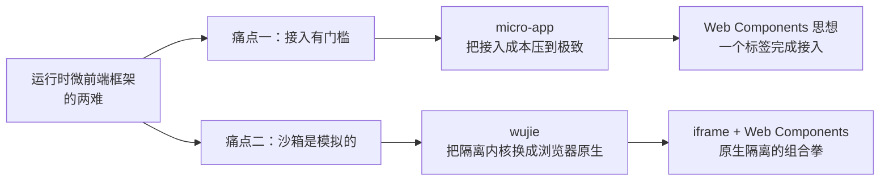
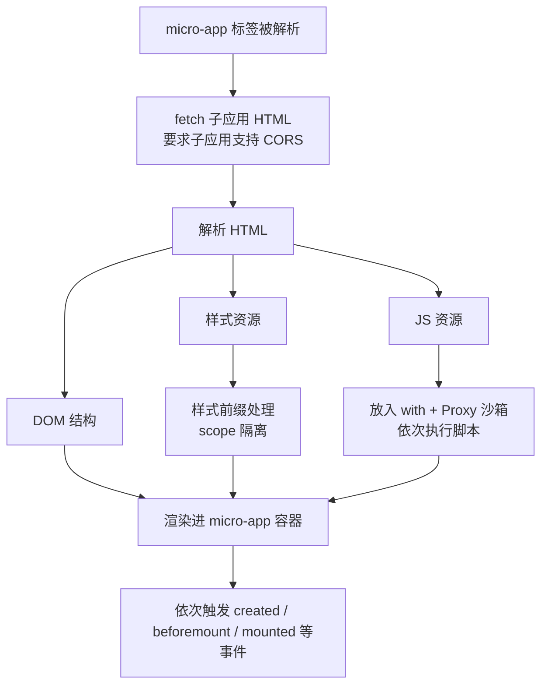
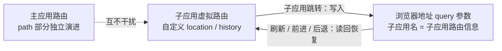
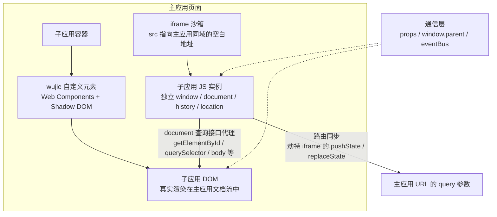
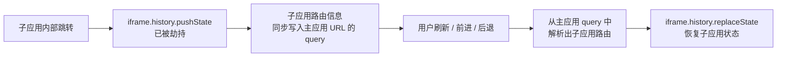
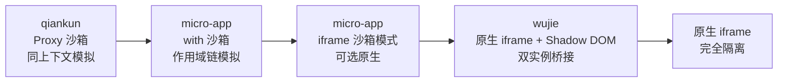
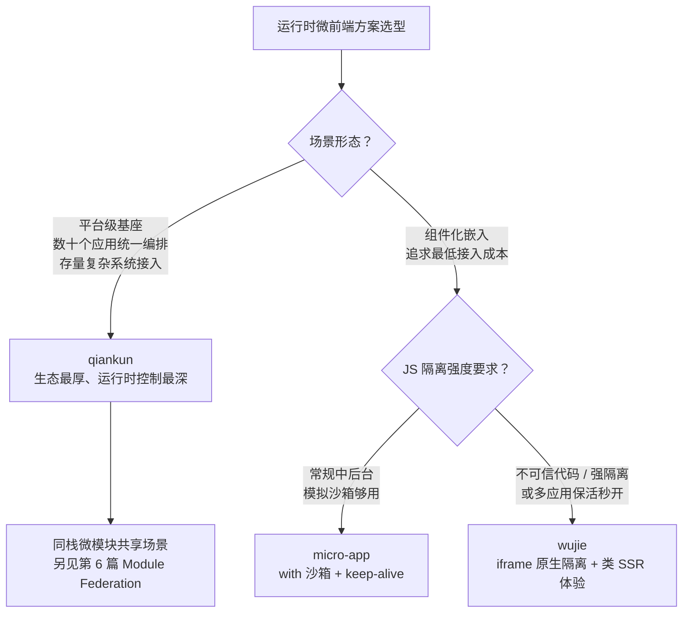

# 第七篇：无界与 micro-app——微前端框架的新选择

**核心要点：**

- micro-app 的定位：借鉴 Web Components 思想做「类组件」封装，一个 `<micro-app>` 标签完成接入，JS 沙箱（Proxy + with）与样式作用域隔离，接入成本在同类方案中最低
- wujie 的混合架构：iframe 承载 JS 运行环境（复用浏览器原生 JS 隔离），Shadow DOM/Web Components 承载 DOM 渲染——用 iframe 之「强」补 DOM 割裂之「短」
- wujie 的关键设计：iframe 内的 window 代理到外层渲染容器，路由、通信、样式透传的桥接层与对应成本
- 与 qiankun 的对比维度：接入成本（micro-app 最低）、隔离强度（wujie 借 iframe 最强）、保活与预渲染体验（wujie 内置）、生态成熟度与深度定制空间（qiankun 最成熟）
- 各自的坑：micro-app 的样式处理与低版本浏览器兼容、wujie 的弹层/焦点跨 iframe 边界问题、两者共同的路由基座与生命周期约定
- 选型逻辑：新平台从零搭建、追求低侵入快速接入选 micro-app/wujie；存量复杂生态、需要深度运行时控制选 qiankun；三个方案都值得读源码，因为设计取舍各具代表性

## 一、开篇：qiankun 之后，为什么还需要新方案？

上一篇我们聊了 Module Federation，它是从「构建期组合」的角度回答微前端问题。这一篇回到运行时路线，看两个更年轻的运行时框架：micro-app 和 wujie（无界）。

先抛一个问题：**qiankun 已经很成熟了，为什么 2021 年之后还会接连出现 micro-app（京东）和 wujie（腾讯）？**

答案藏在第 4 篇结尾的那句话里。qiankun 选择了一条折中路线——“HTML Entry + 同上下文 Proxy 沙箱”——换来的是低接入改造成本，代价是**隔离强度弱于 iframe / Shadow DOM 这类“真隔离”方案**。落地过 qiankun 的团队，大概率都体会过它的两个长期痛点：

1. **接入仍然有门槛**：子应用要导出 `bootstrap` / `mount` / `unmount` 生命周期，要改 webpack 配置（publicPath、library 导出），要在主应用注册激活规则。对于“我只想在一个页面里嵌一个应用”的场景，这套仪式感偏重了。
2. **沙箱终究是“模拟”的**：Proxy 沙箱再精巧，也是在同一个 JS 上下文里模拟隔离。总有场景会“漏”：子应用直接摸到真实 `window`、组件库探测运行环境后行为异常、动态插样式绕过隔离层……

micro-app 和 wujie，正是从这两个痛点的不同方向发起的进攻：



先用一句话给两个方案定位：

- **micro-app**：像写组件一样接微前端。借鉴 Web Components 思想，把子应用封装成一个自定义元素 `<micro-app>`，接入成本在同类方案中最低。
- **wujie**：把 iframe 的隔离能力和 Web Components 的渲染能力拼在一起。JS 跑在 iframe 里享受**原生**隔离，DOM 渲染在主应用的 Shadow DOM 里避免“DOM 割裂”——用一个精巧的桥接层把两者连起来。

第 3 篇的全景对比里，我们把 micro-app 归在“类 Web Components”路线、wujie 归在“iframe 沙箱增强”路线。这一篇就来把它们拆开看个清楚。

## 二、micro-app：一个标签的微前端

### 2.1 定位：借鉴 Web Components 的「类组件」封装

micro-app 是京东零售推出的微前端框架，2021 年开源，2022 年底发布 1.0 大版本（仓库在 micro-zoe 组织下，后随京东开源体系统一迁入 jd-opensource）。它的核心思想一句话就能说清：

**借鉴 Web Components 的思路，把子应用封装成一个类自定义元素，让微前端的使用方式向写组件看齐。**

它注册了一个真正的自定义元素 `micro-app`，于是接入一个子应用，从“注册配置一段 JS”变成了“写一个标签”：

```html
<micro-app name='app' url='http://localhost:3000/'></micro-app>
```

主应用侧只需初始化一次：

```js
import microApp from '@micro-zoe/micro-app'

microApp.start()
```

用过 `iframe` 的人会立刻产生既视感：**都是一个标签，填个地址就能用**。区别在于：

| 维度 | 原生 iframe | micro-app 标签 |
| --- | --- | --- |
| 子应用 DOM 位置 | 独立 document，与主应用割裂 | 渲染进主应用文档流，天然共享布局 |
| 通信 | 只能 postMessage 传拷贝 | 同上下文，可直接传对象引用 |
| 样式 | 完全隔离但也完全割裂 | 容器内渲染 + 样式前缀隔离 |
| 子应用改造 | 零改造 | 几乎零改造（需支持 CORS） |

这个对照表其实点出了 micro-app 的设计哲学：**保留 iframe“一个标签”的使用体验，但把子应用拉回主应用的文档流里，避免 iframe 那套割裂问题**（番外篇一详细讨论过原生 iframe 的割裂代价）。

### 2.2 一个标签背后发生了什么：渲染流程

`<micro-app>` 标签挂到页面上之后，框架大致做了这几件事：



和 qiankun 的 HTML Entry（第 4 篇第六节）对比一下，会发现思路同源——都是拉 HTML、解析资源、沙箱执行。**真正的差别在“编排方式”**：

- qiankun 是**注册式**：`registerMicroApps` 声明激活规则，路由驱动加载卸载
- micro-app 是**组件式**：标签写在哪，子应用就渲染在哪；标签销毁，子应用就卸载；不需要注册表，也不强绑定路由

组件式带来的直接好处是场景变宽了：除了整页路由切换，还可以在一个页面里**并排嵌多个子应用**、在弹窗里嵌子应用、在低代码画布里嵌子应用——这些“局部嵌入”场景用 qiankun 做要绕不少弯路（qiankun 的 `loadMicroApp` 手动加载可以做，但心智不如一个标签直接）。

标签上还挂了一组生命周期事件，让宿主能感知子应用的装载过程：

```jsx
<micro-app
  name='app'
  url='http://localhost:3000/'
  onCreated={() => console.log('元素创建')}
  onBeforemount={() => console.log('渲染前')}
  onMounted={() => console.log('渲染完成')}
  onUnmount={() => console.log('卸载')}
  onError={() => console.log('加载出错')}
/>
```

### 2.3 JS 沙箱：with + Proxy 的「伪全局」

micro-app 默认的 JS 沙箱（with 沙箱）思路和 qiankun 的 Proxy 沙箱同源，但切入角度不同：

- qiankun 的做法：给子应用一个 `fakeWindow`，子应用代码里对 `window` 的读写落到代理上
- micro-app 的做法：**直接改写作用域链**——把子应用代码包进 `with(代理window)` 里执行，让代码中所有裸标识符的查找都先命中沙箱对象

> ⚠️ 示意代码：为便于讲原理做了大幅简化，真实实现要处理作用域、document 劫持、事件绑定等大量边界，请勿照抄。

```js
// 1. 构造沙箱全局对象：写入落自己、读取兜底真 window
const fakeWindow = Object.create(null);
const proxyWindow = new Proxy(fakeWindow, {
  get: (target, key) => (key in target ? target[key] : window[key]),
  set: (target, key, value) => {
    target[key] = value;
    return true;
  },
});

// 2. 用 with 把作用域链第一环换成沙箱对象
const runScript = new Function('window', `
  with(window) {
    // 子应用代码在这里执行
    // 裸写的 window.xxx、var 全局变量、document 查询
    // 都会先命中 proxyWindow
    ${childAppCode}
  }
`);

runScript(proxyWindow);
```

这个设计的精髓在于 **with 改变的是“标识符解析的起点”**：子应用写 `history.pushState(...)`、`var a = 1` 这类代码时，根本不用出现 `window` 字样，就已经被劫持进沙箱了——比“拦截 `window` 引用”覆盖得更彻底。

当然，with 也有天然的工程限制：**严格模式下 with 被禁止**。所以子应用代码需要被包在非严格环境里执行，遇到 ES Module 这类天然严格模式的代码，框架要做转换处理——这是这类方案绕不开的实现细节，读源码时可以重点看它怎么处理。

**元素隔离**是这个沙箱体系里的另一半：子应用里的 `document.querySelector`、`getElementById` 等查询被劫持到 `<micro-app>` 容器内部执行，效果类似 iframe 的元素隔离——子应用“看不到”别人的 DOM，多个子应用都写 `document.getElementById('root')` 也不会互相打架。

**iframe 沙箱模式**：with 沙箱再完善也是模拟。1.0 之后 micro-app 提供了第二种沙箱——给标签加 `iframe` 属性，让子应用 JS 直接跑在一个真实的 iframe 里：

```html
<!-- 强隔离模式：JS 运行在原生 iframe 中 -->
<micro-app name='app' url='http://localhost:3000/' iframe></micro-app>
```

什么时候该开它？两类场景：一是子应用里有库**探测真实运行环境**（比如判断 `window.top`、依赖原生事件对象），with 沙箱的“伪全局”骗不过它们；二是强隔离诉求（不可信代码、对污染零容忍）。代价也直白：多一次 iframe 实例化开销，通信、路由都要走桥接，隔离强度和协作便利性开始向 wujie 那个方向倾斜。

### 2.4 样式隔离与元素隔离的边界

micro-app 的样式隔离走的是**前缀方案**：默认给子应用的样式规则加作用域前缀，收敛在 `<micro-app>` 容器内（效果对应第 4 篇讲 qiankun 时的 `experimentalStyleIsolation`）。可以通过 `disable-scopecss` 关闭——典型场景是子应用和主应用共用一套设计系统，希望样式互通。

前缀方案的老局限在这里同样存在（第 4 篇 5.3 节列过 qiankun 侧的同类问题）：

- `html`、`body`、`:root` 这类全局选择器的处理有限
- `@keyframes`、`@font-face` 等规则仍可能全局泄漏
- 子应用**运行时动态插入**的样式、以及**挂到真实 body 上的弹层**，会游离在前缀保护之外

v0.x 时期 micro-app 还提供过 Shadow DOM 隔离选项，1.0 起已将其移除，样式隔离统一收敛为前缀方案——强隔离场景则交给上面的 iframe 沙箱模式来兜底。更系统的样式治理手段（动态样式、弹层、主题互通）留到第 9 篇展开。

### 2.5 虚拟路由系统：子应用路由的「隔离」与「记忆」

组件式接入带来一个 qiankun 不那么头疼的问题：**路由**。

qiankun 是路由驱动的，主应用天然规划好了每个子应用的路径空间。而 micro-app 是组件式的——一个页面可能同时挂着两三个子应用，而每个子应用都是完整的 SPA，各自的 vue-router / react-router 都想接管浏览器地址，不打架才怪。

micro-app 1.0 的答案是**虚拟路由系统**：给每个子应用一套自定义的 `location` 和 `history`，子应用的路由器活在这套虚拟对象上，与主应用路由隔离，互不影响。默认的 search 模式下，子应用的路由信息会作为 query 参数同步到浏览器地址上：



除了默认的 search 模式，还有几档可按场景切换：

| 模式 | 路由表现 | 适用场景 |
| --- | --- | --- |
| `search`（默认） | 子应用路由同步到地址栏 query，刷新可恢复 | 多子应用并存，路由都要可恢复 |
| `native` / `native-scope` | 放开路由隔离，子应用直接基于浏览器路由渲染 | 单子应用独占路由的整页场景（需配置基础路由 baseroute） |
| `state` | 基于 `history.state` 模拟路由，不修改地址栏 | 不想污染 URL，又要保留刷新恢复 |
| `pure` | 完全独立于浏览器路由，不改地址也不加堆栈 | 把子应用当纯组件用 |

虚拟路由还配了一套跨应用导航 API，主应用控子应用、子应用控主应用、子应用控子应用都有对应方法：

```js
import microApp from '@micro-zoe/micro-app'

// 主应用控制子应用 my-app 跳转到 /page1
microApp.router.push({ name: 'my-app', path: '/page1' })
```

默认行为下，子应用卸载后重新渲染会回到首页；配置 `keep-router-state` 可以让它恢复卸载前的页面。路由记忆这一点，在“容器页 + 多个嵌入子应用”的场景里非常实用。

### 2.6 保活、预加载与 fiber

micro-app 把几个性能特性做成了标签属性或一行 API：

```html
<!-- keep-alive：子应用隐藏时保留现场，切回时不重新初始化 -->
<micro-app name='app' url='http://localhost:3000/' keep-alive></micro-app>
```

```js
// 预加载：主应用空闲时提前拉取并缓存子应用资源
microApp.preloadApp({ name: 'app', url: 'http://localhost:3000/' })
```

- **keep-alive 保活**：子应用卸载时保留 DOM 和状态，重新渲染时直接恢复现场，适合“频繁来回切换的 tab 页”场景
- **preloadApp 预加载**：思路与 qiankun 的 prefetch 一致，把资源下载提前到空闲时段
- **fiber 模式**：给标签加 `fiber` 属性后，子应用的 JS 会异步分片执行，减少长任务对主应用渲染的阻塞——子应用很重、首屏压力大时值得一试

### 2.7 micro-app 的边界与坑

低接入成本是有代价的，micro-app 的坑主要集中在这几处：

**兼容性**：with 沙箱依赖 Proxy，无法 polyfill，不支持 IE 及低版本浏览器。存量系统里还有 IE 的团队，这一条就能直接否掉它（qiankun 在无 Proxy 环境可以退回快照沙箱，兼容面更宽）。

**样式处理**：前缀隔离的盲区（动态样式、弹层挂 body、全局 reset 冲突）前面已经提过。实践中最常见的翻车点是：主、子应用都引了组件库，全局 reset 和 CSS 变量互相覆盖——前缀方案保护的是“选择器”，保护不了“全局值”。

**“伪全局”与真实环境的差异**：with 沙箱骗得过大多数代码，骗不过所有代码。依赖原生事件对象、探测真实 `window` 引用的库，行为可能异常——兜底手段就是切到 iframe 沙箱模式。

**常见坑速查**：

| 现象 | 根因 | 处理思路 |
| --- | --- | --- |
| 子应用资源加载报 CORS 错误 | 框架用 fetch 拉 HTML | 子应用静态服务开启 CORS 响应头 |
| 主子应用全局样式互相覆盖 | 前缀隔离保护不了全局值/reset | 约定类名前缀、收敛 reset，或共用设计系统 |
| 弹层样式异常或定位错乱 | 弹层挂载点逃逸出容器或被前缀影响 | 指定挂载容器、检查脱管样式 |
| 第三方库行为异常、报运行环境错误 | with 沙箱的伪全局被识破 | 该子应用切 iframe 沙箱模式 |
| 长任务阻塞主应用交互 | 子应用 JS 同步执行 | 开启 fiber 模式 |

## 三、wujie：iframe 的隔离 + Web Components 的渲染

### 3.1 出发点：原生隔离最强的是 iframe，最难用的也是 iframe

聊 wujie 之前，先回顾一下原生 iframe 的处境（番外篇一展开过）：它是浏览器里**唯一免费午餐级**的 JS 隔离——独立的 window、独立的 document、独立的 history 和 location，子应用再怎么折腾也污染不了主应用。qiankun 的 issue 区甚至有人提议“能不能直接用 iframe 做 JS 沙箱”，这个 idea 正是 wujie 的起点。

但 iframe 的问题同样刺眼，wujie 官方文档把它总结为四条：

1. **路由状态丢失**：刷新后 iframe 的 URL 状态丢了
2. **DOM 割裂严重**：弹窗只能在 iframe 内部展示，无法覆盖全局
3. **通信困难**：跨 iframe 只能 postMessage
4. **白屏时间长**：每次打开都是一次完整的页面加载

**wujie 的答案不是修 iframe，而是“肢解”iframe**：只保留它最强的部分——JS 运行环境；把它最弱的部分——DOM 渲染——整体搬到主应用里来。于是有了那句最好记的概括：

> **JS 的“脑子”在 iframe 里，DOM 的“身体”在主应用里。**

### 3.2 双实例架构：一张图看懂 wujie



> 图注：两个“实例”各司其职——iframe 只负责运行 JS（原生 JS 隔离），自定义元素只负责渲染 DOM（原生样式隔离，且 DOM 在主应用文档流中，没有 iframe 的高度/滚动/遮挡问题）；中间的箭头是 wujie 自己搭建的桥接层，3.3、3.4 两节分别拆解。

三个关键选择值得单独说明：

**iframe 是主应用同域的空白页，不是子应用地址。** wujie 创建的 iframe `src` 指向主应用同域的地址，子应用的 HTML 和 JS 由框架 fetch 下来（所以子应用资源同样需要支持 CORS）再注入 iframe 中执行。这样主应用 JS 才有权限操作 iframe 内部、架桥接层；副作用是 iframe 初始化时可能把主应用的资源再加载一遍，需要用一个返回空内容的同域路径来规避。

**DOM 渲染在 Shadow DOM 里。** wujie 创建一个 `wujie` 自定义元素，内部用 Shadow DOM 承载子应用 DOM。Shadow DOM 天然阻止外部样式渗透、内部样式泄漏——子应用**一行样式代码都不用改**，就拿到了 qiankun `strictStyleIsolation` 想要的严格隔离。同时因为这套 DOM 挂在主应用文档流里，iframe 的滚动高度、层级遮挡、fixed 定位失灵等经典问题都不存在。

**JS 执行没有 with 包裹。** 子应用实例直接运行在 iframe 的原生 window 上下文中，wujie 官方明确说过这是刻意的取舍：避免 `with(proxyWindow){code}` 这类指定执行上下文带来的性能损耗。代价是一次性的 iframe 实例化开销——可以用 `preloadApp` 提前实例化来摊平。

### 3.3 关键桥接一：document 代理——让 iframe 里的 JS 操作外面的 DOM

双实例架构最要命的问题是：**JS 在 iframe 里跑，DOM 在主应用里渲染，两者怎么连起来？** 子应用的 React/Vue 满脑子都是 `document.getElementById`、`document.body.appendChild`，这些操作如果落在 iframe 自己的 document 上，页面就真的“画在 iframe 里”了——那就退化回原生 iframe 了。

wujie 的解法是**代理 iframe 的 document**：把查询类接口——`getElementsByTagName`、`getElementsByClassName`、`getElementsByName`、`getElementById`、`querySelector`、`querySelectorAll`、`head`、`body`——全部代理到外层的 Shadow DOM 上：

> ⚠️ 示意代码：表达代理思想的最小化伪代码，真实实现要处理属性方法全量代理、事件重定向、创建元素归属等大量细节。

```js
// iframe 内部（示意）
const shadowRoot = 主应用中wujie元素.attachShadow({ mode: 'open' });

const proxiedDocument = new Proxy(iframeWindow.document, {
  get: (target, key) => {
    // 查询类接口 → 落到外层 shadowRoot，让子应用"摸到"真实渲染的 DOM
    if (queryInterfaceNames.includes(key)) {
      return shadowRoot 上的对应实现;
    }
    return Reflect.get(target, key);
  },
});

Object.defineProperty(iframeWindow, 'document', {
  get: () => proxiedDocument,
});
```

这个代理层带来了三个“开箱即用”：

1. **子应用零改造**：React/Vue 的渲染逻辑、组件库的挂载逻辑感知不到任何变化
2. **弹层天然适配**：组件库（antd、element-plus 等）默认把弹窗挂到 `document.body`，而这个 `body` 已经被代理——`appendChild` 实际落到 wujie 容器内，弹窗老老实实渲染在子应用区域里，不用像原生 iframe 那样专门改造
3. **完整的 DOM 结构**：子应用 DOM 在 Shadow DOM 里保留完整结构，样式和结构严格对应，开发者工具里看到的和真实环境一致

顺带一提，wujie 给子应用注入的 `window` 本身也是一个代理对象（这也是为什么子应用里可以用 `window.__WUJIE_RAW_WINDOW__` 拿到真实 window）——“代理桥接”贯穿了 wujie 的所有设计。

### 3.4 关键桥接二：路由同步

iframe 的 JS 隔离很强，但它带来一个原生 iframe 同款的难题：子应用的路由活在 iframe 的 history 里，**浏览器地址栏对此一无所知**——刷新、收藏、分享链接，状态全丢。

wujie 的路由同步机制分两步走：



其中“前进 / 后退”能天然工作，靠的是浏览器的一个原生行为：iframe 的 history 会自动进入整个标签页的 **joint session history**，用户点浏览器后退按钮，不需要任何额外处理就能作用到 iframe 内部。wujie 只需要处理“同步到 query”和“从 query 恢复”两个方向的桥接。

使用上就是一个开关：

```js
import { startApp } from 'wujie'

startApp({
  name: 'app-a',
  url: '//localhost:3001/',
  el: '#app-a',
  sync: true, // 开启路由同步
})
```

机制优雅，但有一个肉眼可见的副作用：**query 参数会膨胀**。子应用路由全量塞进主应用 URL 的 query，多开几个 `sync` 子应用后，地址栏会变得又长又难读。多 tab、多子应用并存的平台，要么接受这个形态，要么对非关键子应用关闭 `sync`。

### 3.5 生命周期、保活与「类 SSR」体验

wujie 的主应用 API 是函数式的：`startApp` 启动、`destroyApp` 销毁、`preloadApp` 预加载，加上一组生命周期钩子：

```js
import { startApp, preloadApp } from 'wujie'

// 空闲时预加载：提前创建 iframe 并拉取资源
preloadApp({ name: 'app-a', url: '//localhost:3001/' })

startApp({
  name: 'app-a',
  url: '//localhost:3001/',
  el: '#app-a',
  sync: true,
  alive: true, // 开启保活
  props: { userInfo: { name: '张三' } },
  beforeLoad: (appWindow) => console.log('加载前'),
  beforeMount: (appWindow) => console.log('挂载前'),
  afterMount: (appWindow) => console.log('挂载后'),
  beforeUnmount: (appWindow) => console.log('卸载前'),
  afterUnmount: (appWindow) => console.log('卸载后'),
})
```

wujie 有两种运行模式，选型时值得理解它们的差别：

| 维度 | 重建模式（默认） | 保活模式（`alive: true`） |
| --- | --- | --- |
| 切走时 | 销毁 iframe 和渲染容器 | iframe 与 Shadow DOM 全部保留 |
| 切回时 | 重新拉资源、重新执行 JS | 直接恢复现场，JS 不重跑 |
| JS 状态 | 丢失，重新初始化 | 完整保留（内存、登录态、表单） |
| 内存占用 | 低 | 高（每个保活应用常驻） |
| 适合 | 低频访问的应用 | 高频切换的核心应用 |

保活模式叠加上预执行预加载，就是 wujie 宣传的“类 SSR 打开体验”：用户还没点菜单，iframe 已经建好、JS 已经跑完、DOM 甚至已经渲染好，点击瞬间呈现——这对“导航菜单可预测”的中后台平台，是比 qiankun 的 prefetch 更进一步的体验档位。

另外还有一个 `degrade` 降级开关：运行环境不支持 Web Components 时（或主动开启），退回纯 iframe 直接渲染整个子应用——相当于兜底到了原生 iframe 方案，保住“能用”的底线。

### 3.6 通信：同源带来的三条通道

因为 iframe 与主应用同源，wujie 的通信不需要 postMessage，官方提供三条通道（细节留到第 8 篇展开）：

```js
// 1. props 注入：主应用 startApp 时传 props，子应用直接读
const props = window.$wujie?.props

// 2. window.parent：同源，子应用可以直接访问主应用的 window
window.parent?.dispatchEvent?.(new CustomEvent('child-event', { detail }))

// 3. eventBus 去中心化：主应用和子应用都持有 bus 实例，任意互发
window.$wujie?.bus.$emit('theme-change', 'dark')
window.$wujie?.bus.$on('theme-change', (theme) => { /* ... */ })
```

主应用侧同样可以从 `wujie` 包里导入 `bus` 与任意子应用互发事件。“去中心化”意味着通信不必经过主应用中转——子应用之间可以直接对话，灵活，但也更容易失控，第 8 篇会讲怎么约束它。

### 3.7 wujie 的边界与坑

wujie 用桥接层换来了“原生隔离 + 开箱即用”，但桥接层本身也成了新的复杂度来源。它的坑几乎都发生在**两个上下文的边界**上：

**双上下文的心智负担**。这是 wujie 与其他方案最本质的差异——系统里真实存在两个 JS 环境。子应用在 iframe 里 `addEventListener` 监听 `keydown`，监听的是 iframe 的 window；而用户焦点落在主应用文档的输入框里时，键盘事件归主应用的 window——**子应用的全局快捷键静默失效**。类似地，`document.activeElement`、选区、异步回调里的事件归属，都要多问一句“这个对象属于哪个 realm”。跨上下文的键盘/焦点场景，需要在主应用侧监听后通过 bus 转发给子应用。

**Shadow DOM 的原生代价**。Shadow DOM 带来强隔离的同时，也带来了它自己的边界行为：

| 现象 | 根因 | 处理思路 |
| --- | --- | --- |
| 下拉框、气泡弹出位置偏移 | popper 类库递归计算到 `window.visualViewport`，而子应用 DOM 挂在 shadowRoot 上没有这部分滚动量 | 将子应用 `body` 设为 `position: relative` |
| 异步回调里 `e.target` 变成 `wujie-app` 元素 | 浏览器对 Shadow DOM 事件的重定向（retargeting） | 用 `e.composedPath()[0]` 取真实目标 |
| 子应用自定义字体不生效 | `@font-face` 不会在 shadow 内部加载 | 框架会将其移到 shadow 外执行；注意主子应用字体命名不能冲突 |
| 弹窗层级与主应用冲突 | 主、子应用各自维护 z-index 体系 | 统一层级规范（第 9 篇展开） |
| 需要真正挂到主应用 body 的弹层 | 代理把弹层“接”回了子应用容器 | 自建桥接，同时处理样式与事件上下文 |

**脚本闭包执行的全局变量问题**。wujie 把子应用脚本包裹在闭包里执行（方便劫持 location），副作用是脚本里的 `var xxx` 不会挂到 window 上，跨脚本依赖全局变量的老库会报错——需要显式 `window.xxx = xxx`，或用插件的 jsLoader 在运行时改写。

**调试复杂度**。跨 iframe 断点、错误堆栈带 iframe 前缀、两个 document 来回切换，都是日常。排查问题时先分清“这段代码跑在哪个上下文”，能省一半时间。

**多子应用并存时 iframe 的成本**。每个子应用一个 iframe，内存和初始化开销都比模拟沙箱高；`preloadApp` 能摊平时间成本，但内存常驻（尤其保活模式）需要容量评估。

## 四、三方对比：qiankun、micro-app、wujie 怎么选

到这里，三个运行时方案的拼图凑齐了。第 4 篇说过“框架级对比留到第 7 篇”，现在兑现。

### 4.1 能力总表

| 维度 | qiankun | micro-app | wujie |
| --- | --- | --- | --- |
| 出品方 | 蚂蚁（基于 single-spa） | 京东零售 | 腾讯 |
| 接入形态 | 注册式（registerMicroApps / loadMicroApp） | 组件式（`<micro-app>` 标签） | 函数式 startApp / 组件封装 |
| 子应用改造 | 导出生命周期 + webpack 适配 | 几乎零改造（需 CORS） | 几乎零改造（需 CORS，个别场景少量适配） |
| JS 隔离 | Proxy fakeWindow（同上下文模拟） | with + Proxy 沙箱（默认）/ iframe 沙箱（可选） | iframe 原生隔离 |
| CSS 隔离 | 可选：Shadow DOM / scoped 前缀 | 默认 scoped 前缀 | Shadow DOM 原生隔离 |
| 路由方案 | 路由劫持驱动（浏览器路由为核心） | 虚拟路由系统（search / native / state / pure） | iframe 路由同步到主应用 query |
| 保活 | 无内置（需自行封装） | `keep-alive` 属性 | `alive` 原生支持 |
| 预加载 / 预执行 | prefetch 预取资源 | preloadApp + fiber 异步执行 | preloadApp 预执行 + 保活 ≈ 类 SSR 秒开 |
| 多实例并存 | 支持（loadMicroApp） | 天然支持（组件即实例） | 支持（每应用一个 iframe） |
| Vite / ESM | 2.x 需社区插件，3.0（rc）原生支持 | 支持较好 | 天然支持（脚本注入执行，不挑构建产物形态） |
| 兼容性 | 无 Proxy 退快照沙箱，兼容面最宽 | 依赖 Proxy，不支持 IE | 依赖 iframe + Web Components，可 degrade 退纯 iframe |
| 通信 | props / initGlobalState | data 属性 / setData / dispatch / globalData | props / window.parent / eventBus |

### 4.2 接入成本：三段代码的直观对比

同样是“接一个子应用”，三个方案的主应用代码长这样：

```js
// qiankun：注册 + 启动，子应用需导出生命周期并改造 webpack
import { registerMicroApps, start } from 'qiankun'

registerMicroApps([
  { name: 'app-a', entry: '//localhost:3001/', container: '#app-a', activeRule: '/a' },
])
start()
```

```js
// micro-app：初始化一次，之后就是写标签
import microApp from '@micro-zoe/micro-app'
microApp.start()
```

```html
<micro-app name='app-a' url='http://localhost:3001/'></micro-app>
```

```js
// wujie：一个 startApp 调用
import { startApp } from 'wujie'

startApp({ name: 'app-a', url: '//localhost:3001/', el: '#app-a', sync: true })
```

差异一目了然。但要注意：**接入成本最低 ≠ 总成本最低**。micro-app 省掉的是“启动仪式”，而 qiankun 那套注册表 + 激活规则，恰恰是它做**平台级编排**（菜单权限、应用依赖、全局兜底）的抓手。嵌入一个页面，micro-app 最快；治理几十个应用的基座平台，注册式反而是优点。

### 4.3 隔离强度光谱：越真，也越“隔”

把三个方案的隔离手段排成一条光谱，趋势会非常清晰：



> 图注：从左到右，JS/CSS 隔离的“真实性”递增，但跨上下文协作的成本也递增——模拟沙箱里互相传个对象引用就行，原生隔离后要么走同源桥接，要么回到 postMessage。

这里要打破一个直觉：**隔离强度不是越高越好，它是一个和“协作深度”对立的维度。**

- qiankun 的弱隔离是缺陷，也是它**深度运行时控制能力**的来源：主应用可以直接注入 props、共享 store 实例、劫持样式做主题联动——因为一切都在同一个上下文里
- wujie 的强隔离让“污染”绝迹，但每次跨界（快捷键、焦点、弹层、通信）都要过桥，桥接层的完备度决定了体验下限

所以“哪个方案隔离最强”是个好问题，“你愿意为隔离付多少协作成本”才是好答案。

### 4.4 生态成熟度与维护现状

三个方案都出身大厂、都有生产级背书，但生态厚度有客观差异（以下状态截至本文核验的 2026-09）：

- **qiankun**：社区案例、文档、踩坑资料最厚，插件与团队实践沉淀最多，是“出问题能搜到答案”概率最高的方案；2.x 稳定运行多年，3.0 处于 rc 阶段（第 4 篇第十节已分析）
- **micro-app**：京东内部大规模使用，1.x 持续迭代，文档工程化程度高（虚拟路由、通信、样式各主题都有系统章节），对 Vite 场景适配较好
- **wujie**：腾讯出品、源于内部低代码平台的存量页面嵌入诉求，当前已演进到 2.x（2026 年中发布 2.1.0），社区修复仍在持续；文档原理讲解质量高，但社区案例厚度弱于 qiankun

评估维护现状时有个务实提醒：微前端运行时方案整体已进入**稳定期**——这几个框架的核心机制多年未变，选择时不必过度纠结 commit 频率，更要紧的是评估“你们场景下的坑它踩没踩过、社区有没有现成答案”。

### 4.5 选型决策树



翻译成大白话：

- **从零搭建新平台、追求低侵入快速接入**：micro-app 和 wujie 都是好选择。组件化嵌入、无路由强绑定，搭平台和局部嵌入两头都能照顾
- **存量复杂生态、需要深度运行时控制**：qiankun 依然是稳妥答案。它的“重”在大规模治理场景里是资产
- **对隔离有硬性要求**（不可信脚本、强合规）：wujie 的原生隔离（或干脆原生 iframe，见番外篇一/五）是对的方向
- **同一技术栈内做微模块共享**：这三个都不是主场，回看第 6 篇 Module Federation

### 4.6 业务场景映射清单：从「功能对比」到「约束对比」

4.5 的决策树给出的是骨架答案。但真到选型时你会发现一个尴尬的事实：把三份官方文档的能力清单摆在一起，几乎同构——路由、沙箱、隔离、通信、预加载，你有的我也有。**真正的差异不在“能不能做”，而在“你的业务约束撞上它的实现细节时，会不会被咬”**。这类问题只有做过的人才知道，没做的时候连问题都提不出来。

所以这一节换个方式：按产品场景列一张映射清单，每个场景标注“起决定作用的技术细节”和“不匹配时的典型症状”，作为 4.5 决策树的落地补充。

选型前先问四个业务问题（顺序很重要，前一问可以否掉后面所有讨论）：

1. **要不要运行时微前端？** 同一技术栈、团队数量少，Module Federation（第 6 篇）或 monorepo 更简单；纯 C 端性能敏感页面，运行时微前端通常是负资产
2. **子应用可不可信？** 接第三方/ISV 页面，隔离强度直接升为第一优先级
3. **应用怎么组织？** 路由驱动的平台级基座，还是页面里的组件化嵌入
4. **交互有多“跨界”？** 全局弹窗、快捷键、主题联动越多，越要评估隔离带来的协作成本

**平台形态：应用怎么组织**

| 产品场景 | 更合适的选择 | 起决定作用的技术细节 | 不匹配的典型症状 |
| --- | --- | --- | --- |
| 菜单权限驱动的基座平台（几十个应用统一编排） | qiankun | 注册表 + activeRule 是权限系统、应用依赖、全局兜底的天然抓手（4.2 节说过“注册式反而是优点”） | 用组件式方案做平台治理，编排逻辑全要自建，最后自己长出一套“注册表” |
| 一屏多应用的仪表盘/卡片工作台 | micro-app | 组件即实例，天然多实例并存；虚拟路由 search 模式解决多个 SPA 抢地址 | qiankun 要用 loadMicroApp 手动管理实例，心智重；wujie 每卡片一个 iframe，内存翻倍 |
| 低代码画布嵌入应用片段 | micro-app / wujie | micro-app 的 `pure` 路由模式完全不碰地址栏；wujie 本身就出身腾讯低代码平台 | 路由驱动方案在画布拖拽场景里路由状态极易错乱 |
| 详情页弹窗/抽屉里嵌应用 | micro-app | 无路由强绑定，`keep-router-state` 记住现场 | 每个嵌入点都要规划激活规则，接入反而变重 |

**交互形态：细节差异的分水岭**（对照 3.7 节的坑速查表看，感受会更具体）

| 产品场景 | 更合适的选择 | 起决定作用的技术细节 | 不匹配的典型症状 |
| --- | --- | --- | --- |
| 子应用弹“全站级”弹窗（登录过期、全局公告） | qiankun | 同上下文，弹窗挂真实 body 就是真全局 | wujie 的 document.body 被代理回子应用容器，弹窗“被关在卡片里”，要自建桥接才能冲出去（3.7 节表格最后一行）；micro-app 弹层逃逸出前缀隔离，样式可能乱 |
| 键盘密集型应用（客服工作台、IM、快捷键工具） | qiankun / micro-app | 同上下文，keydown 归属清晰 | wujie 焦点落在主应用输入框时，子应用快捷键静默失效——只能主应用监听后经 bus 转发 |
| 富文本/流程图等编辑器（Monaco、JS-Plumb） | micro-app / qiankun | 同上下文，popper、右键菜单定位正常 | wujie 的 Shadow DOM 导致 popper 偏移、`e.target` 被 retargeting（3.7 节），编辑器类库坑密集 |
| 全平台主题联动（一键暗黑模式） | qiankun | 同上下文直接改 CSS 变量即可 | wujie 的 Shadow DOM 阻隔样式，主题变量要逐个注入；micro-app 靠变量继承穿透，reset 类需另约定 |
| 地图/视频/Canvas 重度页面 | 逐个 spike 验证 | 地图 SDK 常自带内层 iframe，与外层沙箱 iframe 嵌套行为需实测 | 全屏 API、画中画等浏览器级 API 在各方案表现不一致 |

**存量与运行环境**

| 产品场景 | 更合适的选择 | 起决定作用的技术细节 | 不匹配的典型症状 |
| --- | --- | --- | --- |
| IE/老浏览器存量（银行、政务） | qiankun | 无 Proxy 退快照沙箱，兼容面最宽 | micro-app 依赖 Proxy 无法 polyfill，一票否决；wujie 依赖 Web Components，degrade 降级后体验打折 |
| 老 jQuery/多页应用接入 | micro-app / qiankun | with 沙箱对 `var` 全局变量友好 | wujie 闭包执行导致 `var xxx` 不挂 window，老库跨脚本报错（3.7 节） |
| 新子应用想用 Vite / Vue3 / React18 | wujie / micro-app | wujie 脚本注入执行天然支持 ESM；micro-app 对 Vite 适配较好 | qiankun 2.x 要社区插件做生命周期 hack，3.0 原生支持但仍在 rc |
| 低端机/移动端 H5 | micro-app | 模拟沙箱内存开销小 | wujie 每应用一个 iframe，低端安卓内存压力大；老 WebView 的 Shadow DOM 兼容要实测 |

**安全、性能与工程**

| 产品场景 | 更合适的选择 | 起决定作用的技术细节 | 不匹配的典型症状 |
| --- | --- | --- | --- |
| 接入不可信的第三方/ISV 页面 | wujie（或原生 iframe） | iframe 原生 JS 隔离，第三方代码摸不到主应用上下文 | qiankun 同上下文模拟隔离跑不可信代码是硬伤；micro-app 要逐个开 iframe 沙箱属性 |
| 高频切换的核心工作台（话务员、审核员） | wujie | alive 保活 + preloadApp 预执行 ≈ 类 SSR 秒开（3.5 节），表单现场不丢 | qiankun 无内置保活，切回即重置；micro-app 有 keep-alive 但无预执行 |
| 跨应用强通信、状态深度共享（购物车、登录态联动） | qiankun | 同上下文可直接共享 store 实例 | wujie 的 eventBus 去中心化没有约束方，通信拓扑容易失控（第 8 篇展开） |
| 团队资浅、无人专职踩坑 | qiankun | 社区案例最厚，“出问题能搜到答案”概率最高 | 选案例少的方案，每个坑都要自己从源码里挖 |

最后是三条实操建议：

- **别按功能对比表选，按你们最痛的 2~3 个场景选**。上表里“交互形态”一组是分水岭：跨界交互越多，qiankun 越顺；隔离要求越硬，wujie 越稳；嵌入形态越组件化，micro-app 越轻
- **用一个真实的最复杂子应用做 30 分钟 spike**（不是官方 demo），重点验证四个点：全局弹窗、快捷键、刷新后路由恢复、主题切换——细节问题会立刻现形
- **混合使用是合法选项**：平台基座用 qiankun 做治理，个别强隔离或强保活的子应用单独用 wujie 接入，两者可以在同一个主应用里共存

## 五、读源码建议：三个方案是三面镜子

本系列反复强调一个观点：微前端框架的价值不在代码量，而在**设计取舍**。而 qiankun、micro-app、wujie 恰好是三面镜子，各自把一种取舍推到了极致，都非常值得读源码：

- **读 qiankun，看「同上下文模拟」的极致**：重点读沙箱实现——ProxySandbox 的 `fakeWindow`、get/set 陷阱的防御细节（防逃逸、属性探测兼容），以及 import-html-entry 如何做模板改写。它能让你彻底理解“模拟隔离的天花板在哪”
- **读 micro-app，看「作用域劫持 + 状态机」的工程化**：重点读 with 沙箱（作用域链劫持如何覆盖裸标识符）、元素隔离的 document 代理、以及虚拟路由系统（自定义 location/history 如何骗过 vue-router/react-router）。它是“如何把一个方案做成低门槛产品”的范本
- **读 wujie，看「原生能力组合」的桥接艺术**：重点读 iframe 的创建与 window 代理（document 接口如何指到 shadowRoot）、路由同步（pushState 劫持与 query 恢复）、事件重定向。几乎每一处桥接都对应一个浏览器原生行为的利用或对抗

推荐的阅读顺序：先 qiankun（第 4 篇已有原理铺垫，对照看效率最高）→ 再 micro-app（沙箱思路相近，重点看差异）→ 最后 wujie（原生组合方案，思维跨度最大，也最能看到浏览器标准的深度利用）。

## 六、小结

回顾本篇，micro-app 和 wujie 对“qiankun 之后还缺什么”给出了两个方向的回答：

- **micro-app**：不换沙箱内核，而是把**接入形态**做到极致——一个标签、类组件心智、虚拟路由、keep-alive，是“低门槛”路线的代表作
- **wujie**：不追求轻，而是把**隔离内核**换成浏览器原生——iframe 跑 JS、Shadow DOM 渲染 DOM，再用一层精巧的桥接把割裂缝回来，是“原生隔离”路线的代表作

加上 qiankun 的“生态与控制”路线，三个方案其实是同一道题的三个答案：**在共享与隔离之间，你把支点放在哪里。** 支点决定一切——选接入形态，其实是在选团队的协作深度与隔离需求的平衡点。

下一篇我们把镜头拉近，聚焦三个方案共同的核心难题之一：**微前端的通信机制**。props、事件总线、共享状态、跨 iframe postMessage——哪些该用、哪些慎用、怎么防内存泄漏，第 8 篇见。
