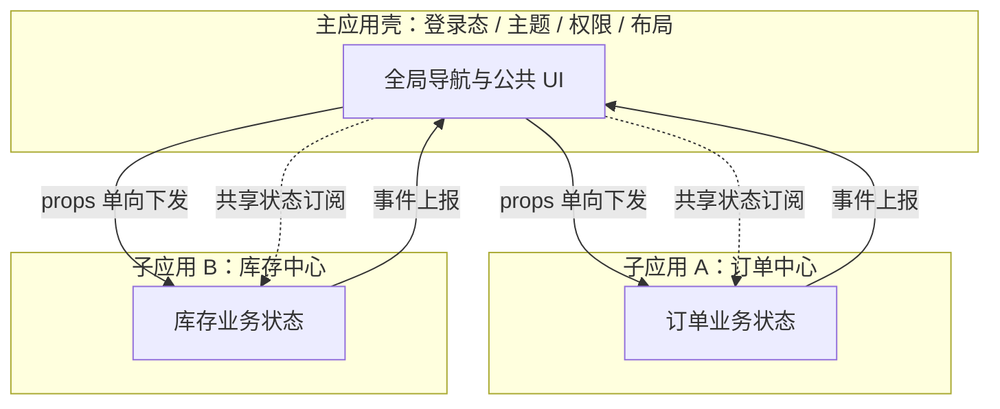
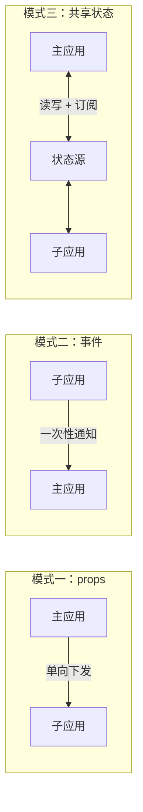
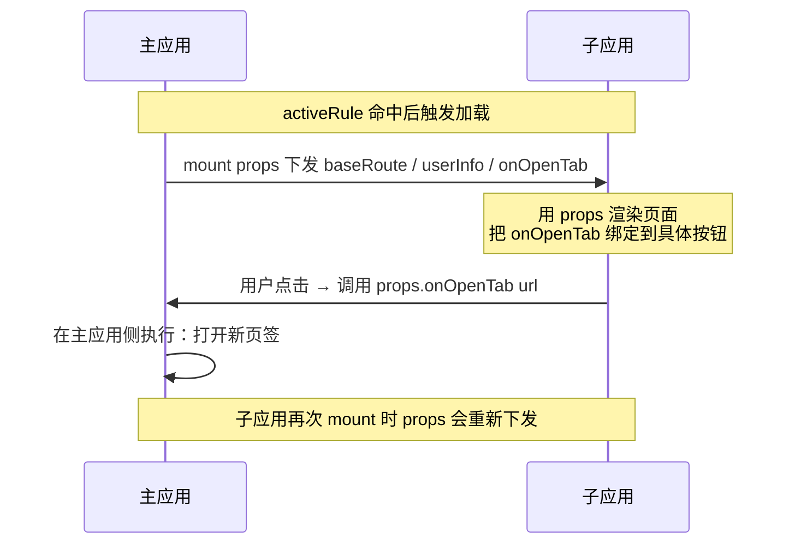
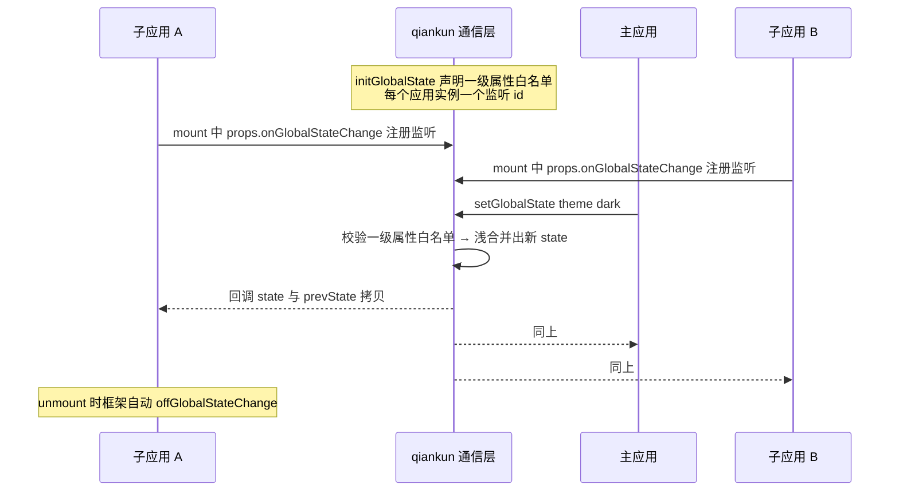
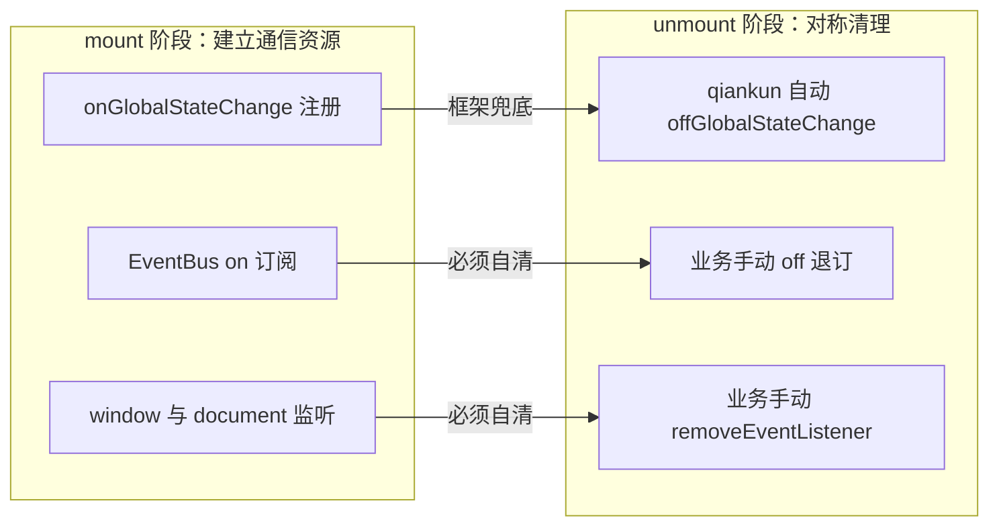
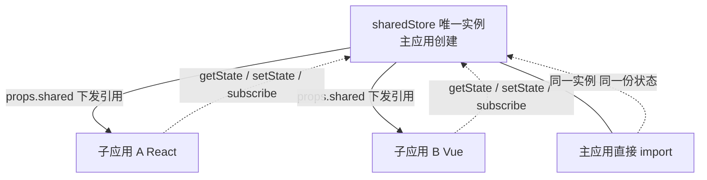
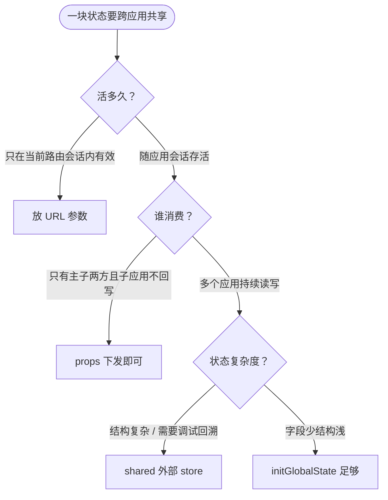
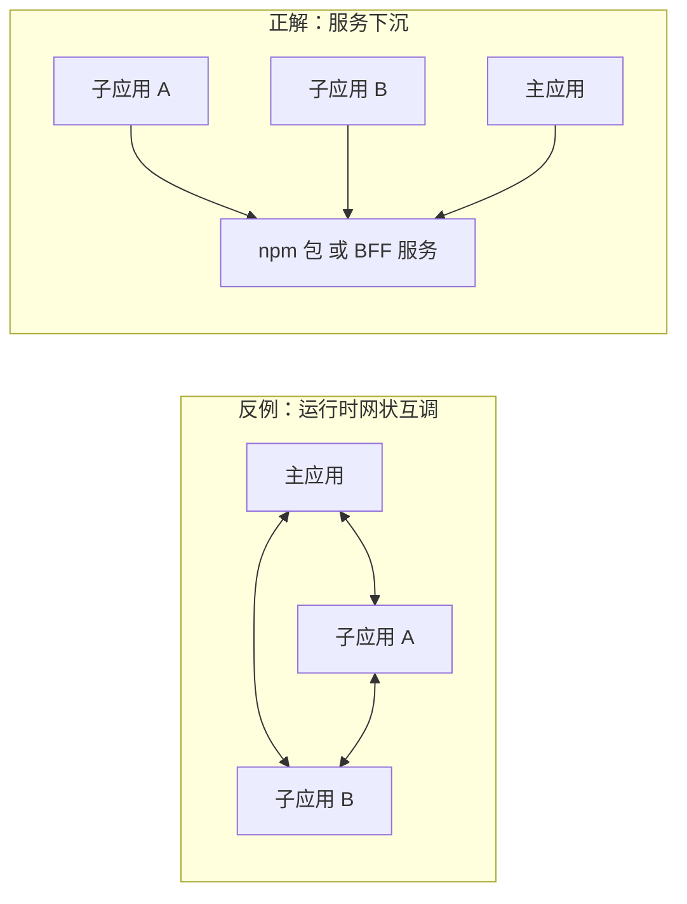
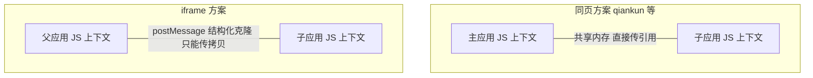

# 第八篇：微前端通信机制全攻略

**核心要点：**

- 通信设计的前提是先立边界：props 单向下发、事件上报、共享状态三种模式的适用场景，以及「通信越多、耦合越深」的基本盘
- qiankun 的三层通信：initGlobalState 全局状态、props 传参、EventBus 事件总线，各自的生命周期绑定与清理时机（防内存泄漏）
- 共享状态方案对比：initGlobalState vs 通过 shared 依赖共享外部 store（Redux/Pinia）vs URL 承载状态——状态放哪里取决于「谁生产、谁消费、活多久」
- 事件总线的工程规范：命名空间约定（事件名前缀归应用）、注册/销毁与子应用 mount/unmount 严格绑定、事件清单文档化与类型安全
- 跨应用调用的克制原则：服务下沉（共享逻辑做成 npm 包或 BFF 服务）优于运行时互相调用；主子应用互相调业务方法是最危险的耦合形态
- 通信反模式清单：绕过 props 直接摸父应用 window、双向强耦合数据流、用全局状态传「只有一方用」的数据
- 与 iframe 方案的差异呼应（对照番外篇五）：同页方案共享内存可直接传引用，iframe 只能 postMessage 传拷贝——这是两种路线协作能力的本质分野

> 本文是「微前端架构」技术专栏的第八篇。前面几篇我们把「隔离」讲透了：qiankun 如何用沙箱把子应用隔开、生命周期如何清理现场（第 4 篇）；第五篇的可运行示例里，你已经见过一次真实的通信——子应用点一下按钮，主应用顶部的「全局状态」卡片跟着变。这一篇回答另一半问题：**隔离之后，应用之间怎么「合法地」说话。**

## 一、开篇：隔离之后，最难的是「说话」

先建立一个反直觉的认知：**微前端的通信问题，恰恰是被隔离「制造」出来的。**

在单体应用时代，组件之间共享状态有很多「顺手」的办法：一个挂在 `window` 上的全局对象、一个跨文件的单例 store、甚至一个约定俗成的全局变量。这些手段的共同点是——**所有代码共享同一个 JS 运行上下文，谁都能摸到谁。**

而微前端（第 4 篇）的核心工作，就是把这件事变难：

- **JS 沙箱**让子应用写进「window」的变量，只落在自己的 `fakeWindow` 里，别人读不到
- **独立构建、独立部署**让子应用之间没有编译期的模块引用，谁也 import 不到谁
- **生命周期模型**让每个子应用随时可能被卸载，任何「提前塞好」的共享变量都可能变成悬空引用

这不是缺陷，是设计使然：**通信通道越显式、越受控，边界就越清晰。** 你应该把「两个应用之间怎么传数据」当成一个架构决策来做，而不是一个随手挂全局变量的工程习惯。

先把一个典型微前端系统的通信需求画出来：



> 图注：请注意子应用 A 和子应用 B 之间**没有直接连线**。子应用之间的协作，要么经由主应用中转，要么下沉为共享逻辑（见第六节）——这是本文反复出现的边界原则。

在看这张图时，请记住一条贯穿全文的基本盘：

**通信越多，耦合越深。** 每增加一条通信通道，就增加一对「谁改了什么、谁要跟着动」的隐性契约。通信设计的目标不是「让应用之间说话更方便」，而是**让必须说话的应用有唯一正道，让不必说话的应用说不上话。**

## 二、先立边界：三种通信模式

把所有通信手段做减法，最后只剩三种模式。所有方案——qiankun 的 props、initGlobalState、EventBus，iframe 的 postMessage，URL 参数——都只是这三种模式的具体实现。

### 2.1 模式一：props 单向下发

主应用把子应用运行所需的**配置和句柄**，在挂载时一次性传下去：

- 静态配置：路由基座 `baseRoute`、部署路径、功能开关
- 快照数据：用户信息、租户信息（注意是快照，不是活引用）
- 受控回调：主应用暴露给子应用的能力句柄，如 `onOpenTab`、`openDialog`

它的特征是**单向、自上而下、随挂载发生**。类比 React 的 props：父传子，子只读。

### 2.2 模式二：事件上报

子应用向主应用（或其它监听方）发出**一次性的、不留状态的通知**：

- 业务动作：`订单已创建`、`商品已加入购物车`
- 命令请求：`请打开弹窗`、`请切到某个页签`

它的特征是**发射后不管**：发出方不关心谁在听、听到之后干什么；监听方自己决定要不要响应。事件不承载「当前值」——错过就错过了。

### 2.3 模式三：共享状态

多个应用**持续关注同一份数据**，任何一方修改，其它订阅方自动同步：

- 登录态与 token
- 主题、语言等全局偏好
- 权限模型

它的特征是**有当前值、有生命周期、双向读写**。这是三种模式里最强大、也最容易失控的一种。

### 2.4 三种模式怎么选？



| 维度 | props 下发 | 事件上报 | 共享状态 |
| :--- | :--- | :--- | :--- |
| 方向 | 主 → 子（单向） | 子 → 主（或任意方向广播） | 多向，读写 + 订阅 |
| 数据形态 | 配置、快照、回调句柄 | 离散的通知消息 | 有当前值的持续性数据 |
| 生命周期 | 随每次 mount 重新下发 | 触发即逝，不保留 | 独立于单个子应用存活 |
| 典型内容 | `baseRoute`、用户信息、`onOpenTab` | `order-created`、`open-dialog` | 登录态、主题、权限 |
| 主要风险 | 把活数据当快照传，导致不同步 | 事件满天飞，数据流不可追踪 | 全局状态膨胀成「公共垃圾场」 |

一个实用的判断口诀（第四节会展开成完整的决策框架）：

- **只想让子应用知道某件事** → props
- **只想告诉别人「发生了一件事」** → 事件
- **多个人要持续读、还可能写** → 共享状态

## 三、qiankun 的三层通信

有了模式坐标系，再看 qiankun 提供的通信能力就非常清晰了——它正好是三种模式各给了一条通道：

| qiankun 能力 | 对应模式 | 通道方向 |
| :--- | :--- | :--- |
| `props` 传参 | props 下发 | 主 → 子 |
| `initGlobalState` | 共享状态 | 多向 |
| EventBus（自行实现，经 props 下发） | 事件上报 | 任意方向广播 |

> 说明：qiankun 内置通信只有 props 和 initGlobalState 两种；事件总线没有官方实现，需要业务侧自建（第五节给出工程规范），通常经 props 下发给子应用使用。

### 3.1 props：主 → 子的单向下发

props 是最朴素也最被低估的通道。注册子应用时声明，子应用在 `mount` 里接收：

```js
// 主应用
registerMicroApps([
  {
    name: 'app-order',
    entry: '//localhost:3002/',
    container: '#micro-container',
    activeRule: '/order',
    props: {
      baseRoute: '/order',                    // 路由基座（第 5 篇 §2.3）
      userInfo: getUserInfoSnapshot(),        // 用户信息快照
      onOpenTab: (url) => shell.openTab(url), // 受控回调：主应用暴露的能力句柄
    },
  },
]);
```

```js
// 子应用
export async function mount(props) {
  console.log(props.baseRoute); // '/order'
  renderApp({ baseRoute: props.baseRoute });
}
```

用一条时序图把 props 的流转画出来：



两个工程要点：

1. **props 每次 mount 都会重新下发**（第 4 篇 §7 讲过：`bootstrap` 只执行一次，`mount` 反复执行）。所以传快照要意识到「重新挂载时快照会刷新」；如果子应用存活期间外部数据变了，props 是不会自动同步的——那是共享状态的活。
2. **回调句柄是「受控例外」**。子应用通过 `props.onOpenTab` 调用主应用能力，本质上是「主应用单向授权」。注意两个约束：只暴露**白名单方法**，不要把整个主应用实例传下去；回调内部做**入参校验**，把它当成一条 API 边界而不是普通函数调用。

反过来说，如果子应用在 mount 时把 props 深拷贝一份存进自己的全局变量、之后再也不读 props——就会出现「主应用更新了，子应用看到的还是旧值」的灵异问题。**props 不是响应式的，需要持续同步的数据请走共享状态。**

### 3.2 initGlobalState：qiankun 内置的共享状态

这是 qiankun 为「模式三」提供的官方方案。主应用初始化，各应用订阅：

```js
// 主应用
import { initGlobalState, registerMicroApps, start } from 'qiankun';

const actions = initGlobalState({
  user: null,      // 第一层属性 = 白名单字段
  theme: 'light',
});

actions.onGlobalStateChange((state, prevState) => {
  console.log('主应用感知到全局状态变化', state, prevState);
}, true); // 第二个参数：注册后立即用当前值回调一次
```

子应用侧，官方姿势是**直接从 props 里拿**——qiankun 会自动注入：

```js
// 子应用（注意：不需要主应用手动传这些方法）
export async function mount(props) {
  // props.onGlobalStateChange / props.setGlobalState 由 qiankun 自动注入
  props.onGlobalStateChange((state, prevState) => {
    applyTheme(state.theme);
    renderUser(state.user);
  }, true);
}

export async function unmount() {
  // 清理子应用自身的副作用（监听由框架自动注销，见下文）
}
```

第 5 篇示例里「子应用点按钮 → 主应用顶部卡片变化」，走的就是这条通道。

整个广播过程画成时序图：



这套 API 看起来平平无奇，但有四个源码级细节，直接决定了你该不该用、怎么用：

**细节一：`setGlobalState` 是「白名单浅合并」。** 只有初始化时声明过的第一层属性才能被子应用修改；子应用试图新增一级属性会被警告并忽略。这是刻意的防御设计——全局状态的形状必须由主应用统一声明，子应用无权扩张。

**细节二：监听按「应用实例」隔离，新监听覆盖旧监听。** qiankun 内部用一张 `deps: { id: callback }` 的表存监听，每个应用实例分配一个独立 id（应用名 + 序号）。同一个 id 重复注册会**覆盖**而不是累加——源码注释写得很直白：「这么设计是为了减少全局监听滥用导致的内存爆炸」。所以你不需要担心重复注册导致回调执行多次，但也要知道：**一个子应用实例只能挂一个全局监听回调**，多个页面级订阅要在那一个回调里自己分发。

**细节三：回调拿到的是深拷贝。** `emitGlobal` 时会对 `state` 和 `prevState` 做 `cloneDeep`，防止某个应用直接改引用把公共状态搅乱。副作用是：如果状态对象很大、更新很频繁，深拷贝有开销——这是 initGlobalState 适合「少量全局字段」的根本原因。

**细节四：unmount 时框架自动注销监听。** qiankun 的卸载链路里会调用 `offGlobalStateChange(appInstanceId)`，子应用挂的监听随卸载自动清理。也就是说，**用官方姿势（props 自动注入）拿全局状态时，监听的生命周期是框架兜底的**——这是它和 EventBus 最大的工程差异，下一小节展开。

**还有一个容易踩的坑：别把 actions 显式传给子应用。** 有些教程（包括第 5 篇的演示示例）会把 `initGlobalState` 返回的 actions 整个放进 `props.actions` 下发。这种写法能跑通，但语义上和官方姿势有两点差异：

| 对比项 | 官方姿势：props 自动注入 | 显式下发：props.actions |
| :--- | :--- | :--- |
| 监听 id | 每个应用实例独立，互不覆盖 | 共用主应用那一个 id，**互相覆盖** |
| 子应用 `setGlobalState` 权限 | 只能改已声明的一级属性 | 相当于主应用权限，可新增一级属性 |
| unmount 清理 | 框架自动注销 | 需要子应用手动调 `actions.offGlobalStateChange()` |

演示场景只有一两个子应用、不同时激活，差异感知不到；多子应用并存时，显式下发的多个监听会**互相顶掉**，表现就是「B 应用一挂载，A 应用就收不到后续的状态变化」。生产上请优先用官方姿势；确需显式下发时，把上面三点当成已知约束写进接入文档。

最后校准一下它的定位：initGlobalState 本质是一个**极简的发布订阅 store**——没有选择器订阅、没有中间件、没有 devtools、没有类型推导。字段少、结构浅时它最顺手；状态一旦复杂，就该看第四节的外部 store 方案了。顺带一提，qiankun 3.0 已经计划移除这套工具（见第 4 篇 §10.2 的版本演进），新项目做长期选型时要多留一个心眼。

### 3.3 EventBus：状态之外的「通知」通道

有些通信既不是「下发配置」，也不是「同步数据」，只是**喊一嗓子**：

- 子应用完成某个动作，通知主应用弹个 toast
- 主应用通知所有子应用「侧边栏收起了」，好让子应用重算图表尺寸

这类通信的共同点：**不关心当前值，只关心「发生了」。** 如果硬用共享状态来做——为「弹了个 toast」建一个全局字段、改完再改回 null——你会发现状态里全是毫无语义的一次性字段。这就是事件总线的用武之地。

一个最小可用的事件总线不到三十行：

> ⚠️ 示意代码：为便于讲清机制做的极简实现（无命名空间校验、无错误隔离），生产使用请结合第五节的工程规范补充完善。

```js
class EventBus {
  constructor() {
    this.listeners = new Map(); // event -> Set<handler>
  }

  on(event, handler) {
    if (!this.listeners.has(event)) {
      this.listeners.set(event, new Set());
    }
    this.listeners.get(event).add(handler);
    // 返回退订函数，方便在 unmount 里清理
    return () => this.off(event, handler);
  }

  off(event, handler) {
    this.listeners.get(event)?.delete(handler);
  }

  emit(event, payload) {
    this.listeners.get(event)?.forEach((handler) => {
      try {
        handler(payload);
      } catch (err) {
        console.error(`[EventBus] handler error for ${event}`, err);
      }
    });
  }
}

export const eventBus = new EventBus();
```

事件总线实例由主应用创建，经 props 下发，子应用在 mount 里订阅：

```js
// 主应用
registerMicroApps([
  {
    name: 'app-order',
    // ...
    props: { baseRoute: '/order', eventBus },
  },
]);

// 主应用自己也可以监听
eventBus.on('@order/order-created', ({ orderId }) => {
  shell.showToast(`订单 ${orderId} 已创建`);
});
```

```js
// 子应用
export async function mount(props) {
  const unsubscribe = props.eventBus.on('@main/sidebar-toggled', (payload) => {
    resizeCharts(payload.collapsed);
  });
  // 把退订函数存起来，unmount 里用
  store.set('unsubscribe', unsubscribe);
}

export async function unmount() {
  store.get('unsubscribe')?.();
}
```

**怎么判断一件事该用状态还是事件？** 问一个问题就够了：**错过这条消息，要不要紧？**

- 不要紧（通知性质，响应即可）→ 事件
- 要紧（响应方需要知道「现在的值是什么」）→ 状态

| 维度 | initGlobalState | EventBus |
| :--- | :--- | :--- |
| 语义 | 「现在是什么」 | 「刚才发生了什么」 |
| 新订阅者 | 立即拿到当前值（可配 fireImmediately） | 只能收到订阅之后的事件 |
| 生命周期 | 状态持续存在，监听随 unmount 自动注销 | 事件即发即逝，订阅必须手动清理 |
| 适合 | 登录态、主题、权限 | toast、跳转指令、埋点、布局调整 |

### 3.4 生命周期绑定与清理：通信资源的 mount/unmount 对称

第 4 篇 §7 说过：`mount` 反复执行、`unmount` 是清理现场的最后机会。通信资源是「现场」的重要部分，把每种资源的建立与清理时机列成对照表：



| 通信资源 | 建立时机 | 清理时机 | 谁负责 |
| :--- | :--- | :--- | :--- |
| props 传参（含回调句柄） | 注册时声明，每次 mount 重新下发 | unmount 后自动失效 | qiankun |
| 全局状态监听（自动注入姿势） | mount 里 `onGlobalStateChange` | unmount 链路自动 `offGlobalStateChange` | qiankun |
| 全局状态监听（显式 actions 姿势） | mount 里 `actions.onGlobalStateChange` | 必须 mount/unmount 成对调用 `offGlobalStateChange` | 业务 |
| EventBus 订阅 | mount 里 `on` | unmount 里退订 | 业务 |
| window/document 监听里的通信逻辑 | mount 里 `addEventListener` | unmount 里 `removeEventListener` | 业务 |

一句话总结：**qiankun 只兜底它自己那套全局状态监听；EventBus、原生事件监听、以及一切经 props 注入的资源，都要业务侧按「谁建立、谁清理」对称处理。** 漏掉清理的典型症状，就是第 5 篇 §5.4 描述的：切换几轮之后事件重复触发、接口重复请求、页面越来越卡。

## 四、共享状态方案对比：状态放哪里

initGlobalState 不是共享状态的唯一答案。工程上至少有三种主流方案，各有明确的适用边界。

### 4.1 方案一：initGlobalState——轻量内置

优点是零依赖、和 qiankun 生命周期天然集成（监听自动清理）、白名单防越权。缺点同样明显：

- 没有 devtools，状态变化不可回溯，联调靠 console.log
- 没有选择器订阅，任何字段变化都广播全量 state，监听方自己 diff
- 深拷贝开销，状态一大就难受
- 3.0 计划移除，长期演进有不确定性

**适合**：字段少（登录态、主题、权限等个位数一级字段）、结构浅的「全局配置型」状态。

### 4.2 方案二：shared 注入外部 store——把专业的事交给专业的库

思路：主应用创建一个 store 实例，作为 `props.shared` 下发，主子应用操作**同一个实例**。以框架无关的 zustand vanilla store 为例：

```js
// 主应用：创建全局唯一的 store 实例
import { createStore } from 'zustand/vanilla'; // 不绑定 React，Vue 也能接

export const sharedStore = createStore(() => ({
  user: null,
  theme: 'light',
  permissions: [],
}));

registerMicroApps([
  {
    name: 'app-order',
    // ...
    props: { shared: sharedStore },
  },
]);
```

```js
// 子应用：拿到的是同一个实例的引用
export async function mount(props) {
  const { shared } = props;

  shared.getState().user;          // 读
  shared.setState({ user: user }); // 写
  const unsubscribe = shared.subscribe((state) => {
    applyTheme(state.theme);       // 订阅
  });
}
```

关键在于「同一实例」这个事实——用图看更直观：



它一步解决了 initGlobalState 的所有短板：devtools、选择器订阅（配合各框架的 hook/connector）、中间件生态、类型安全。

**代价与约束**也要看清楚：

1. **技术栈隔离**。React 应用把 Redux store 传给 Vue 子应用，Vue 侧要用起来别扭。要么选框架无关实现（zustand vanilla、自研轻 store），要么约定 store 是「纯数据容器」，各子应用自建适配层。
2. **版本一致性**。如果改成每个应用各自打包一份 store 库，实例就不共享了——所以实例必须由主应用单边创建、经 props 分发，这正是「shared」的含义。
3. **谁都能改**。建议在 store 之上收敛写入口（封装 action），并靠代码评审守住。

**适合**：状态结构复杂、多应用高频读写、需要调试回溯的中大型系统。这也是 qiankun 官方在 3.0 里移除 initGlobalState 后隐含的推荐方向。

### 4.3 方案三：URL 承载状态——最被低估的选项

有一类状态，天然就该放 URL：

```text
/order/detail?orderId=123&readonly=1
```

- **激活参数**：告诉子应用「打开哪个单据」——这本身就是子应用激活规则的一部分（与第 4 篇 §3 的路由劫持天然契合）
- **可分享、可回退**：用户刷新、收藏、转发链接，状态都不丢
- **跨应用传递**：从订单子应用跳到库存子应用，参数就在 URL 上，主应用什么都不用记

约束也很清楚：URL 适合**低频、小型、导航语义**的状态，放高频变化的复杂对象会把历史记录堆爆。

### 4.4 决策框架：谁生产、谁消费、活多久

三种方案放在一起，用一个流程图收敛决策：



| 维度 | initGlobalState | shared 外部 store | URL |
| :--- | :--- | :--- | :--- |
| 作用域 | 所有应用共享 | 所有应用共享 | 单次导航 / 会话 |
| 技术栈耦合 | 无 | 需选框架无关实现或做适配 | 无 |
| 调试能力 | console.log | devtools / 时间旅行 | 浏览器地址栏直读 |
| 生命周期 | 随页面 | 随页面 | 随 URL（可回退可分享） |
| 典型状态 | 登录态、主题 | 权限模型、跨应用业务状态 | 单据 id、列表筛选条件 |

记住那句口诀：**状态放哪里，取决于「谁生产、谁消费、活多久」。** 生产者多、消费者多、活得久 → 外部 store；只有主子两方 → props；一屏一换、需要分享回退 → URL；字段少结构浅 → initGlobalState 兜底。

## 五、事件总线的工程规范

3.3 节的事件总线故意做得很裸——因为它只是机制，真正的难点在**规范**。一个没有规范的事件总线，半年后就会变成谁也理不清的「广播噪音」：事件名随手起、订阅忘了退、payload 结构全靠翻代码。三条规范把口子收住。

### 5.1 规范一：命名空间约定——事件名前缀归应用

事件名必须携带归属信息，格式统一为 `@<应用名>/<事件名>`：

```text
@main/theme-changed        → 主应用发出
@order/order-created       → 订单子应用发出
@stock/stock-warning       → 库存子应用发出
```

这条约定带来三个直接收益：

1. **看事件名就知道谁在说话**，排查「谁发的这条消息」不用全局搜索
2. **天然防止撞名**：两个子应用都想发 `updated`，前缀让它们井水不犯河水
3. **约束事件清单的膨胀**：新增跨应用事件时必须「挂名」，挂名就要过评审——事件天然带上了归属审批

### 5.2 规范二：注册与销毁，和 mount/unmount 严格绑定

事件的订阅生命周期必须遵循**对称原则**：

```js
// 子应用：订阅与退订严格成对
let offHandlers = [];

export async function mount(props) {
  const { eventBus } = props;
  offHandlers = [
    eventBus.on('@main/theme-changed', handleThemeChange),
    eventBus.on('@main/sidebar-toggled', handleSidebarToggle),
  ];
}

export async function unmount() {
  offHandlers.forEach((off) => off());
  offHandlers = [];
}
```

纪律要求：**mount 里出现几个 `on`，unmount 里就必须有几个对应的退订。** 可以让团队统一用「退订函数收集器」模式（如上），把这件事机械化，避免手写遗漏。这条纪律和第 4 篇 §7 的「副作用对称清理」是同一条原则在通信域的投影。

### 5.3 规范三：事件清单文档化与类型安全

把所有跨应用事件登记到一份**单一事实来源**的类型文件里：

```ts
// src/events.ts —— 全仓库共享的事件清单，改动必须过评审
export interface AppEvents {
  '@main/theme-changed': { theme: 'light' | 'dark' };
  '@main/sidebar-toggled': { collapsed: boolean };
  '@order/order-created': { orderId: string; amount: number };
  '@stock/stock-warning': { skuId: string; level: 'low' | 'empty' };
}

type EventHandler<T> = (payload: T) => void;

export interface TypedEventBus {
  on<K extends keyof AppEvents>(
    event: K,
    handler: EventHandler<AppEvents[K]>,
  ): () => void; // 返回退订函数
  emit<K extends keyof AppEvents>(event: K, payload: AppEvents[K]): void;
}
```

```ts
// 消费侧：事件名和 payload 结构都有编译期保障
eventBus.emit('@order/order-created', { orderId: '1001', amount: 99 });
eventBus.emit('@order/order-created', { orderId: '1001' }); // ❌ 编译报错：缺 amount
```

这份清单同时是三样东西：**类型定义、事件文档、评审清单**。新事件进清单要回答三个问题——谁发的、谁听、payload 是什么；回答不了就说明这个事件还没想清楚，先别加。

## 六、跨应用调用的克制原则

前面讲的都是「传数据」，这一节讲更容易失控的形态：**应用之间互相调用方法**。

场景很常见：订单子应用需要「查询库存余量」，库存子应用正好有这个函数。直觉的做法是让订单应用拿到库存应用的某个 service 对象直接调——**这是微前端里最危险的耦合形态**。用一张图对比：



为什么网状互调危险？

1. **生命周期时序地狱**。子应用随时可能被卸载（第 4 篇 §7），A 手里的 B 的方法句柄，可能在 B 卸载后变成悬空引用——调用即报错，而且报错时机取决于用户的操作顺序
2. **双向数据流失控**。A 改 B 的状态、B 的状态又触发 A 的逻辑，数据流在应用间来回穿梭，任何一次线上排查都是考古
3. **独立部署被锁死**。B 改一个方法签名，A 直接挂掉——「独立开发、独立部署」的微前端核心收益归零

正解是**服务下沉**，两条路：

- **编译期下沉：共享逻辑做成 npm 包**。纯逻辑（计算、校验、格式化）抽成包，各应用各自安装各自打包——没有运行时依赖，天然没有时序问题
- **运行时下沉：共享逻辑推给 BFF 服务**。涉及数据的逻辑（查库存）做成后端接口，两个子应用各自请求同一接口——数据的真相只有一份，在后端

下沉之后回头看，原来「A 调 B」的需求变成了「A 和 B 各自依赖同一个包/接口」，应用之间的运行时连线被完全拆掉。

那什么时候**可以**保留运行时调用？只有一种受控例外：**主应用向子应用注入白名单 UI 能力**，比如 `props.onOpenTab`、`props.openDialog`——这正是 3.1 节讲过的回调句柄模式。它安全的前提有三条：方向单一（只从主应用流出）、白名单收口、入参校验。子应用之间、以及子应用调用主应用**业务**方法，一律走下沉。

## 七、通信反模式清单

最后把「别这么干」单独列一节。以下三种反模式在真实项目里出现频率最高，危害也最隐蔽。

**反模式一：绕过 props，直接摸父应用的 window。**

```js
// ❌ 子应用里
window.__MAIN_APP__.openTab('/stock/123');
```

问题有三层：

1. **沙箱下不可靠**：第 4 篇 §4 讲过，Proxy 沙箱里子应用的 `window` 是 `fakeWindow`，读写行为被劫持——你以为摸到了真 window，实际行为取决于沙箱实现细节，升级即碎
2. **耦合回到了史前**：这条通道绕开了所有显式契约，主应用重构 `__MAIN_APP__` 时没有任何工具能发现子应用会挂
3. **多实例直接崩**：同一子应用多实例挂载（`loadMicroApp` 场景）时，全局变量被互相覆盖

正解：一切跨应用通信走显式通道——props 下发受控句柄，需要什么能力让主应用明确注入。

**反模式二：双向强耦合数据流。**

```js
// ❌ A 应用改了状态，B 应用监听到后又改回去
actions.onGlobalStateChange((state) => {
  if (state.filter !== myFilter) {
    actions.setGlobalState({ filter: myFilter }); // 试图「纠正」别人
  }
});
```

两个应用互相「纠正」对方的写入，最轻是无限循环警告，最重是状态震荡、用户操作被无声吞掉。**全局状态必须只有一个写入口**（或一个明确的优先级规则），出现「我要把别人改的字段改回来」的需求时，说明这一块状态应该拆成两份，或收回主应用统一管理。

**反模式三：用全局状态传「只有一方用」的数据。**

```js
// ❌ 主应用往全局状态里塞只有订单子应用用的草稿
actions.setGlobalState({ orderDraft: {...} });
```

全局状态是**所有应用共同声明的公共命名空间**。塞进私有数据，等于把「公共契约」变成了「公共垃圾场」：字段越积越多、谁都不敢删、新接入方要理解所有历史包袱。正解：只有一方使用的数据，走 props 下发或该应用自己的内部状态；确实需要跨应用，就升级成正式的契约（加白名单、过评审）。

汇总成一张排查表：

| 反模式 | 典型症状 | 后果 | 正解 |
| :--- | :--- | :--- | :--- |
| 直接摸父应用 window | 升级 qiankun / 开沙箱后通信失效 | 隐性耦合，随框架升级碎裂 | props 注入受控句柄 |
| 双向强耦合数据流 | 状态震荡、更新丢失、循环触发 | 数据流不可追踪，线上问题难排查 | 单一写入口，或拆分状态归属 |
| 全局状态传私有数据 | 一级字段持续膨胀，无人敢删 | 公共命名空间沦为垃圾场 | props 下发或收归内部状态 |

## 八、与 iframe 方案的通信分野

对照番外篇五，可以看清本文所有讨论的适用边界。同页方案（qiankun 等）和 iframe 方案，通信的**本质**完全不同：



> 图注：左边的箭头传的是**同一个对象**——主子应用拿到的是同一份内存里的引用，改一处两边都看得见；右边的箭头传的是**复制品**——数据经过结构化克隆算法深拷贝一次，从此两边各管各的副本。

这张图就是两种路线协作能力的分水岭：

| 能力 | 同页方案（qiankun 等） | iframe 方案（番外篇五） |
| :--- | :--- | :--- |
| 传递方式 | 内存引用，零拷贝 | 结构化克隆，永远传拷贝 |
| 能否传函数 / store 实例 | 可以（props 里全是活引用） | 不可以，只能传纯数据 |
| 通信成本 | 进程内同步调用 | 每条消息过一次序列化 + 异步投递 |
| 需要自建的东西 | 方案选择 + 使用规范（本文） | 完整协议栈：信封、来源校验、RPC、超时重试（番外篇五） |
| 换来的隔离强度 | 弱（同 window，靠沙箱软隔离） | 强（进程级硬隔离，浏览器安全模型兜底） |

一个具体的对照：本文 4.2 节的 shared 方案，把 store **实例**经 props 传下去，主子应用操作同一份状态——这在 iframe 里**根本做不到**，postMessage 传不了对象方法，番外篇五只能用「状态快照 + 消息队列」重建出「看起来同步」的效果，还要自己处理时序和丢失问题。

反过来看也成立：iframe 方案的每条消息都要过协议、校验、序列化，看似笨重，却换来**谁也摸不到谁**的硬边界——想犯第七节的反模式一（摸对方 window）都没有路径。同页方案的通信自由是真实的生产力，但这份自由没有护栏，**全靠本文的边界原则自我约束**。这也是番外篇一得出的结论在通信维度的重申：隔离与协作是一对权衡，选了哪条路线，就接受了哪一边的代价。

## 九、小结

把全文收回到一句话：

**微前端的通信设计，本质是边界设计。** 先想清楚哪些应用「必须说话」，再为它们各修一条唯一的、可审计的通道；剩下的应用，保持沉默。

落地时按这条 checklist 过一遍：

1. **先分模式**：下发配置用 props，一次性通知用事件，持续共享用状态
2. **状态有归属**：谁生产、谁消费、活多久，决定放 props、URL、initGlobalState 还是 shared store
3. **事件有纪律**：命名空间归应用、订阅与 unmount 成对、事件清单过评审
4. **调用要克制**：逻辑下沉为 npm 包或 BFF 接口，运行时互调只留主应用白名单能力注入这一条受控例外
5. **清理有对称**：mount 里建立的通信资源，unmount 里逐一回收——框架只兜底 globalState 监听，其余靠自己

下一篇《样式隔离与资源管理》会把镜头转向另一类「看不见的污染」：为什么两个应用的按钮颜色会互相覆盖、子应用的字体为什么会影响主应用，以及 Shadow DOM、Scoped CSS 这些隔离策略背后的取舍。
