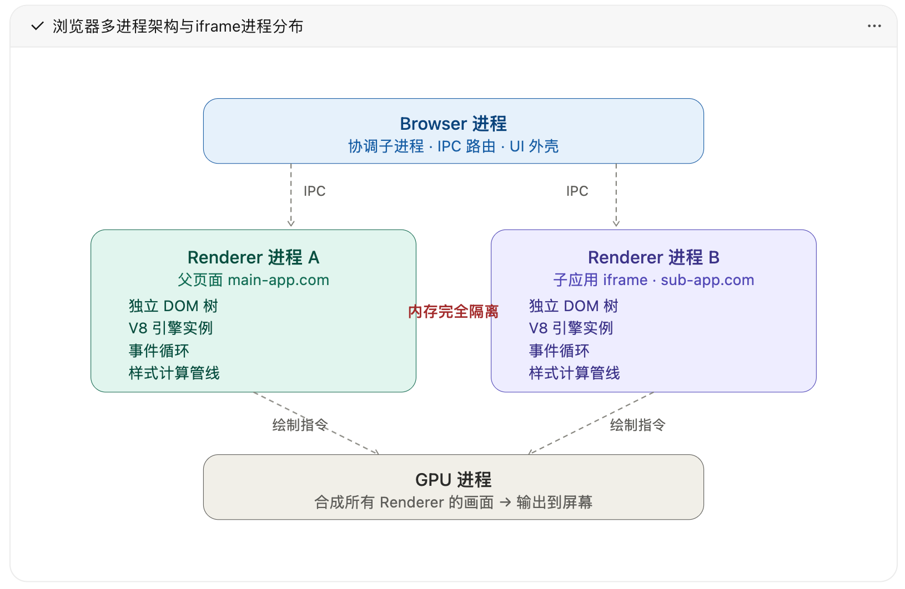
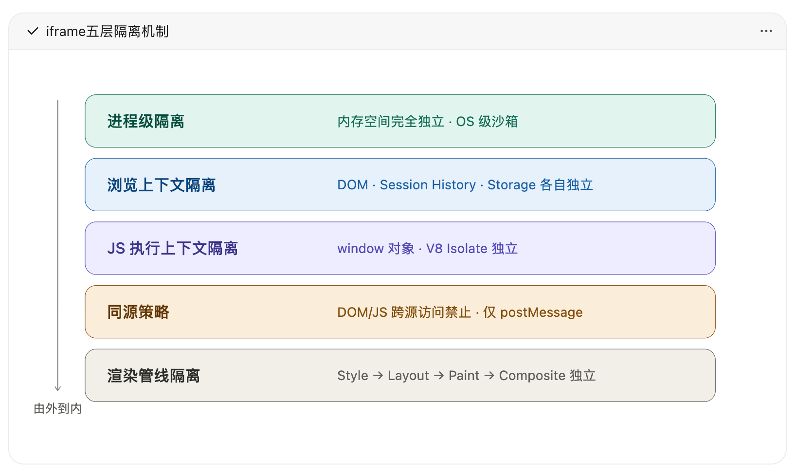
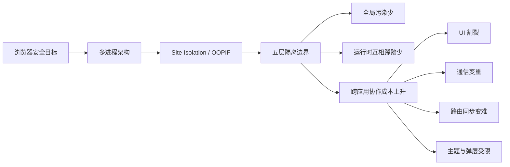
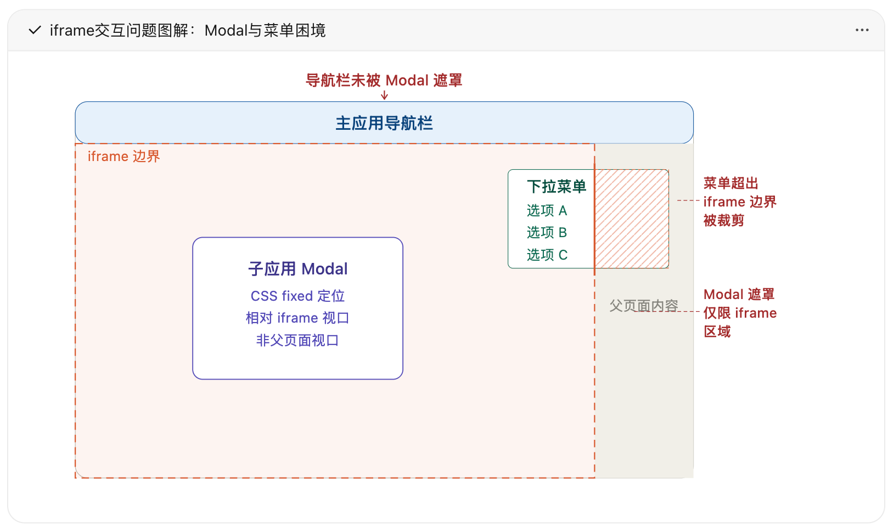
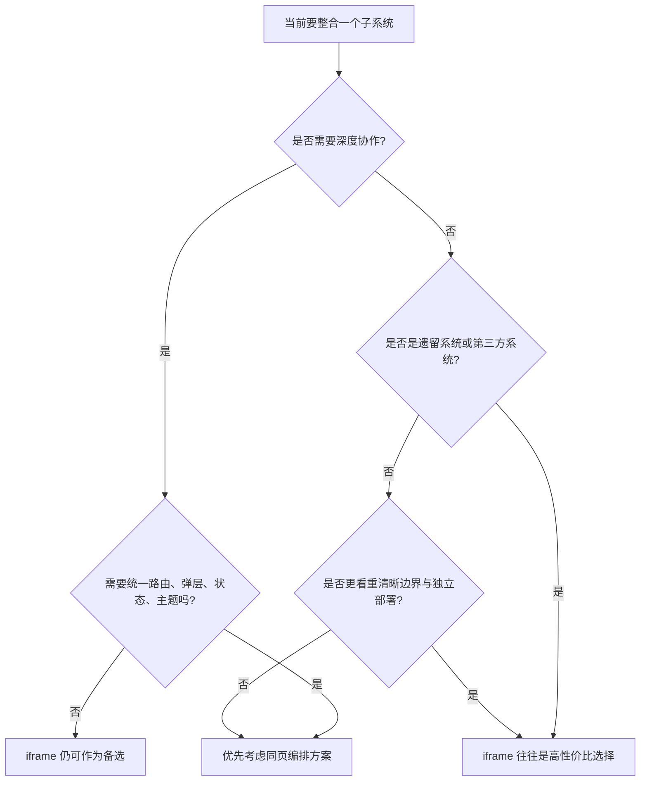

# 番外篇一：iframe 真的是微前端吗？为什么很多团队最后还是选了它

**核心要点：**

- `iframe` 的强隔离，本质上不是某个微前端框架额外“做出来”的，而是浏览器多进程架构、Site Isolation 和同源策略共同带来的结果
- 在跨站点场景下，`iframe` 往往会进入 OOPIF（Out-of-Process Iframe）模型，父子页面不只是 DOM 边界分开，很多时候连 Renderer 进程和内存空间都分开了
- 这种隔离天然解决了全局变量污染、样式污染、运行时互相踩踏等问题，但也会带来 UI、通信、路由、性能和可访问性上的协作成本
- `iframe` 的问题不是“实现不够好”，而是浏览器安全模型和微前端协作诉求在设计目标上天然不同
- 即便如此，很多团队依然会选择 `iframe`，因为它在遗留系统接入、跨技术栈集成、第三方系统嵌入和安全边界清晰等场景下，依然是成本最低、最稳妥的方案之一

> 本文是「微前端架构」技术专栏的番外篇一。上一篇我们讨论了微前端的几种主流隔离路线，这一篇把镜头拉回浏览器底层，专门讲清楚 `iframe` 的隔离机制从哪里来，以及为什么这套机制一旦用于微前端，就会从“强隔离”走向“强割裂”。

## 一、开篇：为什么 iframe 总让人又爱又恨

在微前端实践里，`iframe` 是一个很特殊的存在。

它足够老，几乎所有前端都见过；它也足够稳，浏览器原生支持、接入成本低、隔离效果强。很多团队第一次做“多应用拼装”时，最后落地的往往不是 `qiankun`、`Module Federation` 或 `micro-app`，而是看起来最“朴素”的 `iframe`。

但另一面也很明显：一旦页面开始追求统一导航、全局弹窗、路由联动、状态共享和设计系统一致性，`iframe` 往往又是最容易让人头疼的方案。

这并不是因为 `iframe` “太老”，也不是因为它“实现得不够现代”，而是因为它从一开始就不是为了“多个可信应用协同工作”设计的。`iframe` 的原生定位，是在浏览器这个安全容器里承载一个被隔离的嵌入页面。理解这一点，后面很多看似零散的问题，其实都会自然串起来。

## 二、浏览器的多进程架构，才是 iframe 隔离的真正起点

### 2.1 从单进程到多进程

早期浏览器更接近单进程模型：页面渲染、JavaScript 执行、网络请求都挤在一个进程里。这样做的问题很直接：一个页面崩溃，可能拖垮整个浏览器；一段恶意脚本，也更容易越过边界窥探其他页面的数据。

现代浏览器，尤其是以 Chrome 为代表的 Chromium 系内核，逐步演进成多进程架构，把不同职责拆给不同进程：

| 进程 | 主要职责 |
| --- | --- |
| `Browser` 进程 | 浏览器外壳、标签页管理、导航协调、权限控制、IPC 路由 |
| `Renderer` 进程 | HTML 解析、CSS 计算、JavaScript 执行、DOM 构建与布局绘制 |
| `GPU` 进程 | 接收各个 Renderer 的绘制结果，负责合成与输出 |
| `Utility` 进程 | 网络、音频、存储等基础服务 |

其中最关键的是 `Renderer` 进程。页面的大多数“前端逻辑”都跑在这里，但它运行在操作系统级沙箱中，权限被严格限制。它不能随意访问文件系统，不能直接摸其他进程的内存，很多敏感操作都要通过 IPC 让 `Browser` 进程代办。

这就是后面一切隔离能力的物理基础：**浏览器天生先假设页面不可信，再通过进程和权限边界把损害范围收窄。**

### 2.2 从“一个 Tab 一个进程”到 Site Isolation

很多人早年接触浏览器架构时，会听到一句经典说法：“一个 Tab 对应一个 Renderer 进程。”

这句话不能算错，但放到今天已经不够用了。随着 Web 应用越来越复杂，浏览器不再简单按“一个标签页一个进程”去理解页面，而是进一步引入 **Site Isolation** 来决定不同内容能不能待在同一个 Renderer 里。

换句话说，`iframe` 的隔离，不只是“页面里多了一个内嵌窗口”这么简单，它背后其实牵涉到了浏览器的进程分配策略。

## 三、Site Isolation 与 OOPIF：iframe 为什么会变成跨进程边界

### 3.1 什么是 Site Isolation

`Site Isolation` 的核心思路可以概括成一句话：**尽量让不同站点的内容运行在不同的 Renderer 进程里。**

这里的 “site” 不是常说的 origin，而更接近：

```text
site = scheme + eTLD+1
```

- `scheme` 指协议，比如 `https`
- `eTLD+1` 指有效顶级域名加一级主域名，比如 `example.com`

例如：

- `https://a.example.com` 和 `https://b.example.com`：同站点，但不是同源
- `https://example.com` 和 `https://evil.com`：既不同站点，也不同源

这里要特别区分两个概念：

- **origin** 决定 DOM、JS 对象、存储等能不能直接互访
- **site** 更多用于浏览器的站点隔离和进程策略

所以，“同站点但不同源”并不等于“可以互相操作”。即便某些情况下它们可能仍处在同站点实例或相近的进程策略下，DOM 和 JS 访问依然要受同源策略约束。

### 3.2 OOPIF：跨站 iframe 往往不只是“嵌进来”而已

当一个主页面嵌入跨站点 `iframe` 时，浏览器通常会把这个子页面放到独立的 Renderer 进程里。这个机制叫 **OOPIF（Out-of-Process Iframe）**，也就是“跨进程 iframe”。

一个看起来很普通的页面：

```html
<!-- 父页面：https://main-app.com -->
<body>
  <div id="header">主应用导航</div>
  <iframe src="https://sub-app.com/dashboard"></iframe>
</body>
```

在浏览器内部，更接近下面这种结构：



图：父页面与跨站 `iframe` 往往由不同 Renderer 进程分别负责，最终再由 GPU 进程合成输出。

这意味着父应用和子应用很多时候并不是“同一棵 DOM 树里套了一层容器”，而是：

- 各自维护独立的 DOM 树
- 各自拥有独立的 JavaScript 运行环境
- 各自维护自己的事件循环、样式计算和布局绘制
- 通过浏览器进程调度和 IPC 协同工作

从这个角度看，`iframe` 所谓的“硬隔离”并不是抽象概念，而是实打实的内存边界和进程边界。

### 3.3 浏览器为什么非要这样设计

浏览器这样做，不是为了让前端更方便做微前端，而是为了安全：

- **防御侧信道攻击**：例如 Spectre 这类攻击，进程级隔离是重要缓解手段
- **强化沙箱边界**：恶意页面即便被攻破，影响范围也尽量限制在当前进程内
- **实现故障隔离**：一个 Renderer 崩溃，不至于波及所有页面

所以浏览器在这里贯彻的设计哲学一直很明确：

> **隔离是默认状态，通信是受控例外。**

而微前端需要的恰恰是另一件事：**隔离之上还能高效协作。** 这就是后面所有矛盾的起点。

## 四、iframe 的五层隔离机制

如果只把 `iframe` 理解成“页面里嵌了一个页面”，就很难真正理解它为什么隔离这么强，也很难理解它为什么会在后续协作中带来这么多成本。

更准确的理解方式是：`iframe` 的隔离不是单点能力，而是一层一层叠加出来的。最外层是进程，往里是浏览上下文、JavaScript 运行环境、同源策略，再往里甚至会落到渲染管线。正因为这些边界同时存在，它才能一边把污染和冲突隔得很干净，一边又让跨应用协作变得格外费劲。



图：`iframe` 的隔离并不只发生在 DOM 层，而是从进程、浏览上下文、JS 运行环境一路延伸到渲染管线。

### 4.1 进程级隔离

先看最外面这一层，也是最硬的一层：进程级隔离。

在跨站点场景下，`iframe` 往往运行在独立的 Renderer 进程里，拥有独立的内存空间。换句话说，父应用和子应用很多时候并不只是“代码分开放”，而是从运行载体上就已经被拆开了。一个子应用里的 JavaScript 崩溃、内存泄漏，甚至恶意代码执行，都很难直接影响父页面的运行时状态。

这也是 `iframe` 相比很多“同页运行”的微前端方案最有优势的一点：**它的隔离不是靠框架约定出来的，也不是靠 Proxy 或快照补出来的，而是浏览器和操作系统一起兜底的。** 这层边界一旦成立，后面的全局污染、原型链互踩和脚本互相干扰，天然就会少很多。

### 4.2 浏览上下文隔离

再往里一层，是浏览上下文（Browsing Context）隔离。

每个 `iframe` 都有自己的 `document`、自己的 DOM 树、自己的会话历史、自己的导航生命周期，也会在自己的上下文里独立应用安全策略，比如 CSP。可以把它理解成：浏览器并不是在“主页面的一部分区域里临时放点内容”，而是真的给这个嵌入页面划出了一个相对完整的小世界。

这层隔离解决的是“页面级实体不要互相串线”的问题，但代价也同样明显：父子应用天然不处在一个统一的页面语义空间里。换句话说，**从这一层开始，`iframe` 就已经不像同一个页面里的两个模块，而更像两个相邻但彼此独立的小页面。**

### 4.3 JavaScript 执行上下文隔离

再往里，是 JavaScript 执行上下文隔离。

父页面的 `window` 和子页面的 `window` 不是同一个对象，一方定义的全局变量、函数、原型链修改，默认不会自然污染到另一方；在跨站场景下，这种运行时隔离通常还会更强，很多实现上会体现为更明确的引擎实例边界。

这恰恰是 `iframe` 在微前端里最让人省心的地方之一。很多在同页方案里需要额外补沙箱才能尽量规避的问题，比如全局变量污染、原型链冲突、脚本互踩，在这里天然就轻很多。也正因为如此，很多团队在面对“先别互相影响”这个刚需时，会很自然地倾向于 `iframe`。

### 4.4 同源策略隔离

再往里，是大家更熟悉的同源策略。

即便两个页面在视觉上嵌套在一起，只要不同源，父页面就不能直接读写跨源 `iframe` 的 DOM，也不能直接访问子页面里的对象和函数，双方通常只能通过 `postMessage` 这类受控通道通信。

这层规则更像“逻辑边界”。它不直接决定进程怎么分，但会决定一件对工程体验影响很大的事：**即便你看得到彼此，也不代表你能直接摸得到彼此。** 这句话后面会直接落到通信、路由同步和弹层联动这些问题上。

### 4.5 渲染管线隔离

最后一层，经常最容易被忽略，但对用户体验影响很大：渲染管线隔离。

父页面和子页面各自完成样式计算、布局、绘制，再由浏览器做最终合成。也正因为如此，父页面的 CSS 不会自然漏进子页面，子页面的 CSS 也不会污染父页面；同时，CSS 自定义属性、层级关系和很多视觉上下文也无法自然穿透 `iframe`。

这一层让 `iframe` 获得了非常强的样式独立性，但也在另一个方向上埋下了问题：统一主题、共享设计令牌、跨应用弹层和菜单浮层，都会在这里撞上边界。

如果把前面五层串起来，你会发现 `iframe` 的能力和代价其实是一体两面的：



图：`iframe` 的交互问题不是零散缺陷，而是从浏览器安全边界一路推导出来的连锁结果。

## 五、隔离的另一面：为什么它会变成微前端的交互困境

看到这里，逻辑其实已经很清楚了：`iframe` 几乎把微前端想要的“隔离”做到了极致，但微前端真正要的从来不是“只有隔离”，而是“隔离之后还能顺畅协作”。

而浏览器给 `iframe` 的，是面向不可信嵌入内容的安全边界，而不是面向多个可信业务系统的协作边界。所以，一旦把它放到中后台平台、业务工作台或者多系统整合场景里，很多日常交互问题就会被成倍放大。

### 5.1 UI 割裂：Modal 和菜单为什么总是最先出问题

这通常是团队最早感知到的痛点，因为它最直观，也最难靠工程技巧掩盖。

当子应用在 `iframe` 里弹出 Modal 时，`position: fixed` 参考的是 **`iframe` 自己的视口**，而不是整个主页面的视口。于是你会看到这样的画面：遮罩只能盖住 `iframe` 区域，主应用导航栏还露在外面，用户甚至可以在弹窗已经弹出的情况下继续操作外层页面。

同样的问题也会出现在菜单、Tooltip、Popover 上。只要这些浮层想要溢出 `iframe` 边界，通常就会被直接裁剪。这里最重要的不是记住某个 CSS 现象，而是记住它背后的根因：**`iframe` 不是普通容器，它后面连着的是独立视口和独立合成边界。**



图：`iframe` 内的弹层和菜单，受限于独立视口与合成边界，很难像普通 DOM 一样自由跨越父容器。

它的根因不是 CSS 写得不够巧，而是更底层的合成边界：子应用的画面是由独立上下文渲染完成后，再“贴”进 `iframe` 对应区域里的。这个矩形区域，本质上就是一个很难跨越的渲染边界。所以很多团队做到这里才第一次意识到，`iframe` 带来的并不是“实现上麻烦一点”，而是“交互模型本身就不一样”。

### 5.2 通信割裂：有通道，但很难像同页应用那样协作

通信问题和 UI 问题一样，不是不能解决，而是很难解决得“像同一个应用”。

跨源场景下，父子应用最常见的通信方式是 `postMessage`。它当然能用，但它不是为“高频、强类型、可追踪的应用协作”设计的。它天然是异步的，通常要做序列化，不能直接传 DOM 引用和函数，消息协议还需要靠双方约定维护。一旦页面多、事件多、链路长，排查起来就很容易变成“到底是哪一段消息没有接上”。

当然，工程上也可以继续往上叠 `MessageChannel`、`BroadcastChannel`、共享 Worker 或自定义通信总线，但这些增强本质上都是在“浏览器原生只给了一条窄通道”的前提下，再额外补一层适配。对比 `qiankun` 这类同页编排方案里“通过 props、全局状态或运行时 API 直接协作”的体验，`iframe` 的通信成本通常还是更高。

### 5.3 路由割裂：地址栏和真实状态开始脱节

路由问题往往比通信更隐蔽一些，因为它在 demo 里不一定马上暴露，但一到真实业务就会变得很烦。

每个 `iframe` 都有自己的浏览上下文和历史栈，这带来的直接后果是：子应用内部切路由，主页面地址栏不一定感知得到；浏览器前进后退按钮的行为，也容易和用户预期不一致；深链接能力则需要额外设计，不能天然继承。

如果希望 URL 同时表达“主应用在什么位置”和“子应用在什么页面”，就往往要自己维护一套父子路由同步协议。能做，但这本质上是在给两个独立历史栈之间手工搭桥，边界情况和维护成本都会明显上升。

### 5.4 性能割裂：每个 iframe 都更像一个完整网页，而不是一个组件

性能问题的本质，是 `iframe` 更像一个完整网页，而不是一个普通组件。

这通常意味着子应用要独立请求自己的 HTML、CSS、JS 资源，要独立完成框架启动和运行时初始化，父子页面间也很难天然复用已经加载好的依赖和上下文。单个 `iframe` 的代价未必一定不可接受，但一旦多个 `iframe` 并行启动，内存占用、首屏开销和运行时资源消耗就通常更容易恶化。

所以很多团队会发现，`iframe` 在“快速接一个系统”时很好用，但在“把很多业务入口长期堆在同一个工作台里”时，性能和资源管理压力会逐步显现。

### 5.5 样式隔离过头：设计系统很难自然贯通

样式不互相污染，本来是好事；可一旦平台想做统一主题和设计系统，这份“彻底隔离”就会立刻翻面。

暗黑模式需要显式同步给每个子应用，父页面里的 CSS Variables 不能自然透传进去，相同字体、图标或主题资源也可能会在多个子应用里重复加载。也就是说，它不仅隔离了“污染”，也一起隔离了“复用”。

这就是为什么 `iframe` 很适合做“边界清晰的接入”，却不太适合承载那种希望全站视觉体验高度统一的平台型系统。

### 5.6 焦点、快捷键与可访问性也会被一起切断

还有一类问题平时不一定第一时间暴露，但线上体验会逐渐体现出来：键盘焦点在父子应用之间切换不够连贯，屏幕阅读器跨 `iframe` 边界时语义流容易被打断，父应用和子应用都监听快捷键时，冲突协调也会更麻烦。

这类问题往往不是功能“不能用”，而是整体体验开始变得不自然。它们不会像接口报错那样一下子炸出来，却会持续拉低产品的一致性和易用性。

## 六、既然问题这么多，为什么很多团队最后还是选了 iframe

这也是 `iframe` 最容易被误解的地方。

很多文章讲到这里，会顺势把 `iframe` 写成“理论上能用、实践中不推荐”的方案。但真正做工程时，团队会不会选它，看的不只是交互体验，还要看接入成本、组织边界、历史包袱和安全要求。

很多团队最后仍然选择 `iframe`，通常不是因为他们没意识到问题，而是因为在某些场景里，它的收益足够直接：



图：是否选择 `iframe`，关键不在“它好不好”，而在“当前场景更需要强隔离，还是更需要深协作”。

### 6.1 接遗留系统，成本最低

如果你手里已经有多个老系统，技术栈不统一、打包体系混乱、代码质量参差不齐，这时候最现实的问题往往不是“要不要做统一协作”，而是“能不能先接进来”。

`iframe` 的优势就在这里：几乎不用动子系统内部结构，给一个 URL 就能嵌进来。对于过渡期整合，它往往是启动成本最低的方案。很多团队第一阶段选它，不是因为它最优雅，而是因为它最能让项目先跑起来。

### 6.2 跨团队、跨技术栈时，边界最清晰

当团队之间的发布节奏、测试责任、技术栈选型都不同，清晰边界有时候比高协作更重要。

`iframe` 把边界画得非常直接：子应用独立部署、独立运行，出问题时排查责任也相对清楚。在组织协作还不够成熟的阶段，这种“割裂”反而会变成一种管理上的稳定性。换句话说，有时候它解决的不是技术上的最优问题，而是团队协作中的现实问题。

### 6.3 第三方系统接入和安全隔离，天然合适

如果嵌入的根本就不是“自己人”的系统，而是外部供应商、合作方平台或低信任页面，那浏览器原生隔离就是优点，不是缺点。

这类场景里，你往往本来也不期待深度协作，只希望它能嵌进来、别污染我、出事别连带我。那 `iframe` 往往就是最顺手的选项。它在这里不是退而求其次，而是非常贴题。

### 6.4 有些平台要的不是“最强协作”，而是“可控接入”

并不是所有微前端平台都追求子应用像本地模块一样协作。有些平台型系统更在意的是快速聚合多个业务入口，降低存量系统整合成本，同时保留独立部署和演进空间。

在这种目标下，`iframe` 不是“错误答案”，而是一个非常务实的答案。它未必适合承担整个体系的长期主路线，但在某些阶段、某些业务边界里，依然是非常有性价比的选择。

## 七、回到本质：浏览器要安全隔离，微前端要应用协作

把前面的内容压缩成一句话，其实就是：

| 维度 | 浏览器的设计目标 | 微前端的需求 |
| --- | --- | --- |
| 隔离 | 进程级硬隔离，尽量减少跨上下文影响 | 应用级隔离，但仍需要协作通道 |
| 通信 | 受控、有限、默认保守 | 需要共享状态、事件和调用能力 |
| 渲染 | 每个上下文独立渲染，合成边界明确 | 需要弹层、菜单等跨应用统一体验 |
| 路由 | 各自维护浏览历史 | 希望 URL 能表达组合式应用状态 |
| 安全 | 默认不信任，最小权限 | 通常默认内部应用之间有更高信任基础 |

`iframe` 的很多问题，并不是技术细节没打磨好，而是 **浏览器安全架构** 和 **微前端集成诉求** 在目标上天然不同。

- 浏览器在思考的是：“如何防备一个不可信页面伤害其他页面？”
- 微前端在思考的是：“如何让多个业务应用既独立又协作？”

这两套目标在“隔离”这个词上看起来相似，但一旦落到交互和工程上，答案就完全不一样。

## 八、结语

`iframe` 在微前端世界里，提供了一个非常有代表性的极端样本：**当你拿到了最强隔离，也往往同时拿到了最深的割裂。**

理解浏览器架构，不是为了给 `iframe` 开脱，而是为了建立一个更可靠的判断坐标系。后面无论我们继续看 `qiankun`、`Module Federation`、`Web Components` 还是服务端组合，本质上都在回答同一个问题：

**在隔离与协作之间，边界到底该画在哪里？**

而 `iframe` 给出的答案也非常鲜明：如果这条线直接画在浏览器进程和上下文边界上，你得到的往往不是“隔离但协作”，而是“隔离且割裂”。
