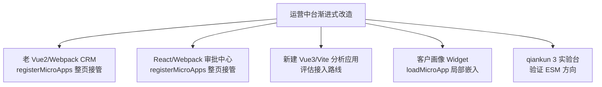
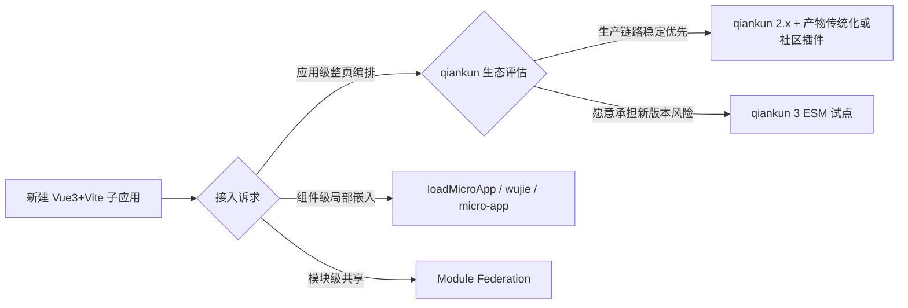

# 番外篇四：企业级混合微前端改造实战——老项目、新项目、局部嵌入与 qiankun 3 试验

**核心要点：**
- 真实生产场景是“存量系统渐进式改造”，而不是从零搭建一套微前端
- 混合技术栈并存：老旧 Vue2/Webpack、React/Webpack、新建 Vue3/Vite 子应用
- 非整页场景用 `loadMicroApp` 做局部嵌入，而不是所有子应用都接管整页路由
- 多子应用同屏：一个页面同时存在“路由驱动子应用 + 局部嵌入子应用”
- 现代工程适配：Vue3 + Vite 在 qiankun 2.x 生态里的接入成本，以及生态中的替代路线
- 新特性试验：单独开辟 qiankun 3（ESM 方向）实验台，验证新版本而不干扰生产主链路
- 配套可运行案例：[qiankun-production-lab](../../examples/micro-frontend/qiankun-production-lab/README.md)

## 一、开篇：生产环境的“真实形态”

第五篇的 `qiankun-basic-demo` 验证了一件事：**只要子应用愿意配合，qiankun 能跑得很顺。**

但真实生产项目几乎不会以这种形态出现。多数团队的现状是：系统已经在跑、代码已经很难改、团队已经换了好几拨。所谓微前端改造，通常是某个业务压力倒逼出来的：

- 老的 CRM 系统是 Vue2 + Webpack，还在被核心客户天天使用，**不能重写、只能改造**；
- 另一个审批中心是 React 技术栈，历史包袱一样重；
- 新产品想用 Vue3 + Vite，却发现 qiankun 2.x 的适配并不像文档里那么顺手；
- 有些页面只是想在主应用里**嵌一块局部功能**，根本不需要整页接管；
- 还有团队在观望 qiankun 3 的新特性，但不敢拿生产链路做实验。

这一篇不回避这些矛盾，而是把它们做成一个**尽量贴近生产的混合改造实验室**，一个一个场景拆开讲：接入时怎么决策、代码怎么落、坑在哪里。



## 二、案例全景：qiankun-production-lab

配套案例放在：

```text
examples/micro-frontend/qiankun-production-lab/
├── shell-app             # 主应用壳，http://localhost:7200
├── legacy-crm-vue2       # 模拟存量 Vue2/Webpack CRM，http://localhost:7201
├── approval-react        # 模拟 React/Webpack 审批中心，http://localhost:7202
├── customer-widget       # 局部嵌入子应用，http://localhost:7203
├── analytics-vue3        # 新建 Vue3/Vite 分析应用，http://localhost:7204
├── qiankun3-lab/
│   ├── host-app          # qiankun 3 rc 主应用，http://localhost:7300
│   └── esm-app           # 原生 ESM 子应用，http://localhost:7301
└── README.md             # 分组启动与验证说明
```

设计上分两组：

1. **生产改造实验室**：qiankun 2.x + 经典脚本子应用，覆盖老项目接入与局部嵌入；
2. **qiankun 3 试验台**：单独一组，验证 ESM 方向的新特性。

这样划分的原因后面会展开：**新版本验证不该和还在跑的业务混在一起。**

| 技术栈 | 技术栈形态 | 接入方式 |
| --- | --- | --- |
| 存量 CRM | Vue2 / Webpack 心智 | `registerMicroApps` 整页接管 |
| 审批中心 | React / Webpack 心智 | `registerMicroApps` 整页接管 |
| 客户画像 | 纯 JS 小组件 | `loadMicroApp` 局部嵌入 |
| 分析应用 | Vue3 / Vite | 独立运行 + 单独评估接入路线 |
| ESM 试验 | Vue/React 风格 ESM 入口 | qiankun 3 rc 原生 ESM 验证 |

## 三、场景一：老 Vue2/Webpack 系统怎么“先接进来”

老系统的特点决定了改造原则：**先保证业务不中断，再逐步治理。**

接入老 Vue2/Webpack 项目时，改造量其实比想象中小——核心仍是老三样：入口导出生命周期、构建产物暴露成 UMD、路由基座对齐。但老项目有几个特别容易出问题的地方：

1. **Webpack 版本老**：可能需要手动补 `output.library`、`libraryTarget: 'umd'` 与独立的 `jsonpFunction`，避免不同子应用的异步 chunk 加载函数互相冲突；
2. **全局变量与老插件**：老项目常依赖 jQuery、全局 bus、挂 `window` 上的插件对象，沙箱开启后可能“拿不到原来的东西”，需要逐个排查并收敛到 `props` 传递；
3. **路由 base 改造影响老书签**：老系统原来在 `/`，接入后被挪到 `/crm` 前缀下，内部跳转、绝对链接都要跟着改。

老系统接入的价值在于：**它把“要不要重写”这个最贵的问题先冻结了。** 先跑起来，让团队有余力去做下一步治理，而不是在业务高压下推翻重来。

## 四、场景二：`loadMicroApp` 局部嵌入与多子应用同屏

第五篇里的路由驱动模式解决的是“整页切应用”。但很多需求根本不是整页——比如客户详情页右侧想嵌一块“客户画像”卡片，它可能由另一个团队维护。为一个卡片做整页路由接管，反而很别扭。

这种场景 qiankun 提供了 `loadMicroApp`：**不依赖路由激活规则，随时手动挂载/卸载一个子应用。**

```js
import { loadMicroApp } from 'qiankun'

const widgetApp = loadMicroApp({
  name: 'customer-widget',
  entry: 'http://localhost:7203',
  container: '#widget-slot',   // 页面里的任意一个挂载点
  props: { customerName: '华东大区 KA 客户', score: 86 },
})

// 需要卸载时手动调用
// widgetApp.unmount()
```

配套案例里，[shell-app](../../examples/micro-frontend/qiankun-production-lab/shell-app/src/main.js) 正是“混合形态”：

- 左侧主区域用 `registerMicroApps` 在 CRM 和审批中心之间整页切换；
- 右侧客户画像卡片始终用 `loadMicroApp` 挂着，与主路由无关。

这就是**多子应用同屏**的最小形态：一个页面上，路由驱动的子应用和局部嵌入的子应用同时存在。它提示了一件事：微前端的编排模型不是只有“路由切换”一种，**组件式挂载和路由式编排应该并存。**

## 五、场景三：Vue3 + Vite 的接入路线

这是本案例里最需要谨慎表述的部分。

新建的 `analytics-vue3` 是一个标准的 Vite + Vue3 项目，单独运行在 7204。之所以**默认不让它进主应用**，是因为它在 qiankun 2.x 下接入需要额外适配：Vite 开发态输出的是原生 ESM，加载时序、产物形态都和 qiankun 2.x 习惯的“script 全局 + UMD 生命周期”不完全一致。接入可行的路径主要有三条，各有取舍：

| 路线 | 做法 | 特点 |
| --- | --- | --- |
| 构建产物传统化 | 关闭 module 输出、产物收敛成 IIFE/UMD，主应用当经典子应用加载 | 改动可控，但弱化了 Vite 的原生 ESM 优势 |
| 社区适配插件 | 使用 `vite-plugin-qiankun` 一类的社区方案完成开发态代理与生命周期注入 | 上手快，但依赖社区维护，升级节奏不由自己控制 |
| 等待/试点 qiankun 3 | 用 qiankun 3 的原生 ESM 加载能力承载 Vite 子应用 | 方向最契合现代工程体系，但需按新版本成熟度评估 |

对应地，生态里的其他方案也值得放进“扩展评估”：

- `micro-app`：定位低侵入、组件化嵌入，对 Vite 的适配也是一条独立路线；
- `wujie`：提供 Vue2/Vue3 组件封装，做局部嵌入、多实例与保活这类场景比较自然；
- Module Federation：如果诉求更多是**模块级共享**（而不是应用级编排），它是更对口的答案。

这一篇不替读者拍板选谁，因为答案高度依赖存量结构与团队维护能力。案例把它做出来的意义是：**让“Vue3 + Vite 要不要接入、怎么接入”从口头争论，变成可以验证的对比。**



## 六、场景四：qiankun 3 试验台

qiankun 3 的核心变化是运行时重写与原生 ESM 支持，方向是更贴近现代构建体系。但在写这篇文章的时间点，它仍以预发布（rc）形态存在，所以我们的处理方式是**单独开一个试验台**，而不是把它混进生产主链路：

```text
qiankun3-lab/
├── host-app   # 依赖 qiankun@^3.0.0-rc.22，http://localhost:7300
└── esm-app    # 原生 ESM 入口子应用，http://localhost:7301
```

`esm-app` 的入口直接导出生命周期函数，同时保留独立运行分支：

```js
async function mount(props) {
  render(props)
}

export { bootstrap, mount, unmount }
```

这个实验台只回答一个问题：**按 ESM 习惯写的子应用，能不能被新版本的主应用发现、加载并挂载。** 至于未来要不要引入生产，需要结合当时 rc 版本的成熟度、团队维护成本以及存量系统（多是 webpack/老架构）能否平滑共存，再做一轮架构评审。

一点实测记录（本文写作时基于 `3.0.0-rc.22`）：qiankun 3 rc 的 `registerMicroApps` 要求 `container` 传已经解析好的 DOM 元素，而不是像 2.x 那样接受字符串选择器；传入字符串会在加载阶段报 `Invalid value used as weak map key`。rc 版本接口仍在演进，任何接入尝试前都值得先做一次最小冒烟验证，而这也正是把这个 lab 单独分开的原因。

这一点也在案例里明确写进了注释：**它适合验证能力，不适合直接当生产标准答案。**

## 七、启动与验证

### 7.1 生产改造实验室

```bash
cd examples/micro-frontend/qiankun-production-lab
npm install
npm run dev:portal
```

访问：

- 主应用：`http://localhost:7200`（默认落在 `/crm`，可切到 `/approval`）
- 右侧客户画像 Widget 随主应用一起挂载
- 可选：`npm run dev:analytics` 单独启动 Vue3/Vite 分析项目（7204）

验证点：

1. `/crm` 挂载存量 Vue2 模拟子应用，`/approval` 卸载并切换；
2. 无论主路由怎么切，右侧 Widget 都保持存在——`loadMicroApp` 与路由解耦；
3. 打开 `analytics-vue3`，能看到它作为独立工程运行完好，但**没有直接并进主链路**，便于讨论接入路线。

### 7.2 qiankun 3 试验台

```bash
npm install
npm run dev:qiankun3
```

访问 `http://localhost:7300`，观察 esm-app 是否被挂载，Console 中应出现 `[esm-app] bootstrap` 与 `[esm-app] mount` 日志。

## 八、生产决策清单

把这个 lab 里的经验收成一份可直接用于评审的清单：

| 决策点 | 建议 |
| --- | --- |
| 老系统要不要重写？ | 先接入、后治理；把“重写”冻结成远期选项 |
| 什么场景用 `loadMicroApp`？ | 与主路由无关的局部功能、组件式嵌入 |
| 什么场景坚持 `registerMicroApps`？ | 整页应用、与 URL 强绑定的业务域 |
| 新建 Vue3/Vite 项目怎么进？ | 先独立跑通，再按“产物传统化 / 社区插件 / qiankun 3”三选一评估 |
| qiankun 3 什么时候上？ | 单独实验台验证，不直接赌生产链路 |
| 边界怎么守？ | 壳应用瘦身、注册信息集中、props 取代全局变量、命名前缀统一 |

## 九、小结

如果第五篇是“教你怎么把 qiankun 接起来”，这篇番外就是“带你看真实改造里到底有哪些形态”。

真正的工程里没有整齐划一的“主应用 + 两个子应用”。它通常是一锅由历史债务、异构技术栈、渐进节奏组成的混合物。而微前端框架能做的，只是把“编排能力”交到你手上——**怎么编排、先接谁、哪些该用局部嵌入、哪些新版本可以试点，是架构决策问题，不是 API 问题。**

看完这两篇配套案例，可以继续进入本系列的专题篇，把通信、样式隔离、性能这些横切面逐个做深：

- [第五篇：qiankun 深度解析（下）——实战与踩坑](./05-qiankun-practice.md)
- [第八篇：微前端通信机制全攻略](./08-communication.md)
- [第九篇：样式隔离与资源管理](./09-style-isolation-and-resource-management.md)
