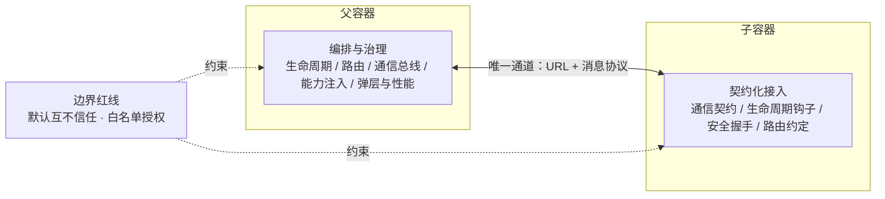
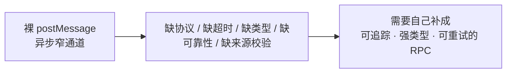
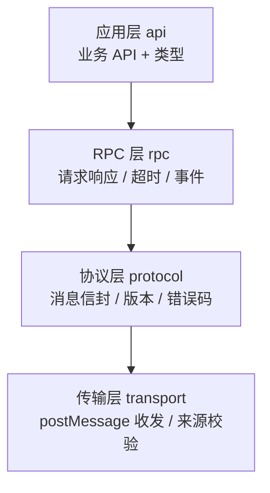
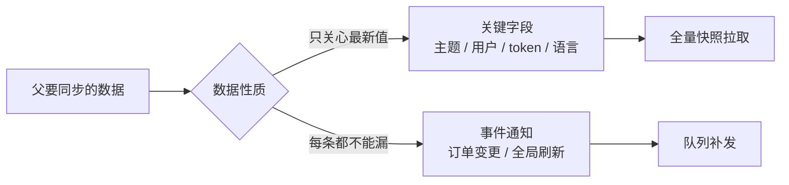
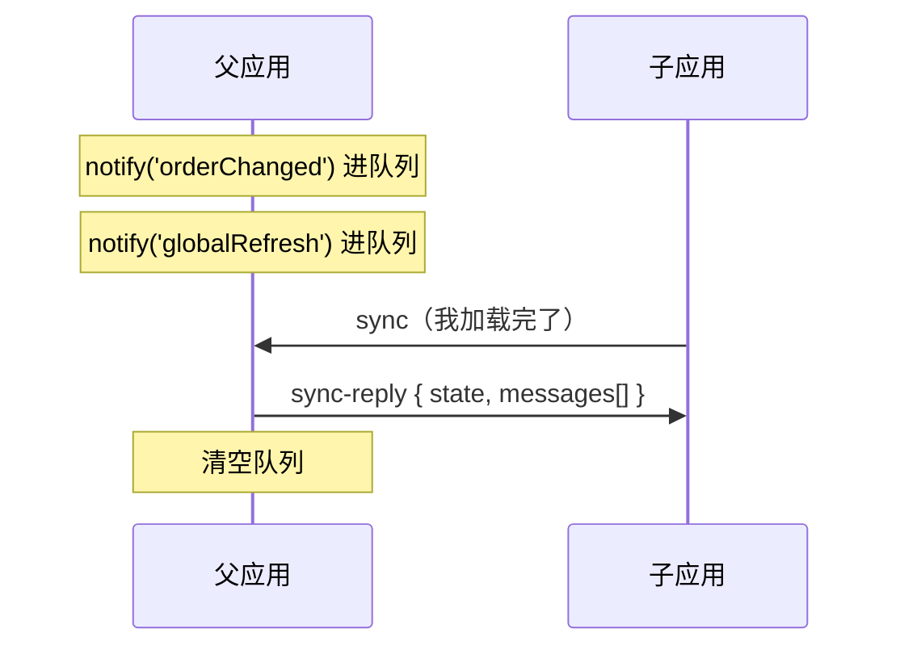
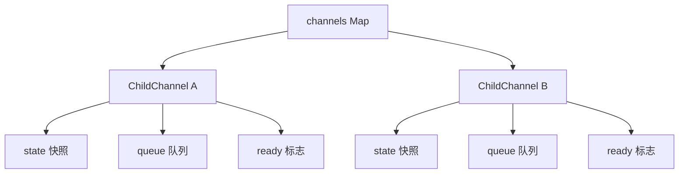
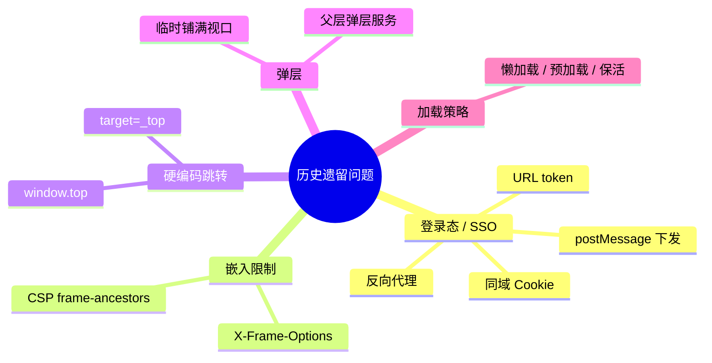

# 番外篇五：iframe 微前端工程化落地——一条 postMessage 怎么撑起父子协作

**核心要点：**

- `postMessage` 是 iframe 通信唯一的地基，但它只给了一条「能传结构化数据的异步窄通道」：没有协议、没有超时、没有类型、没有可靠性，这些都要自己补
- 落地通信架构分四层：协议层（信封/版本）→ 传输层（来源校验）→ RPC 层（请求响应/超时/事件）→ 应用层（强类型 API）
- 父子是「先要数据、再干活」的时序：子应用加载后主动 `sync`，父返回「状态快照 + 积压队列」，天然解决消息时序和丢失
- 多子应用时，快照和队列必须按应用隔离（每个应用一个 Channel），否则 A 应用清空队列会漏掉还没加载的 B 应用
- 通信 SDK 必须框架无关，放在子应用入口最顶部、框架初始化之前；不同技术栈只差「state 灌到哪里」
- 实际业务里，登录态/SSO、嵌入限制、硬编码跳转、弹层、加载策略各有明确取舍

> 本文是「微前端架构」技术专栏的番外篇五。番外篇一从浏览器底层讲清楚了 iframe 的隔离机制从哪里来、代价是什么；这一篇把镜头拉回工程现场，专门回答一件事：**既然选了 iframe，怎么把父子应用之间的通信与接入规则真正搭起来。** 至于横跨 qiankun、全局状态、事件总线的通信全景，可对照第八篇《微前端通信机制全攻略》，本篇只聚焦 iframe 这一条线。

## 一、开篇：从「强隔离」到「能协作」，中间要补什么

番外篇一留下了一个判断：`iframe` 的强隔离是浏览器安全模型带来的结果，而微前端要的是「隔离之上还能高效协作」——中间这一段空档，正是工程要补的地方。

真正把 `iframe` 用在业务里，父子应用之间其实只靠一件事连接：`postMessage`。它没有框架、没有魔法，就是浏览器给的一条窄通道。所以 iframe 工程化的核心命题，就收敛成一句话：**怎么把这条窄通道，一步步搭成一套够用、够稳、能复用的通信与接入体系。**

在写代码之前，得先想清楚两件事：父子各自该管什么、边界画在哪。否则通信协议再精致，也会被混乱的职责划分拖垮。

## 二、先立边界：父子容器各自干什么



图：父容器负责编排治理，子容器按契约接入，两者只通过「URL + 消息协议」这一条受控通道连接，其余全靠边界红线约束。

### 2.1 父容器的七块职责

父容器不是「一个 div 里套个 iframe」就完了，它真正承担的是**编排与治理**：

| 职责 | 要解决的问题 |
| --- | --- |
| 生命周期管理 | iframe 的创建、复用、销毁、保活；什么时候建、复用、杀 |
| 路由映射与激活 | URL ↔ 子应用 iframe 的对应关系，激活/失活/切换 |
| 通信总线 | 统一 `postMessage` 协议、命名空间、握手、超时、重试、鉴权 |
| 加载与容错 | loading 态、超时、加载失败、白屏检测、降级 |
| 能力注入 | 主题、用户信息、token、国际化语言，通过受控通道统一下发 |
| 弹层/浮层策略 | 全局弹层放父层还是子层？跨应用弹窗怎么处理 |
| 资源与性能治理 | 预加载 / 懒加载 / 保活 / iframe 数量上限 |

其中两个最容易踩的坑值得单独强调：

1. **挂载容器要稳定**。iframe 的宿主节点不能挂在「随路由切换就卸载」的组件里，否则每次切路由 iframe 都会销毁重建、子应用重新加载。要放在稳定的 Layout 层，让 iframe 只做 `display` / `src` 级别的切换，而不是销毁 DOM。
2. **父容器不要假设子应用内部结构**。父只认识两样东西：`URL` 和 `消息协议`。一旦父去读子应用 DOM、猜子应用框架，边界就破了，耦合就会传染。

### 2.2 子容器的接入规则

本质是把「不可控的嵌入页」变成「可契约化的接入方」：

- **通信契约**：规定消息格式（`type` / `payload` / `requestId` / `version`）、允许的事件清单、应答方式。
- **生命周期钩子**：子应用要能上报 `ready` / `bootstrapped` / `unmounted` 状态，父据此判断「加载完成没有、能不能开始交互」。
- **安全握手**：子应用必须校验消息来源 `origin`、校验 token；不能让子应用单向任意调用父能力，要收口到白名单。
- **路由约定**：子应用要能接收外部传入的初始路径，也要能把自己的路由变化上报给父。
- **UI 规范**：弹层、菜单的定位约束；主题变量（CSS Variables / 设计 token）的接入方式；字体图标资源声明。
- **性能预算**：子应用首屏资源体积、加载耗时上限。

### 2.3 边界红线

边界要画在「默认互不信任」上，这和浏览器安全模型是一致的思路：

- 子应用**不能**直接操作父 DOM，**不能**随意读父的 `localStorage` / `cookie`（除非显式授权）。
- 父应用**不能**假设子应用技术栈和 DOM 结构，只能通过 URL + 协议交互。
- 资源各自隔离：依赖各自动态加载，不共享运行时上下文。
- 授权是「白名单制」，不是「默认开放」。

一句话概括这条边界的定位：**隔离是默认，通信是受控例外。**

## 三、postMessage：唯一的地基，但它太「裸」

### 3.1 结构化克隆限制

postMessage 传递数据要经过 **Structured Clone（结构化克隆）算法**，不是引用传递。这是最容易被低估的限制：

| 能传 | 不能传（会报错或静默丢失） |
| --- | --- |
| 原始类型、普通对象、数组 | **函数**（直接抛 `DataCloneError`） |
| `Map` / `Set` | **DOM 节点** |
| `Date` / `RegExp` | **类实例**（方法、私有字段、原型链全丢） |
| `ArrayBuffer` / `TypedArray` | `Symbol`、`WeakMap` / `WeakSet` |
| 循环引用 | `Error` 对象（只剩 `name` / `message`） |

关键结论：**postMessage 永远传的是「数据的拷贝」，不是引用**。所以不能传函数、传组件、传一个带方法的 service 实例——这是 iframe 微前端永远做不到「像同页模块那样直接调函数」的根本原因。

### 3.2 它还缺什么

- **纯异步，无返回值**：只负责「发出去」，没有同步返回，要自己构造请求-响应关联。
- **无协议**：消息长什么样、字段叫什么，全靠口头约定，漂移就静默出错。
- **无可靠性**：没有 ACK、没有超时、没有重试、没有流控。
- **无类型安全**：发的是什么、回的是什么，全靠约定。
- **安全要自己兜底**：`targetOrigin` 传 `'*'`、不校验 `event.origin`，都是漏洞。



图：裸 postMessage 只提供一条窄通道，这些缺口都要在工程层补齐。

一句话总结：**postMessage 只给你一条「能传结构化数据的异步窄通道」，而微前端要的是「可追踪、强类型、可重试的 RPC」——中间这一大段必须自己搭。**

## 四、通信架构：四层补齐限制

思路是把「裸 postMessage」逐层包装成「类型安全的 RPC」。父子和子应用复用同一套内核，只是角色不同。



### 4.1 协议层：统一信封

```ts
export const PROTOCOL_VERSION = '1.0';

export interface Envelope<T = unknown> {
  v: string;                 // 协议版本
  kind: 'request' | 'response' | 'event';
  id: string;                // request/response 配对用
  channel: string;           // 方法名 / 事件名
  payload: T;
  error?: { code: number; message: string };
  ts: number;
}
```

### 4.2 传输层：来源校验

```ts
export class Transport {
  constructor(private target: Window, private targetOrigin: string, private allowedOrigins: string[]) {}

  listen(handler: (env: Envelope) => void) {
    window.addEventListener('message', (event) => {
      if (!this.allowedOrigins.includes(event.origin)) return; // 拒收陌生来源
      const env = event.data as Envelope;
      if (!env || env.v !== PROTOCOL_VERSION) return;           // 版本不符丢弃
      handler(env);
    });
  }

  post(env: Envelope) {
    this.target.postMessage(env, this.targetOrigin);            // 绝不写 '*'
  }
}
```

### 4.3 RPC 层：请求响应 + 超时

```ts
export class Rpc {
  private pending = new Map<string, { resolve: Function; reject: Function; timer: number }>();
  private handlers = new Map<string, (p: any) => Promise<any>>();
  private idSeq = 0;

  constructor(private transport: Transport) {
    transport.listen(this.dispatch);
  }

  // 调用方：发起请求，带超时
  call<T>(channel: string, payload?: any, timeout = 5000): Promise<T> {
    return new Promise((resolve, reject) => {
      const id = `${Date.now()}-${++this.idSeq}`;
      const timer = window.setTimeout(() => {
        this.pending.delete(id);
        reject(new Error(`请求超时: ${channel}`));
      }, timeout);
      this.pending.set(id, { resolve, reject, timer });
      this.transport.post({ v: '1.0', kind: 'request', id, channel, payload, ts: Date.now() });
    });
  }

  // 被调方：注册可被远程调用的方法
  provide(channel: string, handler: (p: any) => Promise<any>) {
    this.handlers.set(channel, handler);
  }

  emit(channel: string, payload?: any) {
    this.transport.post({ v: '1.0', kind: 'event', id: `evt-${++this.idSeq}`, channel, payload, ts: Date.now() });
  }

  private dispatch = (env: Envelope) => {
    if (env.kind === 'response') {
      const p = this.pending.get(env.id);
      if (!p) return;
      clearTimeout(p.timer);
      this.pending.delete(env.id);
      env.error ? p.reject(env.error) : p.resolve(env.payload);
    } else if (env.kind === 'request') {
      const handler = this.handlers.get(env.channel);
      if (!handler) {
        this.transport.post({ ...env, kind: 'response', error: { code: 404, message: `未注册: ${env.channel}` } });
        return;
      }
      handler(env.payload)
        .then((result) => this.transport.post({ ...env, kind: 'response', payload: result }))
        .catch((e) => this.transport.post({ ...env, kind: 'response', error: { code: 500, message: e?.message } }));
    }
  };
}
```

### 4.4 应用层：强类型 API

上层只看到类型化方法，完全不感知 postMessage 的存在。

```ts
// 子应用侧：把 Rpc.call 包装成有类型的 api
export class ParentApiClient {
  constructor(private rpc: Rpc) {}
  getToken() { return this.rpc.call<string>('parent.getToken'); }
  getUser() { return this.rpc.call<User>('parent.getUser'); }
  confirm(msg: string) { return this.rpc.call<boolean>('parent.confirm', { msg }); }
}

// 父应用侧：把能力收口成白名单
rpc.provide('parent.getToken', async () => getShortLivedToken());
rpc.provide('parent.getUser', async () => currentUser);
rpc.provide('parent.confirm', async ({ msg }) => confirmService.open(msg));
```

这套四层架构补上了哪些限制：

| postMessage 原始限制 | 补齐手段 | 落在哪一层 |
| --- | --- | --- |
| 只能传结构化克隆数据 | 不传函数/组件，改传「方法名 + 数据」走 RPC | 协议层约定 |
| 纯异步无返回值 | `requestId` + `Promise` 映射 | RPC 层 |
| 无协议 | 统一 `Envelope` 信封 + 版本号 | 协议层 |
| 无超时 | `setTimeout` 兜底 + 错误码 | RPC 层 |
| 无类型安全 | `ParentApiClient` 强类型包装 | 应用层 |
| 来源伪造风险 | `origin` + `targetOrigin` 白名单 | 传输层 |

## 五、时序设计：先要数据，再干活

四层架构解决了「怎么传」，但还有一个更隐蔽的问题：**子应用还没加载完时，父应用发的消息谁接？**

答案是「先存起来，等子应用就绪后再补发」，而且要区分两类数据：

| 数据 | 特点 | 机制 |
| --- | --- | --- |
| 关键字段（主题、用户、token、语言） | 只关心「最新值」，不关心历史 | 子应用加载后**主动拉全量快照** |
| 事件通知（订单变更、全局刷新） | 关心「每一条」都不能漏 | 父容器**暂存队列**，子应用来拉取 |



图：数据性质决定同步机制——状态类走快照覆盖，事件类走队列补发。

统一成一个 `sync` 握手流程：



父应用侧：

```js
const state = { theme: 'dark', locale: 'zh-CN', user: { id: 1 }, token: '...' };
const pendingMessages = [];
let childReady = false;

function notify(type, payload) {
  if (childReady) iframe.contentWindow.postMessage({ type, payload }, SUB_ORIGIN);
  else pendingMessages.push({ type, payload });
}

window.addEventListener('message', (event) => {
  if (event.origin !== SUB_ORIGIN) return;
  if (event.data.type === 'sync') {
    childReady = true;
    iframe.contentWindow.postMessage(
      { type: 'sync-reply', payload: { state, messages: pendingMessages.splice(0) } },
      SUB_ORIGIN,
    );
  }
});
```

子应用侧：

```js
let resolveSync;
const syncPromise = new Promise((r) => (resolveSync = r));

window.addEventListener('message', (event) => {
  if (event.origin !== PARENT_ORIGIN) return;
  const { type, payload } = event.data;
  if (type === 'sync-reply') { resolveSync(payload); return; }
  handleMessage({ type, payload });   // 运行中的增量消息
});

async function bootstrap() {
  window.parent.postMessage({ type: 'sync' }, PARENT_ORIGIN);
  const { state, messages } = await syncPromise; // 阻塞，等快照

  applyState(state);                 // 先落地主题/语言/用户/token
  messages.forEach(handleMessage);   // 再消费积压事件
  initRouter();                      // 最后才初始化路由守卫
  mountApp();                        // 最后才渲染
}
bootstrap();
```

为什么子应用要「先握手、后加载」：如果先渲染再等同步，会出现首屏先闪默认色再切主题、token 未到就发请求导致 401、路由守卫读到空 `user` 等一串问题。因为 postMessage 往返是同页毫秒级，**首屏直接阻塞等快照，通常是最简单也最稳的做法**。

## 六、多子应用：每个应用一份 Channel

上一节的代码有一个隐藏 bug：`state`、`pendingMessages`、`childReady` 都是全局单份。如果同时有 A、B 两个子应用，A 先加载并 `sync`，会把队列 `splice(0)` 清空，B 还没加载就漏掉了。

所以快照和队列必须**按应用隔离**：



图：每个子应用各自持有快照、队列、就绪标志，互不干扰；`sync` 只清空自己的队列。

```js
const channels = new Map(); // name -> ChildChannel

class ChildChannel {
  constructor(name, iframe, origin) {
    this.name = name;
    this.iframe = iframe;
    this.origin = origin;
    this.state = { theme: 'dark', user: { id: 1 }, token: '...' }; // 每个应用一份快照
    this.queue = [];                                                 // 每个应用一份队列
    this.ready = false;                                              // 每个应用一份就绪标志
  }

  notify(type, payload) {
    if (this.ready) this.iframe.contentWindow.postMessage({ type, payload }, this.origin);
    else this.queue.push({ type, payload });
  }

  onMessage(event) {
    if (event.origin !== this.origin) return;
    if (event.data.type === 'sync') {
      this.ready = true;
      this.iframe.contentWindow.postMessage(
        { type: 'sync-reply', payload: { state: this.state, messages: this.queue.splice(0) } },
        this.origin,
      );
    }
  }
}

function registerChild(name, iframe, origin) {
  channels.set(name, new ChildChannel(name, iframe, origin));
}

// 用 event.source 精确定位是哪个子应用，而不是只看 origin
window.addEventListener('message', (event) => {
  for (const channel of channels.values()) {
    if (event.source === channel.iframe.contentWindow) {
      channel.onMessage(event);
      break;
    }
  }
});
```

这里有个细节：**用 `event.source === iframe.contentWindow` 定位子应用**，而不是只看 `origin`。因为多个子应用可能部署在同域（比如反向代理统一域名），`origin` 相同就分不清是谁了。

## 七、跨技术栈：SDK 放哪

通信逻辑要放进**框架无关的独立 SDK**，调用位置在子应用入口文件最顶部、任何框架初始化之前。因为框架启动（路由守卫、状态初始化、首屏渲染）都依赖拿到的 `state`，握手必须排在框架 init 之前。


图：通信 SDK 必须在框架启动之前完成握手，之后才轮到框架做初始化。

SDK 核心是纯 JS，各技术栈共用，唯一不同的是「拿到 state 后往哪里灌」：

| 技术栈 | 拿到 `state` 后注入到哪里 |
| --- | --- |
| React | `Context` / Zustand / Redux 初始值 |
| Vue 2 | `Vue.prototype` 或 Vuex 初始 state |
| Vue 3 | `provide/inject` 或 Pinia |
| Angular | `InjectionToken` + Service 单例 |
| jQuery / 原生 | `window` 全局对象 |

React 的接法：

```jsx
// main.jsx —— 入口最顶部，createRoot 之前
import { createMicroApp } from '@company/micro-app-sdk';
import { createRoot } from 'react-dom/client';

const sdk = createMicroApp({ parentOrigin: 'https://portal.example.com' });

async function bootstrap() {
  const { state, messages } = await sdk.sync();  // 先拿数据
  createRoot(document.getElementById('app')).render(
    <AppContext.Provider value={{ state, sdk }}>
      <App />
    </AppContext.Provider>
  );
  messages.forEach(dispatch);
}
bootstrap();
```

老系统无构建时，用 UMD 版 `<script>` 引入：

```html
<script src="micro-app-sdk.umd.js"></script>
<script>
  var sdk = window.MicroAppSDK.createMicroApp({ parentOrigin: '...' });
  sdk.sync().then(function (res) {
    window.__APP_STATE__ = res.state;   // 挂全局，老代码直接读
    res.messages.forEach(handleMessage);
    initLegacyApp();
  });
</script>
```

## 八、实际业务的历史遗留问题

iframe 的主要价值恰恰在于接历史遗留系统，所以这几块是真正的「脏活」，要提前卡死。



图：接入历史遗留系统时要提前卡死的五个横切面，下面逐个展开。

### 8.1 登录态 / SSO

| 方案 | 原理 | 优点 | 缺点 |
| --- | --- | --- | --- |
| URL token | 父拼 URL 带一次性 token | 简单、跨域无障碍 | token 暴露在 URL/日志，需一次性+短时效 |
| postMessage 下发 | 子 `ready` 后父下发 token | 不进 URL，较安全 | 子先加载完才拿到，首屏可能慢一拍 |
| 共享 Cookie（同域） | 同域 iframe 自动带 Cookie | 零额外逻辑 | 跨域受限，第三方 Cookie 被逐步禁用 |
| 同域反向代理 | 所有子应用统一域名 | 消掉跨域 | 需要网关配置、运维成本 |

**第三方 Cookie 被禁的坑**：老系统靠跨域 Cookie 维持会话，在现代浏览器里会失效，这是接老系统返工率最高的点，务必前置验证。

### 8.2 嵌入限制与硬编码跳转

老系统可能带 `X-Frame-Options: DENY` 或 CSP `frame-ancestors 'none'`，直接禁止被嵌入，需要改成白名单：

```text
Content-Security-Policy: frame-ancestors https://portal.example.com
```

老系统里 `window.top.location.href = ...` 或 `<a target="_top">` 会把整个窗口带飞，要拦截改成上报：

```js
// 子应用侧全局拦截
document.addEventListener('click', (e) => {
  const a = (e.target).closest('a');
  if (a && a.target === '_top') {
    e.preventDefault();
    sdk.emit('child:navigate', { url: a.href });
  }
}, true);
```

### 8.3 弹层方案

这是 iframe 最痛的点：`position: fixed` 参考的是 iframe 自己的视口，遮罩盖不住父导航。

| 方案 | 做法 | 优点 | 缺点 |
| --- | --- | --- | --- |
| 子应用内弹（默认） | 弹层就在 iframe 里 | 零成本 | 遮罩盖不住父导航，割裂 |
| 临时铺满视口 | 子应用弹全屏层时，父把 iframe 临时 `position:fixed; inset:0` 铺满 | 成本低、接近原生 | 需要父子联动切换 |
| 弹层提升到父层 | 子应用把弹层内容经消息传给父，父在顶层渲染 | 体验最佳、可统一 | 跨 iframe 传内容复杂，维护重 |
| 父层弹层服务 | 需要全局的弹层做成父层能力，子只触发 | 统一可控 | 子应用弹层逻辑要改造成调用式 |

推荐折中：常规弹层在子应用内；需要全屏遮罩的确认/表单，走「临时铺满视口」或「父层弹层服务」。

### 8.4 加载策略

| 策略 | 做法 | 优点 | 缺点 |
| --- | --- | --- | --- |
| 懒加载 | 首次激活才创建 iframe | 省内存 | 切换有白屏等待 |
| 预加载 | 空闲时提前建 iframe | 切换秒开 | 占用内存 |
| 保活 | 隐藏不销毁（display 或移出视口） | 状态保留、切换快 | 内存持续占用 |
| 混合 | 高频保活，低频预加载，其余懒加载 | 平衡 | 需要配置管理 |

关于「隐藏」的具体方式，有一个容易踩坑的区分：

- **保活**（iframe 已加载完，切换时隐藏）：用 `display:none` 是可行的，`src` 不变就不会重新加载，JS 照跑；唯一副作用是隐藏期间内部 `requestAnimationFrame`、CSS 动画会暂停。普通表单/列表场景用 `display:none` 反而更省资源。
- **预埋/预加载**（iframe 一开始就藏在 `display:none` 容器里，等切过去再显示）：要避开 `display:none`。Chrome 115+ 对「初始就是 `display:none`」的 iframe 可能根本不发请求，应改用 `visibility:hidden` 或移出视口。

## 九、结语

把这一篇和番外篇一放在一起看，会得到一条完整的判断链：

- **番外篇一**回答了「为什么 iframe 隔离强、代价是什么」——答案在浏览器的进程与上下文边界里；
- **这一篇**回答了「怎么在工程里把 iframe 用起来」——答案在你自己搭的那套通信与接入规则里。

`postMessage` 不会替你解决任何协作问题，它只是把「隔离」这个默认状态，留了一个可以主动打开的小口子。真正决定 iframe 方案成败的，从来不是浏览器给了什么，而是你有没有把这条窄通道，补成一套够用、够稳、能复用的体系：**协议要立得住、时序要排得清、状态要按应用隔离、SDK 要框架无关。** 这几条做到，iframe 的「强隔离」才会从负担，真正变成工程上的确定性与安全感。
