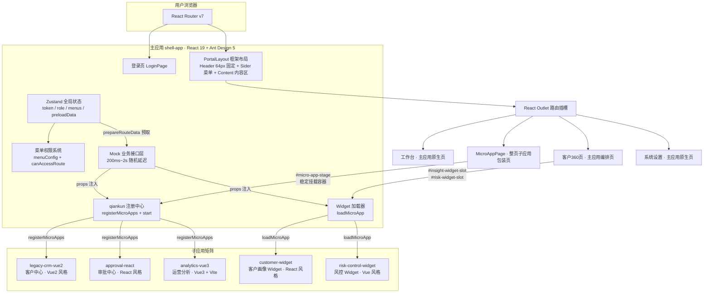
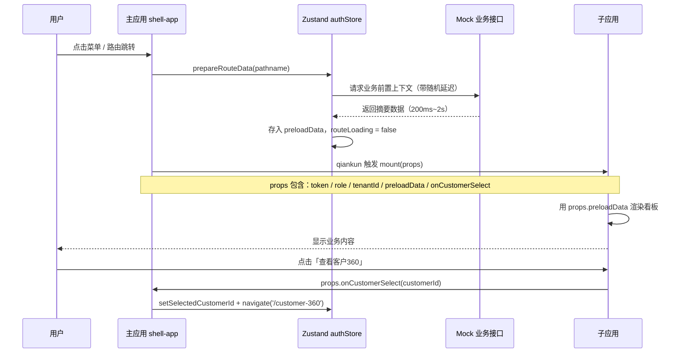

# qiankun Production Lab - 企业级混合微前端实战案例

## 一、项目概览

本项目是《企业级混合微前端改造实战》专栏的配套实验室，模拟一个真实的**集团运营中台**场景。通过 qiankun 微前端框架，将多个独立的业务子应用（不同技术栈、不同生命周期）统一编排到一个主应用框架下，实现登录权限、动态菜单、路由驱动整页挂载、页面级局部 Widget 嵌入等企业级能力。

### 核心能力一览

| 能力 | 说明 | 对应模块 |
| --- | --- | --- |
| 登录与权限体系 | 4 种内置角色，菜单按角色动态生成 | [authStore.js](file:///Users/qihaibing/Documents/qihb/frontend-architecture/examples/micro-frontend/qiankun-production-lab/shell-app/src/store/authStore.js)、[menuConfig.js](file:///Users/qihaibing/Documents/qihb/frontend-architecture/examples/micro-frontend/qiankun-production-lab/shell-app/src/config/menuConfig.js) |
| 路由驱动整页子应用 | 点击菜单挂载整页子应用（客户中心 / 审批中心 / 运营分析） | [registerApps.js](file:///Users/qihaibing/Documents/qihb/frontend-architecture/examples/micro-frontend/qiankun-production-lab/shell-app/src/qiankun/registerApps.js)、[MicroAppPage.jsx](file:///Users/qihaibing/Documents/qihb/frontend-architecture/examples/micro-frontend/qiankun-production-lab/shell-app/src/pages/MicroAppPage.jsx) |
| 局部 Widget 同屏 | 客户360页面同时挂载客户画像 + 风控两个子应用 | [Customer360Page.jsx](file:///Users/qihaibing/Documents/qihb/frontend-architecture/examples/micro-frontend/qiankun-production-lab/shell-app/src/pages/Customer360Page.jsx)、[widgetBus.js](file:///Users/qihaibing/Documents/qihb/frontend-architecture/examples/micro-frontend/qiankun-production-lab/shell-app/src/qiankun/widgetBus.js) |
| 前置数据预取 | 进入业务页面前，主应用先请求业务上下文再传给子应用 | [authStore.js](file:///Users/qihaibing/Documents/qihb/frontend-architecture/examples/micro-frontend/qiankun-production-lab/shell-app/src/store/authStore.js#L81-L133) |
| 父子通信 | 子应用通过 props 拿到 token / 角色 / 业务数据，回调通知父应用路由跳转 | [registerApps.js](file:///Users/qihaibing/Documents/qihb/frontend-architecture/examples/micro-frontend/qiankun-production-lab/shell-app/src/qiankun/registerApps.js#L14-L34) |
| 多技术栈兼容 | Vue2 / Vue3 + Vite / React / 原生 JS Widget 全部接入 | 各子应用入口文件 |

---

## 二、项目架构

### 2.1 整体架构图



### 2.2 目录结构

```text
qiankun-production-lab/
├── package.json                  # 根 workspace 配置 + 统一启动脚本
├── README.md                     # 本文档
│
├── shell-app/                    # 🏠 主应用（基座）
│   ├── src/
│   │   ├── config/
│   │   │   ├── menuConfig.js     # 菜单配置 + 角色权限 + 路由守卫
│   │   │   └── microApps.js      # 子应用注册表（名称 / entry / 路由前缀 / 权限）
│   │   ├── layouts/
│   │   │   └── PortalLayout.jsx  # 核心框架布局，含稳定的 #micro-app-stage 容器
│   │   ├── pages/
│   │   │   ├── LoginPage.jsx     # 登录页，4 种角色选择
│   │   │   ├── DashboardPage.jsx # 工作台（主应用原生页）
│   │   │   ├── MicroAppPage.jsx  # 整页子应用包装页（含前置数据等待逻辑）
│   │   │   ├── Customer360Page.jsx # 双子应用同屏编排页
│   │   │   └── SettingsPage.jsx  # 系统设置
│   │   ├── qiankun/
│   │   │   ├── registerApps.js   # qiankun 核心：注册、启动、remount 触发
│   │   │   └── widgetBus.js      # 局部 Widget：聚合上下文后传给双 Widget
│   │   ├── router/
│   │   │   └── index.jsx         # React Router 路由表 + 权限守卫
│   │   ├── services/             # Mock 业务接口层
│   │   │   ├── mockRequest.js    # 统一 200ms~2s 随机延迟
│   │   │   ├── authService.js    # 登录 / 用户信息 / 菜单权限
│   │   │   ├── customerService.js # 客户域：客户列表 / 客户360上下文
│   │   │   ├── approvalService.js # 审批域：待办 / 摘要
│   │   │   └── analyticsService.js # 分析域：漏斗 / 区域数据
│   │   ├── store/
│   │   │   └── authStore.js      # Zustand 全局状态：登录态 + 角色 + 预取数据
│   │   ├── App.jsx
│   │   ├── main.jsx
│   │   └── style.css             # 全局样式（含主/子应用可视化边框）
│   ├── package.json
│   └── vite.config.js
│
├── legacy-crm-vue2/              # 📦 子应用 1：客户中心（Vue2 风格存量系统）
│   └── public/
│       ├── index.html            # 含 #legacy-crm-root 挂载点
│       ├── app.js                # 核心入口：bootstrap/mount/unmount 生命周期
│       └── app.css
│
├── approval-react/               # 📦 子应用 2：审批中心（React 风格系统）
│   └── public/
│       ├── index.html            # 含 #approval-root 挂载点
│       ├── app.js                # 生命周期 + 审批看板渲染
│       └── app.css
│
├── analytics-vue3/               # 📦 子应用 3：运营分析（Vue3 + Vite 现代应用）
│   ├── src/
│   │   ├── main.js               # vite-plugin-qiankun 桥接生命周期
│   │   ├── App.vue
│   │   └── style.css
│   ├── package.json
│   └── vite.config.js
│
├── customer-widget/              # 📦 子应用 4：客户画像 Widget（局部嵌入）
│   └── public/
│       ├── index.html            # 含 #widget-root
│       ├── widget.js             # loadMicroApp 加载的轻量 Widget
│       └── widget.css
│
├── risk-control-widget/          # 📦 子应用 5：风控信息 Widget（局部嵌入）
│   └── public/
│       ├── index.html            # 含 #risk-widget-root
│       ├── app.js                # 风险信号 + 授信数据渲染
│       └── app.css
│
└── qiankun3-lab/                 # 🧪 qiankun 3 ESM 试验台（独立运行）
    ├── host-app/
    └── esm-app/
```

### 2.3 关键概念与设计决策

#### 主应用 vs 子应用的职责边界

| 职责 | 主应用 shell-app | 子应用 |
| --- | --- | --- |
| 登录认证 | ✅ 统一登录、token 管理 | ❌ 不处理登录，从 props 拿 token |
| 路由与菜单 | ✅ 统一路由表、菜单渲染、权限判断 | ❌ 只响应父应用传入的 activeRule |
| 业务前置数据 | ✅ 统一预取，封装业务上下文 | ❌ 不独立请求主数据，只消费 props |
| 页面 UI 框架 | ✅ Header + Sider + 全局样式 | ✅ 自己的业务 UI 组件 |
| 细粒度业务请求 | ❌ 不做业务明细查询 | ✅ 拿到上下文后，请求自己的详情接口 |

#### 两种微前端挂载模式

1. **整页子应用模式**（`registerMicroApps`）
   - 用于：客户中心 `/customers/*`、审批中心 `/approvals/*`、运营分析 `/analytics/*`
   - 特点：路由切换驱动 qiankun 自动匹配和加载
   - 挂载点：`#micro-app-stage`（在 PortalLayout 中稳定存在，不随路由组件销毁）

2. **局部 Widget 模式**（`loadMicroApp`）
   - 用于：客户360页面的客户画像 + 风控 Widget
   - 特点：不由路由驱动，而是主应用先拿数据，再手动按插槽位加载
   - 挂载点：`#insight-widget-slot`、`#risk-widget-slot`

---

## 三、快速开始

### 3.1 环境要求

- Node.js >= 16
- npm（使用 npm workspaces 管理 monorepo）

### 3.2 启动所有应用

```bash
# 进入案例根目录
cd examples/micro-frontend/qiankun-production-lab

# 安装所有 workspace 依赖
npm install

# 一键启动主应用 + 全部子应用
npm run dev:portal
```

启动成功后，终端会显示 6 个并发进程（颜色区分）：

| 颜色 | 进程 | 访问地址 | 说明 |
| --- | --- | --- | --- |
| 🔵 Cyan | shell（主应用） | http://localhost:7200 | 集团运营中台入口 |
| 🟣 Magenta | crm（Vue2 存量） | http://localhost:7201 | 客户中心（可独立调试） |
| 🟡 Yellow | approval（React） | http://localhost:7202 | 审批中心（可独立调试） |
| 🟢 Green | insight（Widget） | http://localhost:7203 | 客户画像 Widget（可独立调试） |
| 🔵 Blue | risk（Widget） | http://localhost:7205 | 风控 Widget（可独立调试） |
| 🔴 Red | analytics（Vue3） | http://localhost:7204 | 运营分析（可独立调试） |

### 3.3 单独启动 qiankun 3 试验台

```bash
npm run dev:qiankun3
```

---

## 四、演示流程（建议按顺序体验）

### 4.1 角色与权限演示

1. 打开 http://localhost:7200 → 自动跳转到登录页
2. 选择 **销售经理** 角色登录 → 观察左侧菜单：工作台 / 客户中心 / 客户360 / 运营分析
3. 在顶部 Header 右侧切换角色为 **财务审批** → 菜单自动刷新：客户中心和运营分析消失，出现审批中心
4. 尝试手动访问无权限路由（如 /analytics/overview）→ 自动跳回该角色的默认首页

### 4.2 整页子应用 + 前置数据预取

1. 以 **销售经理** 登录
2. 点击「客户中心」菜单 → 观察：先出现 Loading（正在请求客户域前置上下文）→ 再渲染整页 CRM 子应用
3. 在客户列表中，点击任意一条记录的「查看客户360」按钮 → 子应用通过 `props.onCustomerSelect` 回调父应用 → 父应用设置选中客户 ID 并跳转到 `/customer-360`

### 4.3 双子应用同屏编排

1. 进入「客户360」页面
2. 观察页面上方：主应用先渲染客户名称 / 评分 / 风险标签摘要卡（主应用自己拿到的数据）
3. 下方两个并排卡片：左侧是 **客户画像 Widget**（绿色边框），右侧是 **风控信息 Widget**（蓝色边框）
4. 切换顶部客户选择器 → 两个 Widget 同时更新数据（共享同一份父应用上下文）

### 4.4 子应用独立运行

每个子应用都支持独立运行（方便调试和对比）：

- 直接访问 http://localhost:7201 → CRM 自己有 mock 数据，不需要父应用
- 访问 http://localhost:7202 → 审批中心独立运行
- 访问 http://localhost:7203 → 客户画像 Widget 独立运行

独立运行 vs 被 qiankun 接入的差异：`window.__POWERED_BY_QIANKUN__` 全局变量为 `true` 时，子应用不自己执行 mount，而是暴露生命周期给 qiankun 调用。

---

## 五、核心代码详解

### 5.1 主应用：qiankun 注册与启动

**文件：** [registerApps.js](file:///Users/qihaibing/Documents/qihb/frontend-architecture/examples/micro-frontend/qiankun-production-lab/shell-app/src/qiankun/registerApps.js)

核心知识点：

1. **幂等注册**：`registered` 和 `started` 两个 flag 确保 `registerMicroApps` 和 `start` 只执行一次，避免重复注册。
2. **动态 Props**：`props` 接受一个函数，每次子应用挂载时都会重新从 authStore 取最新状态，保证 token / 角色 / 预取数据都是最新的。
3. **Remount 触发机制**：`remountCurrentMicroApp` 使用 `history.replaceState` + 手动派发 `PopStateEvent` 组合方式，强制 qiankun 重新执行路由匹配（解决某些情况下子应用不渲染的问题）。

```javascript
// 核心片段：构建共享 Props，注入 token / 角色 / 预取数据 / 回调
function buildSharedProps(name) {
  const state = useAuthStore.getState()
  return {
    token: state.token,            // 子应用请求接口用
    role: state.role,              // 子应用按角色渲染模块
    tenantId: state.tenantId,      // 多租户场景
    preloadData: preloadMap[name], // 主应用预取的业务摘要
    onCustomerSelect: (customerId) => {  // 子应用回调父应用
      useAuthStore.getState().setSelectedCustomerId(customerId)
      pushRoute('/customer-360')
    },
  }
}
```

### 5.2 主应用：稳定的子应用挂载容器

**文件：** [PortalLayout.jsx](file:///Users/qihaibing/Documents/qihb/frontend-architecture/examples/micro-frontend/qiankun-production-lab/shell-app/src/layouts/PortalLayout.jsx#L136-L138)

**关键设计：** `#micro-app-stage` 放在 `PortalLayout` 的 Content 区域，而不是放在 `MicroAppPage` 组件内部。

**为什么？** 在 qiankun `singular: true` 模式下，如果子应用容器随 React 路由组件卸载而销毁，会导致 qiankun 无法正确执行旧应用的 unmount 生命周期，进而引发：
- 子应用 DOM 残留
- 来回切换后内容空白
- 控制台报 container not found 错误

### 5.3 主应用：业务前置数据预取

**文件：** [authStore.js](file:///Users/qihaibing/Documents/qihb/frontend-architecture/examples/micro-frontend/qiankun-production-lab/shell-app/src/store/authStore.js#L81-L133)

`prepareRouteData(pathname)` 是连接「菜单点击」和「子应用渲染」的关键桥梁：

```text
用户点击菜单 → handleMenuClick
            → prepareRouteData(key) 被调用
            → 判断是哪个业务域（customers / approvals / analytics）
            → 如果已有缓存，直接返回（避免重复请求）
            → 否则设置 routeLoading = true，调用对应业务 service
            → 数据存入 preloadData，routeLoading = false
            → MicroAppPage 检测到 routeLoading = false
            → 调用 ensureQiankunStarted() + remountCurrentMicroApp()
            → 子应用拿到 props.preloadData 渲染业务内容
```

### 5.4 整页子应用包装页

**文件：** [MicroAppPage.jsx](file:///Users/qihaibing/Documents/qihb/frontend-architecture/examples/micro-frontend/qiankun-production-lab/shell-app/src/pages/MicroAppPage.jsx)

这个组件的职责非常精简：
1. 显示业务介绍卡片（Tag + 标题 + 描述）
2. 显示前置数据 Loading（当 `routeLoading = true` 时）
3. **不直接包含** `#micro-app-stage` 容器（容器在 PortalLayout 中）
4. 等容器出现后，触发 remount（有重试机制，最多 5 次，间隔 60ms）

### 5.5 双子应用同屏编排页

**文件：** [Customer360Page.jsx](file:///Users/qihaibing/Documents/qihb/frontend-architecture/examples/micro-frontend/qiankun-production-lab/shell-app/src/pages/Customer360Page.jsx)

使用 `loadMicroApp` 手动加载 Widget 的典型范式：

```javascript
// 核心片段：先聚合数据，再按插槽位分别 loadMicroApp
const props = await buildWidgetProps(selectedCustomerId)
microAppRef.current = [
  loadMicroApp({
    name: 'customer-widget',
    entry: 'http://localhost:7203',
    container: '#insight-widget-slot',
    props,  // 两个 Widget 拿到的是同一份上下文
  }),
  loadMicroApp({
    name: 'risk-control-widget',
    entry: 'http://localhost:7205',
    container: '#risk-widget-slot',
    props,
  }),
]
```

卸载时必须遍历 `microAppRef` 手动 `.unmount()`，否则会出现 DOM 残留或内存泄漏。

### 5.6 子应用：生命周期三要素

以 [legacy-crm-vue2/public/app.js](file:///Users/qihaibing/Documents/qihb/frontend-architecture/examples/micro-frontend/qiankun-production-lab/legacy-crm-vue2/public/app.js) 为例，每个 qiankun 子应用必须暴露三个函数：

| 生命周期 | 调用时机 | 主要职责 |
| --- | --- | --- |
| `bootstrap(props)` | 首次加载时执行一次 | 做一次性初始化（如配置 CDN 前缀、埋点 SDK） |
| `mount(props)` | 每次路由匹配命中时 | 把自己的 DOM 渲染到 `props.container` 内的挂载点 |
| `unmount(props)` | 路由离开时 | 清空 DOM、销毁实例、解绑事件监听 |

这三个函数需要挂在 `window['应用名']` 上（由 qiankun 通过 entry 的 HTML 解析后执行）。

### 5.7 子应用：Vue3 + Vite 特殊处理

**文件：** [analytics-vue3/src/main.js](file:///Users/qihaibing/Documents/qihb/frontend-architecture/examples/micro-frontend/qiankun-production-lab/analytics-vue3/src/main.js)

Vue3 + Vite 是 ESM 模块，不像 Webpack/UMD 那样天然能把生命周期挂到 window。需要使用 `vite-plugin-qiankun` 插件做桥接：

1. 在 `vite.config.js` 中启用插件，指定应用名
2. 在入口文件中用 `renderWithQiankun({...})` 包裹三个生命周期
3. 通过 `qiankunWindow.__POWERED_BY_QIANKUN__` 判断是否在 qiankun 中运行

---

## 六、父子数据通信机制

### 6.1 数据流向图



### 6.2 Props 契约（整页子应用）

```typescript
interface SharedProps {
  token: string                // 登录态 token，子应用请求头使用
  role: string                 // 当前角色：platform_admin / sales_manager 等
  tenantId: string             // 租户 ID（多租户场景）
  orgId: string                // 组织 ID（数据权限范围）
  userInfo: {                  // 用户信息
    id: string
    name: string
    roleLabel: string
  }
  preloadData: object          // 主应用预取的业务摘要（每个应用不同）
  onCustomerSelect: (id: string) => void  // 子应用→父应用的回调：跳转客户360
}
```

### 6.3 Props 契约（Widget 子应用）

```typescript
interface WidgetProps {
  customerId: string           // 当前选中的客户 ID
  customerName: string         // 客户名称
  profile: {                   // 客户画像
    level: string              // 客户等级 A/B/C
    score: number              // 价值评分
    tags: string[]             // 客户标签数组
  }
  creditSummary: {             // 授信摘要
    amount: number             // 授信总额
    available: number          // 可用额度
    dueDays: number            // 逾期天数
  }
  riskSignals: string[]        // 风险信号数组
}
```

---

## 七、页面可视化区分说明

为了方便读者直观区分「主应用原生内容」和「子应用渲染内容」，本案例在运行时页面中使用不同颜色的虚线边框对不同层级的内容进行了标识：

| 边框颜色 | 应用类型 | 标识内容 | CSS 类 |
| --- | --- | --- | --- |
| 紫色虚线 | 主应用框架层 | PortalLayout 的 Sider + Header 区域 | `.portal-visual-frame` |
| 蓝色虚线 | 主应用原生内容 | 工作台、系统设置、MicroAppPage 的介绍卡 | `.host-native-content` |
| 橙色虚线 | 整页子应用挂载区 | `#micro-app-stage` 容器（客户中心 / 审批中心 / 运营分析） | `.micro-app-stage` |
| 绿色虚线 | 客户画像 Widget | `#insight-widget-slot` | `.widget-slot--insight` |
| 蓝色虚线 | 风控信息 Widget | `#risk-widget-slot` | `.widget-slot--risk` |

在实际生产项目中，这些边框应该通过环境变量控制只在开发/演示环境显示。

---

## 八、常见问题与注意事项

### 8.1 为什么切换子应用后页面空白？

最常见原因：**子应用挂载容器被销毁了**。

检查：`#micro-app-stage` 是否在 `PortalLayout` 这类不随路由卸载的稳定组件中？如果放在 `MicroAppPage` 里，qiankun 在 singular 模式下执行 unmount 时会找不到 container，导致残留。

### 8.2 为什么子应用拿到的 props 是旧的？

`registerMicroApps` 时 `props` 应该传**函数**而不是传**对象字面量**。函数会在每次 mount 时重新执行，从 store 拿到最新状态。

### 8.3 为什么刷新子应用路由会 404？

这是 SPA 路由的常见问题：
- 开发环境：Vite 已配置 history fallback
- 生产环境：Nginx 需要配置 `try_files $uri /index.html;`

### 8.4 子应用样式污染怎么解决？

qiankun 默认开启了沙箱，但实验性样式隔离（`experimentalStyleIsolation: true`）不是 100% 完美。建议：
- 子应用所有样式加统一前缀（如 `.crm-app *`）
- CSS Modules / CSS-in-JS
- 避免使用全局标签选择器（`body { ... }`）

---

## 九、配套资源

- 完整升级实施计划：[2026-09-12-qiankun-production-lab-enterprise-upgrade.md](file:///Users/qihaibing/Documents/qihb/frontend-architecture/docs/superpowers/plans/2026-09-12-qiankun-production-lab-enterprise-upgrade.md)
- qiankun 官方文档：https://qiankun.umijs.org/
